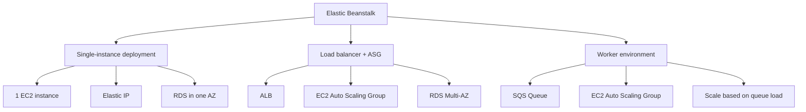
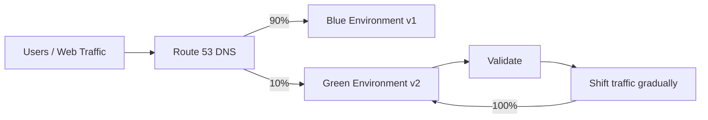

# 118. Elastic Beanstalk

## 🎯 Giới thiệu
AWS Elastic Beanstalk là một **managed service** thiên về developer, nhưng trong **Solutions Architect Professional** bạn cần hiểu đây là công cụ rất tốt để **re-platform** ứng dụng từ **on-premise** lên **AWS cloud**.

- Beanstalk là một lớp bao bọc xung quanh các thành phần quen thuộc như:
  - **EC2**
  - **Auto Scaling Group**
  - **Elastic IP**
  - **Elastic Load Balancer / ALB**
  - **RDS**
- Bạn vẫn có thể kiểm soát cấu hình của từng thành phần, nhưng Beanstalk giúp việc triển khai trở nên đơn giản hơn.
- Beanstalk bản thân **miễn phí**, nhưng bạn vẫn trả tiền cho các tài nguyên bên dưới.

## 1. Platforms và mục tiêu sử dụng
Beanstalk hỗ trợ nhiều platform/runtime khác nhau:

- **Go**
- **Java**
- **Java with Tomcat**
- **.Net on Windows Server**
- **Node.js**
- **PHP**
- **Python**
- **Ruby**
- **Packer**

Nếu runtime không được hỗ trợ trực tiếp, vẫn có thể dùng:

- **Single Docker container**
- **Multi-container Docker**
- **Preconfigured Docker**

Ý chính cho kỳ thi:

- Nếu ứng dụng có thể **dockerize**, Beanstalk có thể là một lựa chọn để migrate lên AWS.
- Trường hợp đặc biệt quan trọng là **Java with Tomcat**, vì phù hợp để migrate ứng dụng Tomcat từ on-premise lên cloud.

## 2. Các mô hình kiến trúc trong Beanstalk
Beanstalk có 3 mô hình triển khai chính cần nhớ:

1. **Single-instance deployment**
   - Phù hợp cho **dev**
   - Có thể gắn **Elastic IP**
   - Có thể kèm **RDS** trong cùng một AZ

2. **Load balancer + ASG**
   - Phù hợp cho **production** hoặc **pre-production web application**
   - Có tính **high availability**
   - Thường chạy **multi-AZ**
   - Có thể dùng **RDS Multi-AZ** với **master/standby**

3. **Worker environment**
   - Phù hợp cho **non-web application** trong production
   - Dùng **SQS queue**
   - Có **EC2 Auto Scaling Group** đọc từ queue và scale theo load

### Single-instance deployment
- Chỉ có **1 Availability Zone**
- Có **EC2 instance**
- Có thể gắn **Elastic IP** để khi instance bị thay thế thì client vẫn truy cập được liên tục
- Có thể dùng **RDS** trong cùng AZ
- Phù hợp cho **development** vì rẻ và nhanh

### Load balancer + ASG
- Dùng cho môi trường giống production hơn
- Có **ALB**
- Có **EC2 Auto Scaling Group**
- Chạy trên **nhiều AZ**
- Có thể dùng **RDS Multi-AZ**
- Phù hợp khi cần **high availability**

### Worker environment
- Dùng khi cần xử lý các tác vụ lâu và nặng CPU/thread
- App web sẽ đẩy task sang **SQS**
- Worker tier gồm **EC2 Auto Scaling Group** đọc từ queue
- Scale theo **queue load**

## 3. Web environment vs Worker environment
Beanstalk phân tách rất rõ giữa:

- **Web server environment**
  - Xử lý request từ người dùng
  - Có thể bị quá tải nếu phải làm task dài

- **Worker environment**
  - Xử lý các job dài hoặc nặng
  - Giúp **decoupling** ứng dụng thành nhiều tier
  - Khi nghe tới **decoupling**, nhớ tới **SQS**

Ví dụ các task phù hợp với worker:

- Xử lý video
- Chèn text lên video
- Tạo file zip
- Tạo filter phức tạp cho image

Ngoài ra, worker environment còn hỗ trợ:

- **cron.yami file**
- Chạy **cron jobs** trực tiếp từ worker environment

## 4. Blue/Green deployment
Blue/Green deployment không phải là feature trực tiếp của Beanstalk, nhưng Beanstalk hỗ trợ mô hình này để đạt:

- **zero downtime**
- khả năng release an toàn hơn

Luồng triển khai:

1. Tạo một environment mới
2. Deploy **v2** lên environment mới, gọi là **green**
3. Validate green environment
4. Nếu có vấn đề, xóa environment đó để rollback
5. Dùng **Route 53 weighted routing** để chuyển traffic dần từ blue sang green
6. Hoặc dùng **Beanstalk Swap URL** để swap toàn bộ DNS giữa hai environment

Điểm cần nhớ:

- **Weighted routing**: chia traffic theo tỷ lệ, ví dụ 90/10 rồi tăng dần
- **Swap URL**: chuyển toàn bộ traffic từ environment này sang environment khác bằng DNS swap

## 📊 Bảng tóm tắt
| Tiêu chí | Mô tả |
|----------|------|
| Bản chất | Managed service để deploy ứng dụng lên AWS |
| Mục tiêu chính | Re-platform ứng dụng từ on-premise lên cloud |
| Thành phần nền | EC2, ASG, Elastic IP, ELB/ALB, RDS |
| Chi phí | Beanstalk free, trả tiền cho underlying resources |
| Platform hỗ trợ | Go, Java, Java with Tomcat, .Net, Node.js, PHP, Python, Ruby, Packer |
| Docker support | Single container, multi-container, preconfigured Docker |
| 3 mô hình chính | Single-instance, Load balancer + ASG, Worker environment |
| Web vs Worker | Web xử lý request; Worker xử lý job dài qua SQS |
| Blue/Green | Dùng green environment + Route 53 weighted routing hoặc Swap URL |
| Use case thi | Migrate app từ on-premise lên AWS và quản lý web/worker tiers |

## 💡 Mẹo ghi nhớ cho kỳ thi AWS
- **Beanstalk = wrapper** quanh các service như **EC2, ASG, ALB, RDS**.
- Muốn nhớ use case chính, hãy nghĩ tới **re-platform from on-premise to AWS**.
- **Java with Tomcat** là keyword rất quan trọng cho migration.
- **Single-instance** = dev, rẻ, đơn giản.
- **Load balancer + ASG** = production web app, high availability, multi-AZ.
- **Worker environment** = task dài, **SQS**, decoupling.
- Khi thấy **decoupling**, nhớ ngay tới **SQS**.
- **Blue/Green** = an toàn khi release, có thể dùng **Route 53 weighted routing** hoặc **Swap URL**.

## ✅ Kết luận
Elastic Beanstalk là lựa chọn phù hợp khi muốn **triển khai nhanh**, **quản lý đơn giản**, và đặc biệt hữu ích cho việc **re-platform ứng dụng từ on-premise lên AWS**. Trong kỳ thi, cần nắm chắc 3 mô hình triển khai, sự khác nhau giữa **web tier** và **worker tier**, cùng cách **blue/green deployment** hoạt động với **Route 53**.
