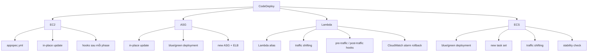

# 119. CodeDeploy

## 🎯 Giới thiệu
CodeDeploy là AWS managed service dùng để triển khai ứng dụng trên nhiều môi trường đích, đặc biệt cần nắm cho SA Pro ở 4 trường hợp: `EC2`, `Auto Scaling Group (ASG)`, `ECS`, và `Lambda`.

- Mục tiêu chính: chuyển ứng dụng từ `V1` sang `V2` một cách có kiểm soát.
- Các instance/target có thể được cập nhật theo kiểu `in-place` hoặc `blue/green`.
- CodeDeploy dùng các cơ chế native của từng dịch vụ để triển khai và có thể hỗ trợ rollback.

## 1. 🚀 CodeDeploy cho EC2
- Dùng cho các `EC2 instances` đã cài `CodeDeploy agent`.
- Triển khai được mô tả trong file `appspec.yml`.
- Cơ chế chính là `in-place update`, không tạo `EC2 instance` mới.
- Có thể định nghĩa `hooks` để kiểm tra deployment sau từng phase.
- Ví dụ `half at a time`:
  - 4 `EC2 instances` đang chạy `V1`.
  - CodeDeploy đưa 2 instance xuống offline.
  - 2 instance còn lại tiếp tục phục vụ traffic.
  - 2 instance offline được nâng lên `V2`.
  - Sau đó đổi tiếp phần còn lại sang `V2`.

## 2. 📦 CodeDeploy cho ASG
- Có 2 kiểu update cho `ASG`:
  - `In-place update`: cập nhật chính các `EC2 instances` hiện có trong `ASG`.
  - `Blue/green deployment`: tạo `new ASG`, copy settings, rồi chuyển instance từ ASG cũ sang ASG mới.
- Nếu `ASG` scale out trong lúc deployment, instance mới tạo ra cũng được CodeDeploy deploy tự động.
- Với `blue/green deployment` trên `ASG`, cần dùng `Elastic Load Balancer`.
- Ý chính để nhớ:
  - `In-place` = sửa trên instance hiện có.
  - `Blue/green` = tạo môi trường mới sạch hơn rồi chuyển traffic.

## 3. 🧩 CodeDeploy cho Lambda và ECS
### Lambda
- CodeDeploy dùng cho `AWS Lambda` thông qua `Lambda alias`.
- Triển khai bằng `traffic shifting` trên alias giữa `V1` và `V2`.
- Có thể khai báo:
  - `pre-traffic hook` Lambda function để test trước khi nhận traffic.
  - `post-traffic hook` Lambda function để test sau khi đã chuyển traffic.
- Có thể dùng `CloudWatch alarm` để tự động rollback nếu phát hiện lỗi.
- Nếu dùng `SAM (Serverless Application Model)`, khi deploy Lambda version mới thì `SAM` sẽ native dùng `CodeDeploy`.

### ECS
- Hỗ trợ `blue/green deployment` cho `Amazon ECS` và `AWS Fargate`.
- Cấu hình nằm trong `ECS service definition`, không phải làm từ `CodeDeploy console`.
- Cách hoạt động:
  - Tạo `new task set`.
  - Reroute traffic sang task set mới.
  - Chờ `stability` trong một khoảng thời gian.
  - Nếu ổn định, terminate `old task set`.
- Có thể dùng chiến lược `Canary`:
  - Ví dụ `10%` trong `5 minutes`, rồi chuyển toàn bộ sang deployment mới.
- Trong ví dụ minh họa, traffic được chuyển dần từ `60% / 40%` rồi mới xóa version cũ.

## 📊 Bảng tóm tắt
| Tiêu chí | Mô tả |
|----------|------|
| Mục tiêu | Deploy ứng dụng từ `V1` sang `V2` trên `EC2`, `ASG`, `Lambda`, `ECS` |
| `EC2` | `In-place update`, cấu hình bằng `appspec.yml`, dùng `hooks` để kiểm tra |
| `ASG` | Có `in-place update` và `blue/green deployment`; `blue/green` cần `ELB` |
| `Lambda` | Dùng `Lambda alias`, `traffic shifting`, có `pre-traffic` và `post-traffic hooks` |
| `ECS` | `Blue/green deployment`, tạo `new task set`, chờ ổn định rồi xóa task set cũ |
| Rollback | Có thể dùng `CloudWatch alarm` để rollback tự động |
| Điểm thi quan trọng | Nắm rõ cách CodeDeploy hoạt động khác nhau theo từng dịch vụ |

## 💡 Mẹo ghi nhớ cho kỳ thi AWS
- `EC2` = nhớ `appspec.yml` + `in-place update` + `hooks`.
- `ASG` = nhớ `in-place` và `blue/green`; nếu `blue/green` thì có `ELB`.
- `Lambda` = nhớ `alias`, `traffic shifting`, `pre-traffic hook`, `post-traffic hook`, `CloudWatch alarm`.
- `ECS` = nhớ `new task set`, traffic chuyển dần, sau đó kiểm tra ổn định rồi mới xóa bản cũ.
- Nếu đề bài nhắc đến deploy trên `EC2`, `ASG`, `ECS`, `Lambda`, rất dễ là đang nói về `CodeDeploy`.

## ✅ Kết luận
CodeDeploy là dịch vụ triển khai rất quan trọng cho SA Pro vì nó xuất hiện trên nhiều target khác nhau: `EC2`, `ASG`, `Lambda`, và `ECS`.

- `EC2` và `ASG` tập trung vào `in-place` hoặc `blue/green`.
- `Lambda` dùng `alias` và `traffic shifting`.
- `ECS` dùng `blue/green` với `new task set` và kiểm tra ổn định trước khi xóa bản cũ.
- Điểm cốt lõi cần nhớ là CodeDeploy luôn tận dụng cơ chế native của từng dịch vụ để deploy an toàn hơn.
