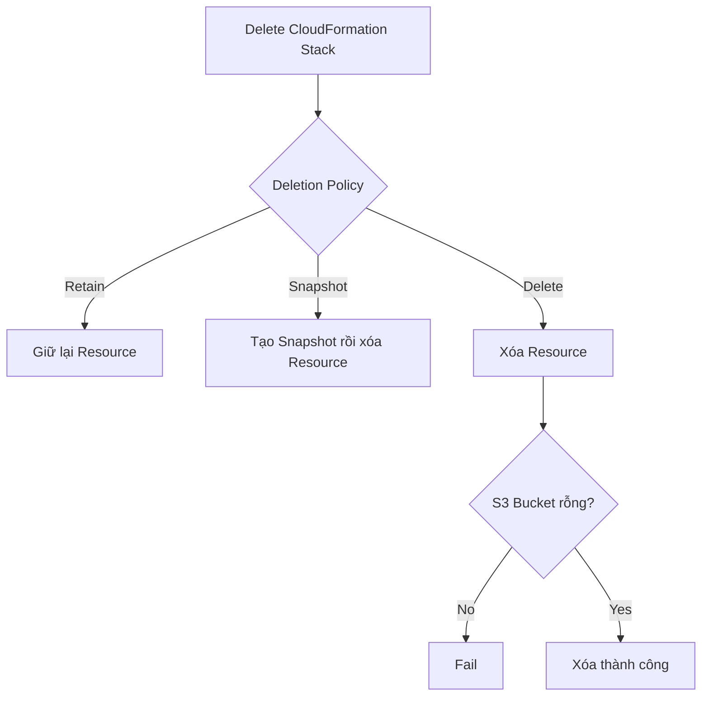
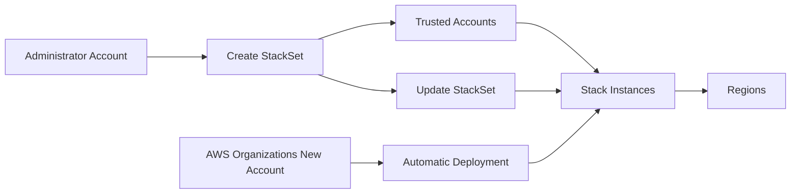

# 120. CloudFormation

## 🎯 Giới thiệu
CloudFormation là dịch vụ đưa khái niệm **Infrastructure as Code (IaC)** vào AWS.

- Viết infrastructure bằng code giúp:
  - tái sử dụng qua nhiều **account** và **region**
  - triển khai lại nhanh chóng
- CloudFormation là nền tảng cho:
  - **Elastic Beanstalk**
  - **Service Catalog**
  - **Serverless Application Model (SAM)**
- Đây là một dịch vụ quan trọng với **developer**, **sysops**, **devops** và cũng cần nắm cho **SA Pro exam**.

## 1. Quản lý vòng đời resource trong stack
CloudFormation mặc định sẽ xóa resource khi stack bị xóa, nhưng có thể điều khiển bằng **Deletion Policy**.

### Các chế độ chính
- `Retain`
  - giữ lại resource khi stack bị xóa
  - dùng để bảo toàn dữ liệu
  - áp dụng cho bất kỳ resource nào hoặc nested stack
- `Snapshot`
  - xóa resource nhưng tạo snapshot trước
  - áp dụng cho các resource hỗ trợ snapshot như:
    - **EBS volume**
    - **ElastiCache Cluster for Redis**
    - **ElastiCache ReplicationGroup**
    - **RDS DBInstance**
    - **RDS DBCluster**
    - **Redshift Cluster**
- `Delete`
  - xóa resource khi stack bị xóa
  - là hành vi mặc định cho đa số resource

### Lưu ý quan trọng
- Với **RDS DBCluster**, default behavior là `Snapshot`
- Khi xóa **S3 bucket** bằng CloudFormation, bucket phải rỗng hoàn toàn, nếu không sẽ lỗi

### Mermaid: flow quản lý xóa resource

## 2. Custom Resources, StackSets và Drift
### Custom Resources
CloudFormation có thể dùng **custom resources** được back bởi **Lambda**.

- Dùng khi:
  - service mới ra mắt nhưng chưa support trong CloudFormation
  - muốn quản lý **on-premise resource**
  - muốn **empty S3 bucket** trước khi xóa
  - muốn lấy **AMI ID** để dùng trong template
  - hoặc bất kỳ logic nào khác
- Khi stack được **create / update / delete**
  - CloudFormation sẽ invoke Lambda
  - Lambda thực hiện API calls để xử lý custom resource

### StackSets
**StackSets** cho phép tạo, update, delete stacks trên nhiều **accounts** và **regions** trong một lần thao tác.

- Có 2 loại account:
  - **administrator account**: tạo StackSet
  - **trusted accounts**: tạo, update, delete stack instances từ StackSet
- Khi update StackSet:
  - tất cả stack instances liên quan sẽ được update đồng loạt trên nhiều account và region
- Có thêm **automatic deployments**
  - nếu dùng **AWS Organizations**
  - có thể tự động deploy StackSet cho account mới
  - phù hợp để provision minimal configuration cho account mới

### Mermaid: StackSets deployment flow

### Drift
**Drift** là khi resource trong CloudFormation bị thay đổi cấu hình thủ công ngoài CloudFormation.

- CloudFormation Drift sẽ:
  - so sánh cấu hình từ template
  - so với cấu hình thực tế sau khi bị chỉnh tay
- Có thể kiểm tra:
  - toàn bộ stack
  - từng resource riêng lẻ

## 3. Secrets Manager Integration và Resource Imports
### Secrets Manager integration
CloudFormation có thể tích hợp với **Secrets Manager** trong template.

Flow cơ bản:
- tạo secret từ **Secrets Manager**
- dùng reference / `sub` function để đưa secret vào **RDS database instance**
- tạo **secret target attachment** để link secret với RDS
- khi secret rotate, password trong RDS cũng rotate theo

### Resource Imports
**Resource imports** cho phép import resource đã tồn tại trong AWS vào stack CloudFormation hiện có hoặc mới.

- Không cần xóa rồi tạo lại resource
- Khi import cần:
  - template mô tả đầy đủ toàn bộ stack
  - resource target phải có **unique identifier**
    - ví dụ với **S3 bucket** thì phải chỉ rõ bucket name
  - mỗi resource import phải có **deletion policy**
- Không thể import cùng một resource vào nhiều stacks

## 📊 Bảng tóm tắt
| Tiêu chí | Mô tả |
|----------|------|
| Mục tiêu chính | Dùng **IaC** để tạo, quản lý và tái triển khai hạ tầng AWS |
| Default delete behavior | Đa số resource bị xóa khi stack bị xóa |
| Deletion Policy | `Retain`, `Snapshot`, `Delete` |
| Custom Resources | Dùng **Lambda** để xử lý logic ngoài khả năng native của CloudFormation |
| StackSets | Quản lý stacks trên nhiều **accounts** và **regions** |
| Automatic deployments | Tự động deploy StackSets cho account mới trong **AWS Organizations** |
| Drift | Phát hiện resource bị thay đổi thủ công so với template |
| Secrets Manager | Có thể gắn secret vào **RDS** và hỗ trợ rotate password |
| Resource Imports | Import resource có sẵn vào CloudFormation mà không tạo lại |

## 💡 Mẹo ghi nhớ cho kỳ thi AWS
- Nhớ 3 keyword của **Deletion Policy**: `Retain` = giữ lại, `Snapshot` = chụp trước khi xóa, `Delete` = xóa hẳn.
- **Custom Resources** luôn gắn với **Lambda** và được invoke khi stack **create/update/delete**.
- **StackSets** = triển khai cùng một stack across nhiều **account/region**.
- **Drift** = lệch giữa cấu hình thực tế và cấu hình trong CloudFormation.
- **Resource Imports** = đưa resource có sẵn vào stack, không recreate.

## ✅ Kết luận
CloudFormation là công cụ **IaC** cốt lõi trong AWS. Với kỳ thi, cần nắm chắc các “quirks” quan trọng: **Deletion Policy**, **Custom Resources**, **StackSets**, **Drift**, **Secrets Manager integration**, và **Resource Imports**.
