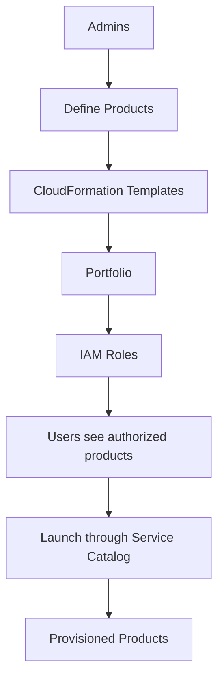

# 121. Service Catalog

## 🎯 Giới thiệu
AWS Service Catalog dùng để cung cấp cho user một **self-service portal** với các sản phẩm AWS đã được **phê duyệt trước**, thay vì cho họ tự do tạo stack theo nhiều cách khác nhau.

Mục tiêu chính:
- Giảm rủi ro user tạo tài nguyên **không compliant**
- Đảm bảo **governance**, **compliance**, và **consistency**
- Tăng **standardization** do admin kiểm soát trước

## 1. Cách Service Catalog hoạt động
Service Catalog hoạt động dựa trên **CloudFormation**.

- **Admins** tạo ra các **products**
- Mỗi **product** thực chất là một **CloudFormation template**
- Các products được gom lại thành một **portfolio**
- Mỗi **portfolio** được gán **IAM roles** để kiểm soát ai được phép truy cập

## 2. Luồng sử dụng cho user
User không dùng trực tiếp `CloudFormation`, mà chỉ dùng **Service Catalog**.

- User chỉ thấy danh sách product đã được **IAM** cho phép
- User chọn product cần dùng, ví dụ:
  - `EC2 Instance`
  - virtual machine
  - database
  - storage như `EFS`
- Khi launch, Service Catalog sẽ dùng CloudFormation template tương ứng để tạo tài nguyên
- Kết quả là **provisioned products**:
  - đã được cấu hình đúng
  - đã được tag đúng
  - sẵn sàng sử dụng

## 3. Ý nghĩa trong AWS exam
Điểm cần nhớ cho kỳ thi:

- Dùng khi user cần launch tài nguyên nhưng **không cần biết quá nhiều về AWS**
- Dùng khi tổ chức muốn:
  - kiểm soát chặt chẽ
  - giảm quyền của user
  - đảm bảo cấu hình thống nhất
- Admin định nghĩa trước template, user chỉ được launch những gì đã được cho phép

Service Catalog cũng có thể tích hợp với **self-service portals** như **ServiceNow**, để user yêu cầu tài nguyên qua portal nội bộ mà không cần nhìn thấy Service Catalog phía sau.

## 📊 Bảng tóm tắt
| Tiêu chí | Mô tả |
|----------|------|
| Mục đích | Cung cấp product AWS đã được phê duyệt trước cho user |
| Nền tảng | Dựa trên `CloudFormation` |
| Người tạo product | `Admins` |
| Đơn vị chứa product | `Portfolio` |
| Kiểm soát truy cập | `IAM roles` |
| Người dùng | Chỉ launch product được phép |
| Lợi ích | `Governance`, `Compliance`, `Consistency`, `Standardization` |
| Tích hợp | Có thể tích hợp với portal như `ServiceNow` |

## 💡 Mẹo ghi nhớ cho kỳ thi AWS
- **Service Catalog = CloudFormation đã được kiểm soát**
- **Admin định nghĩa, user chỉ được dùng**
- Nghĩ đến Service Catalog khi đề bài nói về:
  - chuẩn hóa triển khai
  - kiểm soát quyền
  - giảm độ phức tạp cho user
  - đảm bảo compliance trong tổ chức
- Nhớ chuỗi:
  - `Admins` -> `Products` -> `Portfolio` -> `IAM` -> `Users` -> `Provisioned Products`

## ✅ Kết luận
AWS Service Catalog là giải pháp để **cung cấp các AWS services đã được chuẩn hóa và phê duyệt trước** cho user thông qua **self-service portal**, với **CloudFormation** làm nền tảng và **IAM** làm cơ chế kiểm soát. Nó phù hợp khi cần **giảm quyền user**, tăng **consistency**, và hỗ trợ **governance/compliance** trong tổ chức.
