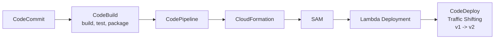

# 122. SAM - Serverless Application Model

## 🎯 Giới thiệu
- **SAM** là viết tắt của **Serverless Application Model**.
- Đây là **framework** để phát triển và triển khai **serverless applications**.
- Toàn bộ cấu hình của SAM được viết bằng **YAML**.
- SAM hỗ trợ tạo và quản lý các thành phần như:
  - **Lambda functions**
  - **DynamoDB tables**
  - **API Gateway**
  - **Step Functions State Machines**
- SAM cũng hỗ trợ chạy local một số dịch vụ như:
  - **Lambda**
  - **API Gateway**
  - **DynamoDB**
- SAM sử dụng **CloudFormation** ở backend.

## 1. Khả năng chính của SAM
- Giúp xây dựng ứng dụng serverless nhanh hơn và thuận tiện hơn.
- Hỗ trợ môi trường phát triển local để tạo **development cycle** tốt hơn.
- Khi deploy **new Lambda function versions**, SAM có thể tận dụng **CodeDeploy** để thực hiện **traffic shifting**.

## 2. Kiến trúc CI/CD cho SAM
- Theo góc nhìn thi AWS, cần nhớ **CICD Architecture for SAM**:
  - **CodeCommit**: nơi lưu source code.
  - **CodeBuild**: build, test, package code.
  - **CodePipeline**: orchestrate toàn bộ luồng triển khai.
  - **CloudFormation**: bước deploy chính trong pipeline.
  - **SAM**: được CloudFormation sử dụng trong quá trình deploy.
- Nếu deploy **Lambda function**, SAM sẽ tự động kích hoạt **CodeDeploy** để chuyển traffic từ version cũ sang version mới.

## 3. Điểm cần nhớ khi ôn thi
- **CloudFormation** là nền tảng backend của SAM.
- SAM không chỉ deploy mà còn hỗ trợ **local development**.
- Điểm quan trọng nhất:
  - Khi SAM deploy **Lambda function**, nó sẽ dùng **CodeDeploy** để làm **traffic shifting** giữa các version.
- **CloudFormation** cũng có thể deploy **API Gateway** hoặc **DynamoDB**, nhưng đó là chức năng CloudFormation thông thường.

## 📊 Bảng tóm tắt
| Tiêu chí | Mô tả |
|----------|------|
| SAM là gì | **Serverless Application Model**, framework cho serverless apps |
| Ngôn ngữ cấu hình | **YAML** |
| Dịch vụ hỗ trợ | **Lambda**, **DynamoDB**, **API Gateway**, **Step Functions State Machines** |
| Hỗ trợ local | Có, cho **Lambda**, **API Gateway**, **DynamoDB** |
| Backend | **CloudFormation** |
| CI/CD | **CodeCommit -> CodeBuild -> CodePipeline -> CloudFormation -> SAM** |
| Điểm thi quan trọng | Deploy **Lambda** bằng SAM sẽ dùng **CodeDeploy** để **traffic shifting** |

## 💡 Mẹo ghi nhớ cho kỳ thi AWS
- Nhớ câu: **SAM = YAML + Serverless + CloudFormation backend**.
- Nếu đề bài nói đến **deploy Lambda version mới** và **traffic shifting**, hãy nghĩ ngay đến **SAM + CodeDeploy**.
- Nếu hỏi về **CI/CD cho SAM**, nhớ chuỗi:
  - **CodeCommit**
  - **CodeBuild**
  - **CodePipeline**
  - **CloudFormation**
  - **SAM**
- Nếu hỏi về khả năng phát triển local, nhớ SAM hỗ trợ:
  - **Lambda**
  - **API Gateway**
  - **DynamoDB**

## ✅ Kết luận
- **SAM** là framework rất hữu ích để phát triển và triển khai **serverless applications**.
- Điểm cốt lõi cần nhớ là SAM dùng **CloudFormation** bên dưới và khi deploy **Lambda**, nó sẽ dùng **CodeDeploy** để thực hiện **traffic shifting** giữa các version.
