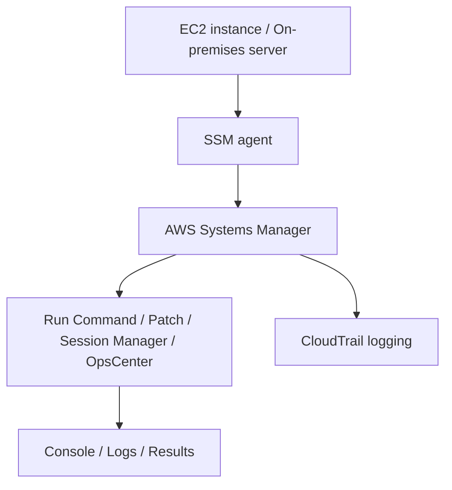
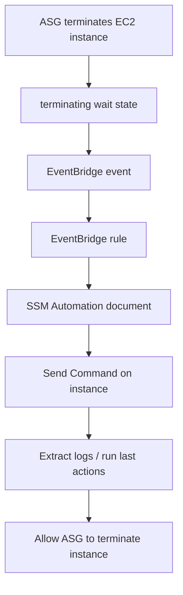
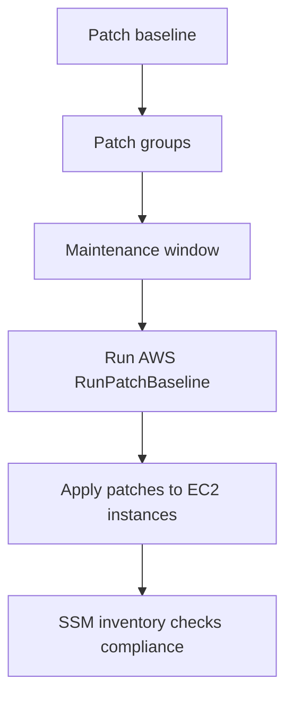
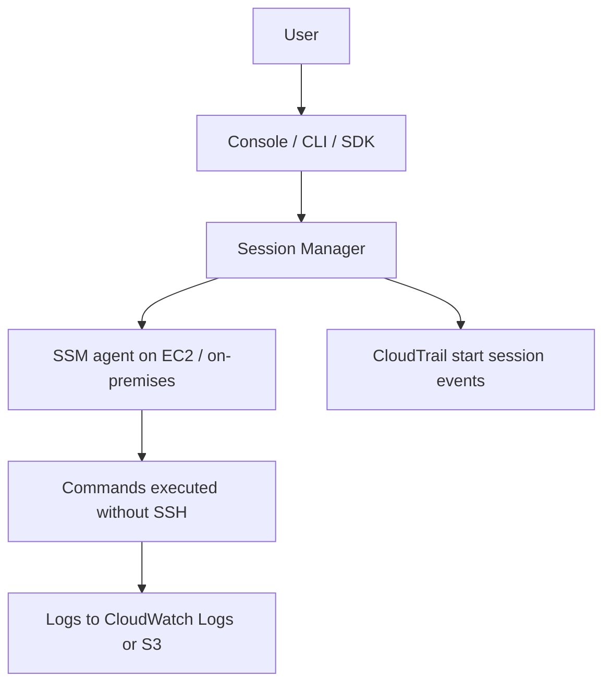

# 124. AWS Systems Manager - SSM

## 🎯 Giới thiệu
AWS Systems Manager (SSM) là dịch vụ giúp bạn quản lý **EC2 instances** và **on-premises servers** ở quy mô lớn.  
Điểm chính cần nhớ cho kỳ thi:

- Cung cấp **operational insights** về trạng thái hạ tầng
- Hỗ trợ phát hiện vấn đề và tự động hóa tác vụ vận hành
- Dùng được cho cả **Linux** và **Windows**
- Tích hợp với các dịch vụ AWS như **CloudWatch metrics** và **AWS Config**
- Là một **free service**

### Cách hoạt động tổng quát
SSM yêu cầu cài **SSM agent** trên hệ thống được quản lý:

- Trên một số **Amazon Linux AMI** và **Ubuntu AMI**, agent đã được cài sẵn
- Nếu không có sẵn thì phải cài thủ công
- Khi agent chạy, EC2 instance hoặc on-premises server sẽ tự động giao tiếp với SSM service

Nếu instance không xuất hiện trong Systems Manager, transcript nhấn mạnh 2 nguyên nhân thường gặp:

- **SSM agent** bị cấu hình sai
- Agent chưa có quyền phù hợp để **register** với Systems Manager

Với:
- **EC2 instance**: cần gắn đúng **IAM role**
- **On-premises servers**: cần **access keys** đúng để agent kết nối được

### Mermaid: luồng hoạt động của SSM

## 1. Run Command và Send Command
**Run Command** cho phép chạy:

- script
- document
- command

trên nhiều instances cùng lúc.

### Các điểm quan trọng
- Có thể nhóm tài nguyên bằng **resource groups**
- Có **rate control** để giới hạn tốc độ chạy command trên nhiều instances
- Có **error control** để quyết định:
  - fail toàn bộ
  - hoặc tiếp tục dù một số instance lỗi
- Tích hợp chặt với **IAM** và **CloudTrail**
- Không cần **SSH**
- Agent sẽ gọi API tới Systems Manager và chạy command từ bên trong instance
- Kết quả hiển thị trên console

### Flow lifecycle với Auto Scaling Group
Transcript mô tả một pattern rất giống với **lifecycle hook** của **ASG**:

- ASG chuẩn bị terminate một EC2 instance
- Instance chuyển sang trạng thái **terminating wait**
- **EventBridge** nhận event này
- Một **rule** intercept event
- Rule kích hoạt **SSM Automation document**
- Automation document có thể gọi **send command**
- Command chạy trên instance trước khi bị terminate
- Sau khi hoàn tất, ASG mới cho instance đi tiếp sang bước terminate

## 2. Patch Management
SSM cũng dùng để **patch instances at scale**.

### Thành phần chính
- **Patch baseline**: định nghĩa cần patch gì và áp dụng patch nào
- **Patch groups**: nhóm theo môi trường, ví dụ:
  - Dev
  - Test
  - Prod
- **Maintenance windows**: thời điểm cho phép chạy patch
- **AWS RunPatchBaseline**: lệnh chạy trong maintenance window
- Hỗ trợ cross-platform cho **Windows** và **Linux**
- Có thể dùng **rate control** và **error threshold**
- Theo dõi compliance bằng **SSM inventory**

### Ý chính để nhớ
- Patch được thực thi theo **patch baseline**
- Patch được áp dụng cho **patch groups**
- Chạy trong **maintenance window**
- Dùng **RunPatchBaseline**
- Theo dõi trạng thái bằng **SSM inventory**

### Mermaid: luồng patch

## 3. Session Manager và OpsCenter
### Session Manager
**Systems Manager Session Manager** cho phép mở shell an toàn vào:

- EC2 instances
- on-premises servers

qua:
- console
- CLI
- SDK

### Điểm thi rất quan trọng
- Không cần mở **port 22**
- Không cần **Bastion Host**
- Không cần **SSH keys**
- Cần:
  - **SSM agent**
  - đúng **IAM instance profile**
- Hỗ trợ:
  - Linux
  - MacOS
  - Windows

### Lợi ích nổi bật
- Các lệnh chạy qua Session Manager đều được **logged**
- Log có thể gửi tới:
  - **CloudWatch Logs**
  - **Amazon S3**
- Có **full traceability** cho mọi session
- **CloudTrail** có thể bắt các **start session events**
- Hữu ích cho **auditability** và **security**

### OpsCenter
**Systems Manager OpsCenter** giúp xử lý các vấn đề vận hành gọi là **OpsItems** liên quan đến AWS resources.

#### OpsItem có thể là:
- issues
- events
- alerts

#### OpsCenter mang lại:
- Một console duy nhất để tổng hợp thông tin từ nhiều nguồn
- Ví dụ trong transcript:
  - **CloudTrail logs**
  - **CloudWatch alarms**
  - **CloudFormation stack information**
  - metrics và thông tin liên quan khác
- Sau khi đã xác định vấn đề, có thể dùng **Automation Runbooks** để xử lý

### Cách tạo OpsItems
Transcript nêu 2 cách tiêu biểu:

- Khi **CloudWatch alarm** bị breached thì tạo **OpsItem**
- **EventBridge** có thể tạo **OpsItems** thông qua rules và targets

### Mermaid: Session Manager flow

## 📊 Bảng tóm tắt
| Tiêu chí | Mô tả |
|----------|------|
| Mục đích | Quản lý EC2 instances và on-premises servers ở quy mô lớn |
| Agent | Cần cài **SSM agent** trên hệ thống quản lý |
| Quyền truy cập | EC2 cần **IAM role**, on-premises cần **access keys** đúng |
| Run Command | Chạy script/document/command trên nhiều instances |
| Kiểm soát | Có **resource groups**, **rate control**, **error control** |
| Patch Management | Dùng **patch baseline**, **patch groups**, **maintenance windows** |
| Patch execution | Chạy bằng **AWS RunPatchBaseline** |
| Compliance | Theo dõi bằng **SSM inventory** |
| Session Manager | Mở shell an toàn không cần SSH, port 22, Bastion Host hay SSH keys |
| Logging | Ghi log vào **CloudWatch Logs** hoặc **Amazon S3** |
| Audit | **CloudTrail** theo dõi **start session events** và command activity |
| OpsCenter | Quản lý **OpsItems** từ nhiều nguồn tập trung trong một console |
| Tích hợp | Tích hợp với **CloudWatch**, **AWS Config**, **CloudTrail**, **EventBridge** |
| Chi phí | **Free service** |

## 💡 Mẹo ghi nhớ cho kỳ thi AWS
- **SSM agent + IAM role** là cặp từ khóa cực quan trọng.
- **Run Command** = chạy lệnh hàng loạt, **không cần SSH**.
- **Session Manager** = truy cập shell an toàn, **không cần port 22 / Bastion Host / SSH keys**.
- **Patch baseline + patch groups + maintenance window** = bộ 3 cần nhớ cho patching.
- **RunPatchBaseline** là lệnh trung tâm cho patch triển khai theo lịch.
- **SSM inventory** dùng để kiểm tra **patch compliance**.
- **OpsCenter** tập hợp **OpsItems** và có thể được tạo từ **CloudWatch alarm** hoặc **EventBridge**.
- **CloudTrail** luôn là điểm cần nhớ khi cần audit hành động trong SSM.

## ✅ Kết luận
AWS Systems Manager (SSM) là dịch vụ vận hành trung tâm cho việc quản lý, chạy lệnh, patch, session truy cập và xử lý sự cố trên **EC2** và **on-premises servers**.  
Các ý thi cần nhớ nhất là:

- cần **SSM agent**
- cần quyền đúng qua **IAM**
- **Run Command** không cần SSH
- **Session Manager** thay thế SSH theo cách an toàn hơn
- **Patch Management** dùng **baseline**, **groups**, **maintenance windows**
- **OpsCenter** giúp gom và xử lý **OpsItems** từ nhiều nguồn khác nhau
