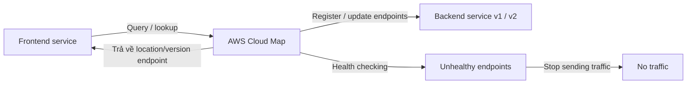

# 125. AWS Cloud Map

## 🎯 Giới thiệu
AWS Cloud Map là một **fully managed resource discovery service** dùng để **service discovery** cho các application dependency như backend services và resources.

Mục tiêu chính:
- Giúp application tìm đúng endpoint/service mà không cần sửa code thủ công nhiều lần.
- Lưu trữ thông tin như:
  - **attributes**
  - **location**
  - **health status**

## 1. Vấn đề khi không có Cloud Map
- Frontend và backend thường phải kết nối trực tiếp với nhau.
- Khi backend từ **version 1** chuyển sang **version 2**:
  - cần disconnect khỏi version 1
  - cần đổi code ở frontend
  - cần redeploy frontend
- Cách này:
  - tốn nhiều công
  - nhiều thao tác thủ công
  - khó vận hành

## 2. Cloud Map giải quyết như thế nào
- Cloud Map cho phép tạo một **map** của các backend services/resources mà application phụ thuộc vào.
- Frontend sẽ:
  - gửi **request/query** lên Cloud Map
  - hỏi nơi tìm backend service
- Khi backend đổi từ version 1 sang version 2:
  - thực hiện **API call** lên Cloud Map để cập nhật endpoint
  - frontend lần sau lookup sẽ nhận được location của version 2
- Điểm quan trọng:
  - **không cần code change** ở frontend
  - thay đổi được quản lý bên trong Cloud Map

## 3. Tích hợp và khả năng sử dụng
- Cloud Map có **health checking** để:
  - ngừng gửi traffic tới endpoint không healthy
- Application có thể sử dụng Cloud Map thông qua:
  - **SDK**
  - **API**
  - **DNS queries**
- Cloud Map được tích hợp chặt với **Route 53**

## 📊 Bảng tóm tắt
| Tiêu chí | Mô tả |
|----------|------|
| Dịch vụ | AWS Cloud Map |
| Mục đích | Service discovery |
| Cách hoạt động | Frontend query Cloud Map để tìm backend endpoint |
| Cập nhật endpoint | API call để đổi từ version 1 sang version 2 |
| Ưu điểm | Không cần code change cho mỗi lần đổi backend |
| Bảo vệ traffic | Health checking để tránh gửi traffic tới endpoint unhealthy |
| Cách dùng | SDK, API, DNS queries |
| Tích hợp | Route 53 |

## 💡 Mẹo ghi nhớ cho kỳ thi AWS
- Nhớ Cloud Map là **service discovery**.
- Khi backend thay đổi version:
  - **không sửa frontend code**
  - chỉ **update endpoint trong Cloud Map**
- Cloud Map có:
  - **health checking**
  - tích hợp với **Route 53**
- Từ khóa hay gặp trong exam:
  - **service discovery**
  - **endpoint lookup**
  - **health status**
  - **SDK / API / DNS queries**

## ✅ Kết luận
AWS Cloud Map giúp application **tìm và cập nhật backend service endpoint một cách linh hoạt**, giảm phụ thuộc vào code change thủ công và hỗ trợ **health-aware service discovery** cho hệ thống.
