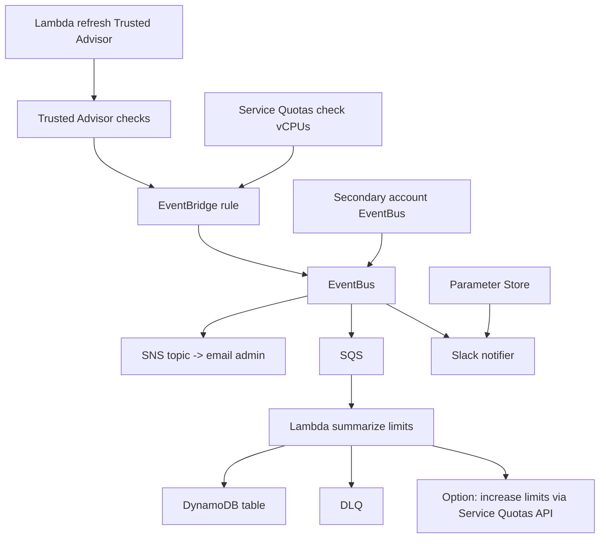

# 128. Trusted Advisor

## 🎯 Giới thiệu
Trusted Advisor là một AWS service **không cần cài đặt**, dùng để đánh giá tổng quan account và đưa ra **recommendations** theo các nhóm:

- `Cost optimization`
- `Performance`
- `Security`
- `Fault tolerance`
- `Service limits`
- `Operational excellence`

Trong đó, `Cost optimization`, `Service limits`, và `Operational excellence` được nhấn mạnh là rất quan trọng cho kỳ thi.

---

## 1. Trusted Advisor là gì và hỗ trợ gì? 🧠
- Trusted Advisor cung cấp **high-level account assessment**.
- Tất cả AWS customers đều có thể dùng **core checks and recommendations**.
- Nếu dùng **full Trusted Advisor** thì chỉ có trong:
  - `Business support plan`
  - `Enterprise support plan`
- Có thể cấu hình **weekly email notifications** trực tiếp từ console.
- Với full Trusted Advisor, còn có:
  - `CloudWatch alarms` khi chạm ngưỡng limit
  - `Programmatic access` qua `AWS Support API`

---

## 2. AWS Support Plans liên quan đến Trusted Advisor 📌
AWS có 4 support plans:

- `Basic support`
- `Developer`
- `Business`
- `Enterprise`

Những điểm cần nhớ cho exam:

- `Basic support`
  - Free
  - Có `7 core checks` của Trusted Advisor
- `Developer`
  - Có phí
  - Vẫn chỉ có `7 core checks`
- `Business` và `Enterprise`
  - Có `full set of checks`
  - Có `programmatic access` đến Trusted Advisor qua `AWS Support API`

### Bảng so sánh nhanh

| Support plan | Chi phí | Trusted Advisor checks | Programmatic access |
|---|---:|---|---|
| Basic | Free | 7 core checks | Không nêu |
| Developer | Có phí | 7 core checks | Không nêu |
| Business | Có phí | Full set of checks | Có, qua AWS Support API |
| Enterprise | Có phí | Full set of checks | Có, qua AWS Support API |

---

## 3. Giới hạn, compliance và kiến trúc monitor limits 🔍
### Điểm cần nhớ
- Trusted Advisor có thể kiểm tra xem **S3 buckets có public hay không**.
- Nhưng Trusted Advisor **không kiểm tra được objects bên trong bucket có bị public hay không**.
- Vì vậy, nếu cần kiểm tra compliance cho phần này thì nên dùng:
  - `Amazon EventBridge`
  - `S3 Events`
  - hoặc tạo `AWS Config rule`

### Về service limits
- Trusted Advisor có thể **monitor service limits**.
- Nếu muốn **increase a limit**:
  - phải **manually open a support center case**
  - hoặc dùng **AWS Service Quotas API**

### Flow kiến trúc được mô tả trong transcript
- `Lambda` định kỳ refresh `Trusted Advisor`
- Trusted Advisor checks sẽ kích hoạt `EventBridge rule`
- Cách tương tự với `Service Quotas` để check như `vCPUs`
- Nếu vượt hoặc chạm limit:
  - Event được gửi qua `EventBus`
  - Có thể đi từ account phụ sang `central primary EventBus`
- `EventBridge` có thể có nhiều targets:
  - `SNS topic` để gửi email cho admin
  - `SQS` để một `Lambda` xử lý và tổng hợp limits
  - `DynamoDB table` để lưu kết quả
  - `DLQ` nếu event không xử lý được
  - `Slack notifier` để báo cho admin
- `Parameter Store` có thể dùng để lưu securely thông tin credential của Slack
- Có thể mở rộng thêm để `Lambda` tự động tăng limit qua `Service Quotas API`

---

## 📊 Bảng tóm tắt
| Tiêu chí | Mô tả |
|----------|------|
| Mục đích | Đánh giá tổng quan account và đưa ra recommendations |
| Nhóm recommendation | Cost optimization, Performance, Security, Fault tolerance, Service limits, Operational excellence |
| Mức truy cập cơ bản | Tất cả AWS customers đều có core checks |
| Full Trusted Advisor | Chỉ có trong Business và Enterprise support plans |
| Email notification | Có thể bật weekly email notifications từ console |
| Programmatic access | Có qua AWS Support API khi dùng full Trusted Advisor |
| Giới hạn S3 | Kiểm tra bucket public, không kiểm tra object public bên trong bucket |
| Tăng service limit | Open support case hoặc dùng AWS Service Quotas API |

---

## 💡 Mẹo ghi nhớ cho kỳ thi AWS
- `Basic` và `Developer` chỉ nhớ một ý: **7 core checks**.
- `Business` và `Enterprise` thì nhớ: **full checks + AWS Support API**.
- Trusted Advisor **không đủ** để kiểm tra object public bên trong S3 bucket.
- Muốn theo dõi compliance hoặc limits ở quy mô lớn, hãy nhớ mô hình:
  - `Lambda` + `EventBridge` + `SNS/SQS/DynamoDB/DLQ/Slack`
- Khi đề bài hỏi tăng limit, đừng chọn Trusted Advisor:
  - hãy nghĩ đến `Support case` hoặc `AWS Service Quotas API`

---

## ✅ Kết luận
Trusted Advisor là công cụ kiểm tra mức độ tối ưu và an toàn ở cấp account, rất hữu ích cho exam khi liên quan đến `checks`, `support plans`, `service limits`, và `recommendations`. Điểm quan trọng nhất là phân biệt rõ: **full Trusted Advisor chỉ có ở Business và Enterprise**, còn **Basic/Developer chỉ có 7 core checks**.
