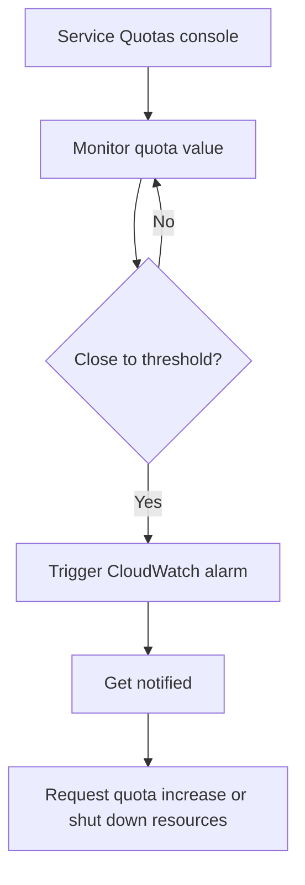

# 129. AWS Service Quotas

## 🎯 Giới thiệu
AWS Service Quotas là dịch vụ giúp bạn nhận **notifications** khi đang tiến gần đến một **service quota value threshold**.

- Mục tiêu chính: tránh bị **throttled** khi sử dụng AWS services.
- AWS đặt ra các **safety quotas** để ngăn việc lạm dụng dịch vụ.
- Khi gần chạm ngưỡng, bạn có thể:
  - biết để **request a quota increase**
  - hoặc **shut down resources** trước khi vượt limit

## 1. Cách hoạt động
Bạn có thể tạo **CloudWatch alarms** trực tiếp từ **Service Quotas console**.

Ví dụ trong transcript:

- Theo dõi quota của **Lambda concurrent executions**
- Đặt threshold, ví dụ **100**
- Khi giá trị tiến gần ngưỡng, hệ thống sẽ **trigger a CloudWatch alarm**
- Bạn sẽ được **notified**

## 2. Ý nghĩa trong thực tế
AWS Service Quotas giúp bạn chủ động quản lý giới hạn sử dụng dịch vụ.

- Biết sớm khi quota sắp hết
- Tránh tình trạng bị gián đoạn do vượt ngưỡng
- Hỗ trợ theo dõi các tài nguyên quan trọng như **Lambda concurrent executions**

## 3. Điểm cần nhớ cho kỳ thi
- **Service Quotas** dùng để theo dõi ngưỡng quota của AWS services
- Có thể tạo **CloudWatch alarms** ngay từ **Service Quotas console**
- Dùng để cảnh báo khi gần chạm quota, tránh **throttling**
- Ví dụ được nêu: **Lambda concurrent executions**

## 📊 Bảng tóm tắt
| Tiêu chí | Mô tả |
|----------|------|
| Mục đích | Nhận notifications khi gần chạm service quota threshold |
| Cách triển khai | Tạo CloudWatch alarm từ Service Quotas console |
| Ví dụ | Lambda concurrent executions |
| Lợi ích | Tránh throttling, chủ động request quota increase hoặc shut down resources |
| Tình huống sử dụng | Khi cần theo dõi quota và cảnh báo sớm trước khi vượt limit |

## 💡 Mẹo ghi nhớ cho kỳ thi AWS
- Nhớ cụm: **Service Quotas + CloudWatch alarms**
- **Quota** gần hết thì **alarm** sẽ báo
- Nếu thấy câu hỏi về cảnh báo ngưỡng sử dụng dịch vụ, nghĩ ngay đến **AWS Service Quotas**
- Ví dụ hay gặp trong transcript: **Lambda concurrent executions**

## ✅ Kết luận
AWS Service Quotas là cách để theo dõi các **quota thresholds** và nhận cảnh báo bằng **CloudWatch alarms** khi sắp chạm giới hạn. Điều này giúp bạn tránh **throttling** và chủ động xử lý trước khi vượt limit.
