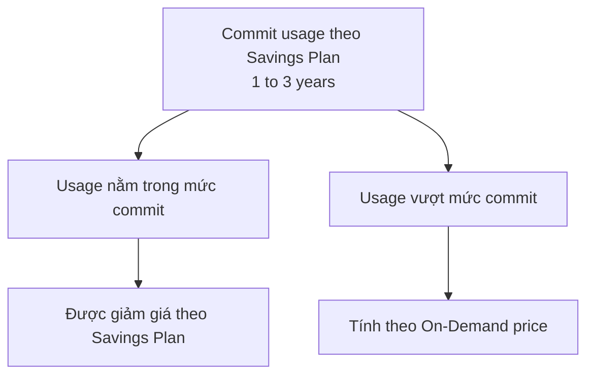

# 130. EC2 Launch Types & Savings Plan

## 🎯 Giới thiệu
Bài này nói về các **EC2 Launch types** và mô hình **Savings Plan**. Trọng tâm là cách chọn loại instance theo thời gian chạy workload, mức độ linh hoạt, độ tin cậy, và mức giảm giá khi commit dài hạn.

## 1. EC2 Launch Types
- **On Demand Instances**:
  - Phù hợp với **short workloads**.
  - Có **predictable pricing**.
  - Được xem là **very reliable**.
  - Đây thường là loại instance bạn launch đầu tiên trên console.

- **Spot Instances**:
  - Phù hợp với **very short workloads**.
  - **Cheap** nhất trong nhóm được nhắc tới.
  - Có rủi ro bị AWS **reclaim capacity**, nên **not considered reliable**.
  - Hợp với workload **resilient to failures** và cần **huge cost savings**.

- **Reserved Instances (RI)**:
  - Phù hợp với **long workloads**.
  - Cần commit tối thiểu **1 year**.
  - Có:
    - **Reserved Instances** cho long workloads.
    - **Convertible Reserved Instances** cho long workloads nhưng **flexible instance types**.

- **Dedicated Instances** và **Dedicated Hosts**:
  - **Dedicated Instances**: đảm bảo **no other customers will share your hardware**.
  - **Dedicated Hosts**: bạn **book an entire physical server** và có thể **control instance placements** trong server.
  - Use case nổi bật:
    - Phù hợp cho **software licenses** hoạt động ở mức **core** hoặc **socket**.
    - Có thể đặt **host affinity** để instance reboot vẫn ở cùng host.

## 2. Savings Plan
Savings Plan là **new pricing model** để giảm giá dựa trên **long-term usage** và có xu hướng sẽ thay thế **Reserved Instances** theo thời gian.

### Cách hoạt động
- Bạn commit một mức usage nhất định, ví dụ:
  - **$10 per hour**
  - trong **1 to 3 years**
- Phần usage **beyond the savings plan** sẽ bị tính theo **on-demand price**.
- Mục tiêu là đạt giảm giá trước, rồi phần vượt mức mới tính On-Demand.

### Các loại Savings Plan
- **EC2 Instance Savings Plans**
  - Giảm giá lên tới **72%**.
  - Mức discount giống **standard RIs**.
  - Linh hoạt ở:
    - chọn **instance family** như **M5, C5**
    - cố định theo **region**
    - linh hoạt theo **size** trong family, ví dụ **m5 large**, **m5.4xlarge**
    - chọn **OS**: **Windows**, **Linux**
    - chọn **tenancy**: **dedicated** hoặc **default**

- **Compute Savings Plan**
  - Giảm giá lên tới **66%**.
  - Mức discount giống **convertible RIs**.
  - Linh hoạt hơn:
    - chuyển giữa **instance families** như **C5** sang **M5**
    - chuyển **across regions**
    - áp dụng cho nhiều loại compute:
      - **EC2 instances**
      - **Fargate**
      - **Lambda**
    - có thể thay đổi **OS** và **tenancy**

- **SageMaker Savings Plan**
  - Giảm tới **64%** cho **SageMaker workloads**.

### Mermaid flow

## 3. So sánh nhanh
| Loại | Khi dùng | Điểm chính | Mức linh hoạt / lưu ý |
|------|----------|------------|------------------------|
| On Demand Instances | Short workloads | Predictable pricing, reliable | Dễ dùng, phù hợp khởi đầu |
| Spot Instances | Very short workloads | Rẻ, nhưng có rủi ro bị reclaim | Không reliable |
| Reserved Instances | Long workloads | Cần commit tối thiểu 1 year | Có standard RI và Convertible RI |
| Dedicated Instances | Khi cần hardware riêng | Không share hardware với customer khác | Hữu ích cho một số license |
| Dedicated Hosts | Khi cần kiểm soát host | Book whole physical server, control placement | Có host affinity |
| EC2 Instance Savings Plans | Long-term EC2 usage | Up to 72% discount | Cố định region, linh hoạt size |
| Compute Savings Plan | Nhu cầu compute linh hoạt | Up to 66% discount | Đổi family, region, EC2/Fargate/Lambda |
| SageMaker Savings Plan | SageMaker workloads | Up to 64% discount | Dành riêng cho SageMaker |

## 📊 Bảng tóm tắt
| Tiêu chí | Mô tả |
|----------|------|
| On Demand Instances | Dành cho short workloads, predictable pricing, reliable |
| Spot Instances | Rẻ cho very short workloads nhưng có nguy cơ bị AWS reclaim capacity |
| Reserved Instances | Phù hợp long workloads, commit tối thiểu 1 year |
| Convertible Reserved Instances | Long workloads nhưng flexible instance types |
| Dedicated Instances | Không share hardware với customer khác |
| Dedicated Hosts | Book entire physical server, control instance placement, có host affinity |
| Savings Plan | Pricing model mới cho long-term usage |
| EC2 Instance Savings Plans | Up to 72% discount, cố định region, linh hoạt size, OS, tenancy |
| Compute Savings Plan | Up to 66% discount, đổi family, region, EC2/Fargate/Lambda |
| SageMaker Savings Plan | Up to 64% off cho SageMaker workloads |

## 💡 Mẹo ghi nhớ cho kỳ thi AWS
- **On Demand = nhanh, rõ giá, reliable**.
- **Spot = rẻ nhưng không ổn định**.
- **RI = cam kết dài hạn, ít linh hoạt hơn Savings Plan**.
- **EC2 Instance Savings Plan = linh hoạt trong cùng instance family và region**.
- **Compute Savings Plan = linh hoạt nhất trong nhóm Savings Plan**.
- **Dedicated Hosts** gắn với use case về **license ở core/socket level** và **host affinity**.
- Nhớ các con số:
  - **72%**: EC2 Instance Savings Plans
  - **66%**: Compute Savings Plan
  - **64%**: SageMaker Savings Plan

## ✅ Kết luận
Bài học này tập trung vào cách chọn đúng **EC2 Launch type** theo workload và độ tin cậy, đồng thời hiểu cách **Savings Plan** tối ưu chi phí cho usage dài hạn. Điểm quan trọng nhất là phân biệt:
- **On Demand** cho nhu cầu ngắn hạn và ổn định,
- **Spot** cho chi phí thấp nhưng chấp nhận rủi ro,
- **RI/Savings Plan** cho cam kết dài hạn,
- và **Compute Savings Plan** là loại linh hoạt nhất trong nhóm Savings Plan.
