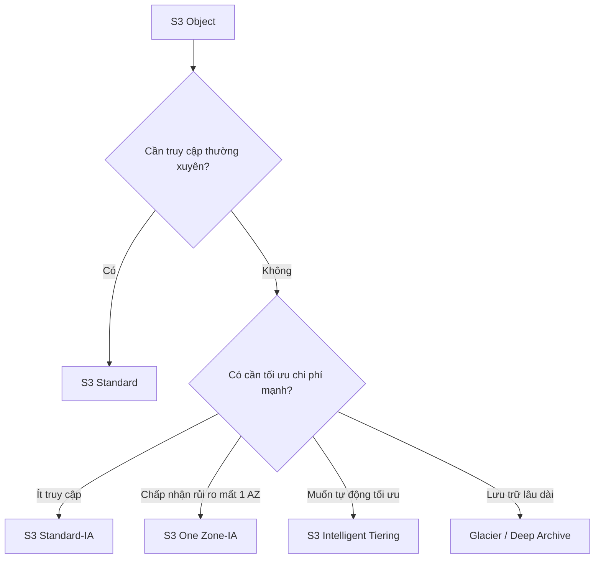
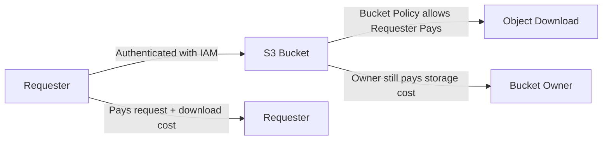

# 131. S3 Cost Savings

## 🎯 Giới thiệu
Bài này nói về cách giảm chi phí khi dùng **S3**. Trọng tâm gồm 3 nhóm chính:

- Chọn đúng **S3 storage classes**
- Dùng **S3 Lifecycle Rules** để tự động chuyển lớp hoặc xóa object
- Dùng **S3 Requester Pays** để chuyển chi phí download cho người request

## 1. S3 Storage Classes 🗂️
Các **storage classes** giúp cân bằng giữa chi phí lưu trữ và chi phí truy xuất:

- **S3 Standard - General Purpose**
  - Lớp mặc định, không nhấn mạnh vào tiết kiệm chi phí trong transcript.

- **S3 Standard - Infrequent Access**
  - Dùng cho object ít được truy cập.
  - Lưu trữ rẻ hơn, nhưng khi truy cập sẽ tốn thêm chi phí.

- **S3 One Zone - Infrequent Access**
  - Rẻ hơn để lưu trữ.
  - Nếu mất toàn bộ một **AZ** thì sẽ mất quyền truy cập object.
  - Phù hợp với dữ liệu có thể khôi phục hoặc tạo lại, ví dụ: thumbnails từ ảnh S3.

- **S3 Intelligent Tiering**
  - Tự động di chuyển object giữa các tier để tối ưu chi phí.
  - Có phí monitoring cho mỗi object được theo dõi.
  - Ít phải quản lý thủ công hơn và có thể tiết kiệm tiền.

- **Amazon S3 Glacier Instant Retrieval**
  - Glacier tier cho phép truy xuất rất nhanh.

- **S3 Glacier Flexible Retrieval**
  - Cho nhiều lựa chọn hơn về cách retrieve file.

- **S3 Glacier Deep Archive**
  - Tiết kiệm chi phí nhất.
  - Nhưng thời gian retrieve và chuyển giữa các lớp sẽ lâu nhất.

### Mermaid: flow chọn lớp lưu trữ

## 2. S3 Lifecycle Rules và Compression ⚙️
Hai cách tiết kiệm chi phí tiếp theo là:

- **S3 Lifecycle Rules**
  - Tự động chuyển object sang tier khác sau một khoảng thời gian.
  - Có thể tự động xóa object.
  - Giảm công quản lý và tiết kiệm chi phí.

- **Compress objects before uploading**
  - Nén object trước khi đưa lên S3.
  - Giảm dung lượng lưu trữ.
  - Từ đó giảm tiền phải trả.

## 3. S3 Requester Pays 💸
**S3 Requester Pays** giúp chuyển chi phí cho người request dữ liệu:

- Bình thường, **bucket owner** trả cho:
  - chi phí lưu trữ
  - chi phí data transfer liên quan đến bucket

- Khi bật **Requester Pays**:
  - người request sẽ trả tiền cho:
    - request
    - data download từ bucket
  - bucket owner vẫn trả chi phí lưu trữ dữ liệu

- Trường hợp dùng hợp lý:
  - chia sẻ dataset lớn cho nhiều account
  - không muốn tự chịu toàn bộ network cost

- Điều kiện theo transcript:
  - cần **S3 bucket policy** để Requester Pays hoạt động
  - user phải được authenticated bằng **IAM**

### Lưu ý quan trọng về cross-account
- Nếu user truy cập qua **assumed cross-account IAM role**:
  - owner của account chứa role đó sẽ là người trả tiền request
- Muốn người khác tự trả tiền:
  - không dùng IAM role kiểu đó
  - dùng **S3 bucket policy**
  - đảm bảo user được xác thực bằng **IAM role** hoặc **IAM user** thuộc account của họ

### Mermaid: request flow của Requester Pays

## 📊 Bảng tóm tắt
| Tiêu chí | Mô tả |
|----------|------|
| **S3 Standard-IA** | Ít truy cập, rẻ hơn để lưu trữ nhưng tốn hơn khi đọc |
| **S3 One Zone-IA** | Rẻ hơn nữa nhưng mất toàn bộ **AZ** sẽ mất truy cập |
| **S3 Intelligent Tiering** | Tự động chuyển tier để tối ưu chi phí, có phí monitoring |
| **Glacier tiers** | Dùng cho dữ liệu lạnh, càng tiết kiệm thì retrieve càng lâu |
| **S3 Lifecycle Rules** | Tự động chuyển tier hoặc xóa object để giảm chi phí |
| **Compression** | Nén trước khi upload để giảm dung lượng lưu trữ |
| **S3 Requester Pays** | Người request trả tiền download và request, owner vẫn trả storage |

## 💡 Mẹo ghi nhớ cho kỳ thi AWS
- **IA = rẻ hơn lưu trữ, đắt hơn khi truy cập**
- **One Zone-IA = rủi ro mất 1 AZ**
- **Intelligent Tiering = tự động, nhưng có phí monitoring**
- **Glacier = càng lạnh càng rẻ, càng lâu mới lấy ra**
- **Lifecycle Rules = tự động hóa tiết kiệm chi phí**
- **Requester Pays = ai download thì người đó trả tiền**
- Nếu thấy **cross-account IAM role** trong bối cảnh **Requester Pays**, hãy nhớ chi phí có thể thuộc về **owner của role account** theo transcript

## ✅ Kết luận
Cách tiết kiệm chi phí với **S3** trong bài này xoay quanh việc:

- chọn đúng **storage class**
- dùng **Lifecycle Rules**
- nén dữ liệu trước khi upload
- bật **Requester Pays** khi muốn chuyển chi phí download cho người dùng khác

Đây là các ý rất dễ xuất hiện trong câu hỏi AWS về **cost optimization** và **S3 pricing behavior**.
