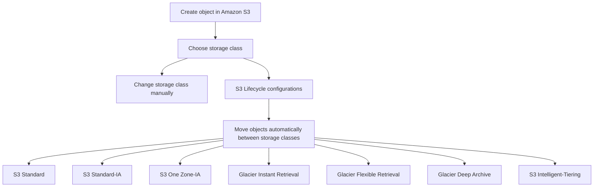

# 132. S3 Storage Classes - Reminder

## 🎯 Giới thiệu
- Amazon S3 có nhiều **storage classes** khác nhau:
  - **S3 Standard - General Purpose**
  - **S3 Standard - Infrequent Access (IA)**
  - **S3 One Zone - Infrequent Access**
  - **Glacier Instant Retrieval**
  - **Glacier Flexible Retrieval**
  - **Glacier Deep Archive**
  - **S3 Intelligent-Tiering**
- Khi tạo object trong S3, bạn có thể:
  - chọn storage class ngay từ đầu
  - thay đổi storage class thủ công
  - dùng **S3 Lifecycle configurations** để tự động chuyển object giữa các classes

## 1. Durability và Availability
- **Durability**: mức độ object bị mất bởi Amazon S3.
  - S3 có durability rất cao, gọi là **11 nines**
  - Theo transcript, nếu lưu **10 million objects**, trung bình có thể mất **1 object mỗi 10,000 năm**
  - **Durability giống nhau cho tất cả storage classes** trong S3
- **Availability**: mức độ service sẵn sàng để truy cập.
  - **Phụ thuộc vào storage class**
  - Cần lưu ý khi thiết kế application vì có thể có thời gian service không sẵn sàng

## 2. Các S3 Storage Classes 📦
- **S3 Standard**
  - Dùng cho **frequently accessed data**
  - Mặc định khi dùng S3
  - **Low latency**, **high throughput**
  - **99.99% availability**
  - Có thể chịu được **2 concurrent facility failures** phía AWS
  - Use cases: **big data analytics**, **mobile and gaming applications**, **content distribution**
- **S3 Standard-IA**
  - Dùng cho dữ liệu **ít truy cập hơn** nhưng cần truy cập nhanh khi cần
  - **Lower cost** hơn S3 Standard, nhưng có **retrieval cost**
  - **99.9% availability**
  - Use cases: **Disaster Recovery** và **backups**
- **S3 One Zone-IA**
  - Chỉ lưu trong **một AZ**
  - Nếu AZ bị phá hủy thì dữ liệu có thể bị mất
  - **99.5% availability**
  - Use cases: **secondary copy of backups**, hoặc dữ liệu có thể **recreate**
- **Glacier Instant Retrieval**
  - Low cost object storage cho **archiving and backup**
  - Có **milliseconds retrieval**
  - Phù hợp với dữ liệu truy cập khoảng **once a quarter**
  - **Minimum storage duration: 90 days**
- **Glacier Flexible Retrieval**
  - Tên cũ là **Amazon S3 Glacier**
  - Có 3 kiểu retrieval:
    - **Expedited**: 1-5 minutes
    - **Standard**: 3-5 hours
    - **Bulk**: free, 5-12 hours
  - **Minimum storage duration: 90 days**
- **Glacier Deep Archive**
  - Dành cho **long term storage**
  - Retrieval:
    - **Standard**: 12 hours
    - **Bulk**: 48 hours
  - **Lowest cost**
  - **Minimum storage duration: 180 days**
- **S3 Intelligent-Tiering**
  - Tự động chuyển object giữa các access tiers theo **usage patterns**
  - Có:
    - **small monthly monitoring fee**
    - **auto tiering fee**
    - **no retrieval charges**
  - Các tier:
    - **Frequent Access tier**: default
    - **Infrequent Access tier**: cho object không access trong khoảng **30 days**
    - **Archive Instant Access tier**: tự động cho object không access quá **90 days**
    - **Archive Access tier**: optional, cấu hình từ **90 days to 700+ days**
    - **Deep Archive Access tier**: optional, cấu hình cho object không access từ **180 days to 700+ days**

## 3. Điểm cần nhớ khi so sánh ⚖️
- **Durability**: tất cả đều là **11 nines**
- **Availability** giảm dần theo loại storage class
- **Retrieval cost** xuất hiện ở một số class như **IA** và **Glacier**
- **Storage duration minimum** rất quan trọng với các **Glacier classes**
- **S3 Intelligent-Tiering** phù hợp khi muốn S3 tự động tối ưu tier theo usage

## 📊 Bảng tóm tắt
| Tiêu chí | Mô tả |
|----------|------|
| Durability | **11 nines** cho tất cả S3 storage classes |
| Availability | Khác nhau theo class, ví dụ: **S3 Standard 99.99%**, **Standard-IA 99.9%**, **One Zone-IA 99.5%** |
| Truy cập dữ liệu | Dữ liệu truy cập thường xuyên dùng **S3 Standard**; ít truy cập hơn dùng **IA** hoặc **Glacier** |
| Chi phí | **Glacier** và **IA** rẻ hơn nhưng có thể có **retrieval cost** |
| Tốc độ retrieve | **Instant Retrieval**: milliseconds; **Flexible Retrieval** và **Deep Archive** có thời gian chờ dài hơn |
| Tự động phân tầng | **S3 Intelligent-Tiering** tự move object theo usage patterns |
| Lifecycle | **S3 Lifecycle configurations** có thể tự động chuyển object giữa các storage classes |

## 💡 Mẹo ghi nhớ cho kỳ thi AWS
- Nhớ công thức: **Durability = 11 nines, giống nhau cho mọi class**
- **Availability** là điểm phân biệt chính giữa các class
- **S3 Standard** = mặc định, dùng cho dữ liệu truy cập thường xuyên
- **Standard-IA** = ít truy cập, cần nhanh khi cần, có retrieval cost
- **One Zone-IA** = chỉ một AZ, phù hợp backup thứ cấp hoặc dữ liệu có thể tạo lại
- **Glacier** = lưu trữ lạnh, rẻ hơn nhưng đổi lại là thời gian retrieve lâu hơn
- **Intelligent-Tiering** = để S3 tự động quản lý tier theo cách dùng thực tế

## ✅ Kết luận
- S3 có nhiều storage classes để cân bằng giữa **cost**, **availability**, và **retrieval speed**
- Đối với kỳ thi AWS, cần nắm:
  - tên từng class
  - mục đích sử dụng
  - availability tương đối
  - retrieval behavior
  - minimum storage duration của các **Glacier classes**
- **S3 Intelligent-Tiering** và **S3 Lifecycle configurations** là hai cơ chế quan trọng để tự động tối ưu lưu trữ
