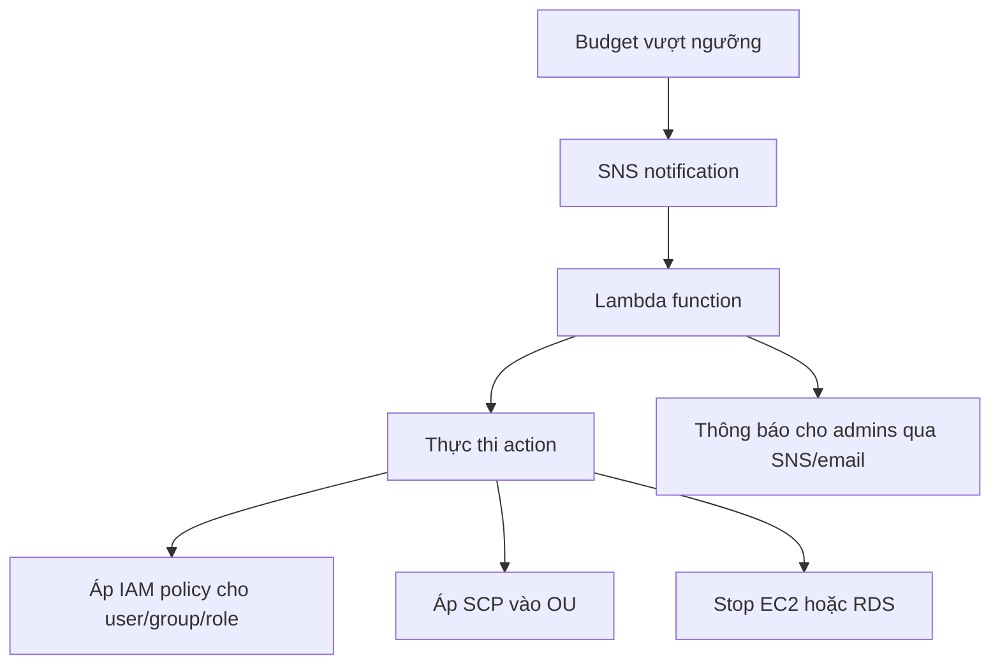

# 133. AWS Budgets & Cost Explorer

## 🎯 Giới thiệu
AWS cung cấp thêm các công cụ để quản lý chi phí:
- **AWS Budgets**: tạo budget và nhận alarm khi chi phí hoặc usage vượt ngưỡng.
- **Budget Actions**: tự động thực thi hành động khi budget bị vượt.
- **Cost Explorer**: trực quan hóa, phân tích và dự báo cost/usage theo thời gian.

## 1. AWS Budgets
AWS Budgets cho phép:
- Tạo budget theo 4 loại:
  - **usage**
  - **cost**
  - **reservation**
  - **savings plan**
- Nhận alarm khi vượt budget.
- Theo dõi **utilization** của **reserved instances** cho:
  - **EC2**
  - **ElastiCache**
  - **RDS**
  - **Redshift**
- Thiết lập tối đa **5 SNS notifications per budget**.

Điểm quan trọng:
- Budget rất **granular**.
- Có thể filter theo:
  - service
  - linked account
  - tag
  - purchase option
  - instance type
  - region
  - availability zone
  - API operation
  - và các filter khác tương tự **Cost Explorer**
- **Hai budget đầu tiên miễn phí**, sau đó tính **2 cents/day per budget**.

## 2. Budget Actions và kiến trúc quản lý budget
**Budget Actions** dùng để chạy hành động khi budget vượt ngưỡng cost hoặc usage nhằm giảm overspending ngoài ý muốn.

### 2.1 Ba loại action
- Áp dụng **IAM policy** cho:
  - user
  - group
  - IAM role
- Áp dụng **Service Control Policy (SCP)** trực tiếp vào **OU**
- Tự động **stop EC2** hoặc **RDS instances**

### 2.2 Cách thực thi action
- Có thể **tự động**
- Hoặc cần **workflow approval** trước khi áp dụng

### 2.3 Flow quản lý budget

### 2.4 Centralized Budget Management
- Budget được tạo trong **management account**
- Mỗi **member account** muốn theo dõi sẽ có một budget riêng
- Có thể dùng **account filter** để budget gắn với từng account cụ thể
- Khi vượt ngưỡng:
  - gửi notification vào **SNS**
  - SNS kích hoạt **Lambda**
  - Lambda gọi API để **move account** sang một **restrictive OU**
  - OU này đã có **SCP** giới hạn sẵn
- Lambda cũng có thể gửi email cho admins qua **SNS topic**

### 2.5 Decentralized Budget Management
- Budget được quản lý trực tiếp trong **member accounts**
- Có thể dùng **CloudFormation StackSets** để triển khai đồng loạt
- Mỗi member account có budget riêng
- Khi đến ngưỡng:
  - gửi SNS
  - có thể trigger **Lambda**
  - ví dụ action: **stop all EC2 instances**

## 3. Cost Explorer
**Cost Explorer** là dịch vụ để:
- Trực quan hóa, hiểu và quản lý **AWS cost and usage over time**
- Tạo **custom reports** để phân tích cost và usage data

### Mức độ phân tích
- Ở mức cao:
  - xem **total cost**
  - xem usage across all accounts
- Đi sâu hơn:
  - theo **monthly**
  - **hourly**
  - **resource level**

### Giá trị chính
- Giúp chọn **optimal savings plan**
- Có thể **forecast cost/usage up to 12 months in advance**
- Dựa trên **previous usage**

### Giao diện
- Có nhiều **filters**
- Dùng cùng nhóm filter như **AWS Budgets**
- Có các **detailed graphs** thể hiện cách cost được phân bổ theo thời gian

## 📊 Bảng tóm tắt
| Tiêu chí | Mô tả |
|----------|------|
| AWS Budgets | Tạo budget và nhận alarm khi vượt ngưỡng |
| Loại budget | usage, cost, reservation, savings plan |
| Budget Actions | Chạy action khi budget vượt ngưỡng |
| Action types | IAM policy, SCP vào OU, stop EC2/RDS |
| Centralized | Budget tạo trong management account, theo dõi member accounts |
| Decentralized | Budget nằm trong member accounts, có thể triển khai bằng CloudFormation StackSets |
| SNS | Dùng để gửi notification, tối đa 5 notifications per budget |
| Cost Explorer | Phân tích, trực quan hóa, báo cáo cost và usage |
| Forecast | Dự báo tới 12 tháng dựa trên usage trước đó |

## 💡 Mẹo ghi nhớ cho kỳ thi AWS
- **Budgets = cảnh báo và kiểm soát**
- **Budget Actions = tự động hóa hành động khi vượt ngưỡng**
- **Cost Explorer = phân tích và dự báo**
- Nhớ rằng:
  - **Budgets** và **Cost Explorer** dùng nhiều **filter giống nhau**
  - Budget Actions có thể tác động lên **IAM policy**, **SCP**, hoặc **EC2/RDS**
  - **Centralized** dùng management account
  - **Decentralized** dùng member accounts và có thể triển khai bằng **StackSets**
- Khi cần giảm overspending, hãy nhớ luồng:
  - **Budget threshold -> SNS -> Lambda -> action**

## ✅ Kết luận
AWS Budgets giúp đặt ngưỡng và nhận cảnh báo chi phí/usage, trong khi Budget Actions cho phép tự động phản ứng khi vượt ngưỡng. Cost Explorer hỗ trợ phân tích, theo dõi và dự báo chi phí để chọn savings plan phù hợp hơn.
