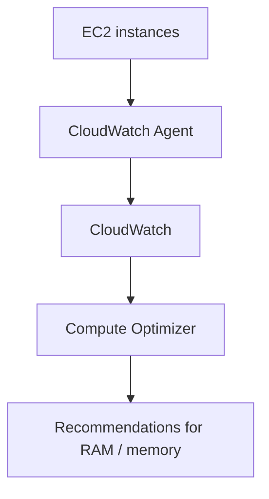

# 134. AWS Compute Optimizer

## 🎯 Giới thiệu
AWS Compute Optimizer được dùng để:
- Giảm cost
- Cải thiện performance
- Đề xuất AWS resources tối ưu cho workload

Dịch vụ này phân tích:
- `EC2 instances`
- `Auto Scaling groups`

Từ đó xác định resource nào:
- `over provisioned`
- `under provisioned`

## 1. Cơ chế hoạt động
Compute Optimizer dùng:
- `machine learning`
- `CloudWatch metrics`

Mục tiêu là:
- Phân tích resource configuration
- Theo dõi mức độ utilization
- Đưa ra recommendation phù hợp để tối ưu cost và performance

## 2. Supported resources
Các resource được Compute Optimizer hỗ trợ:
- `EC2 instances`
- `Auto Scaling groups`
- `EBS volumes`
- `Lambda functions`

Lợi ích được nhắc tới trong transcript:
- Có thể giảm cost lên đến `25%`
- Recommendations có thể export vào `Amazon S3`

## 3. CloudWatch Agent và memory recommendation
Nếu muốn Compute Optimizer phân tích thêm:
- `memory utilization`
- `RAM`

thì cần cài `CloudWatch Agent` trên `EC2 instances`.

Luồng hoạt động:

Điểm cần nhớ:
- `CloudWatch Agent` gửi metrics, bao gồm `RAM`, lên `CloudWatch`
- Sau đó `Compute Optimizer` đọc metrics từ `CloudWatch` để đưa ra recommendation về memory/RAM
- `CloudWatch Agent` **không cần thiết** nếu chỉ phân tích:
  - `CPU`
  - `NetworkIn/Out`
  - `DiskReadOps`
  - `DiskWriteOps`

## 📊 Bảng tóm tắt
| Tiêu chí | Mô tả |
|----------|------|
| Mục đích | Giảm cost và cải thiện performance bằng recommendation |
| Cách phân tích | Dùng `machine learning` và `CloudWatch metrics` |
| Resource hỗ trợ | `EC2 instances`, `Auto Scaling groups`, `EBS volumes`, `Lambda functions` |
| Kết quả | Xác định `over provisioned` hoặc `under provisioned` |
| Xuất kết quả | Recommendations có thể export sang `Amazon S3` |
| Memory analysis | Cần `CloudWatch Agent` để lấy metrics về `RAM` |
| Không cần agent khi | Chỉ phân tích `CPU`, `NetworkIn/Out`, `DiskReadOps`, `DiskWriteOps` |

## 💡 Mẹo ghi nhớ cho kỳ thi AWS
- `Compute Optimizer` = công cụ **recommend optimal resources**
- Nhớ 2 nguồn dữ liệu chính:
  - `resource configuration`
  - `CloudWatch metrics`
- Nếu đề bài hỏi về `RAM/memory recommendation` trên `EC2`, hãy nghĩ tới `CloudWatch Agent`
- Nếu chỉ hỏi `CPU` hoặc `NetworkIn/Out`, `CloudWatch Agent` không bắt buộc
- Nhớ khả năng export recommendation sang `Amazon S3`

## ✅ Kết luận
AWS Compute Optimizer giúp phân tích tài nguyên AWS để tìm cách tối ưu cost và performance. Dịch vụ này hỗ trợ `EC2`, `Auto Scaling groups`, `EBS volumes`, và `Lambda functions`, đồng thời có thể dùng `CloudWatch Agent` để lấy thêm dữ liệu memory/RAM phục vụ recommendation.
