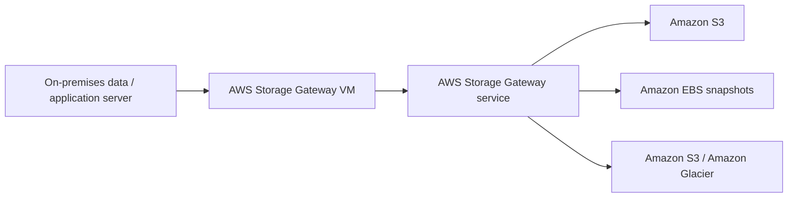

# 137. Storage Gateway

## 🎯 Giới thiệu
AWS Storage Gateway là cầu nối giữa **on-premises data** và **AWS cloud data** trong bối cảnh **hybrid cloud**.

- Mục tiêu chính:
  - Kết nối dữ liệu on-premises với AWS.
  - Hỗ trợ **disaster recovery**.
  - Hỗ trợ **backup and restore**.
  - Hỗ trợ **cloud migration**.
  - Làm **on-premises cache** để truy cập file với độ trễ thấp.
- Dịch vụ này đặc biệt hữu ích khi muốn “đưa” dữ liệu S3 hoặc storage AWS ra phía on-premises theo cách mà ứng dụng vẫn dùng giao thức quen thuộc.

## 1. AWS Storage Gateway là gì?
- Storage Gateway là **bridge** giữa dữ liệu on-premises và cloud của AWS.
- Gateway phải được **cài đặt và chạy trong corporate data center**.
- Trong một số trường hợp, người dùng không có virtual servers để chạy thêm gateway.

### Các use case chính
- **Disaster recovery**: backup dữ liệu on-premises lên cloud.
- **Backup and restore**: phục vụ migration hoặc khôi phục dữ liệu.
- **Mở rộng storage**: dữ liệu “ấm”/dùng thường xuyên ở on-premises, dữ liệu “lạnh” hơn ở AWS.
- **Cache tại chỗ**: lưu bản cache để truy cập file nhanh hơn.

## 2. S3 File Gateway
- Dùng để đưa **Amazon S3** ra như một **standard network file system** cho application server on-premises.
- Hỗ trợ giao thức:
  - **NFS**
  - **SMB**
- Cách hoạt động:
  - Ứng dụng on-premises truy cập như file share bình thường.
  - Bên trong, Storage Gateway dịch request thành **HTTPS request** tới **Amazon S3**.
- Dữ liệu:
  - File Gateway chỉ cache **most recently used data**.
  - Không phải toàn bộ bucket nằm trên gateway.
- Storage class:
  - Có thể dùng nhiều storage class như **S3 Standard**, **S3 Standard-IA**, **S3 One Zone-IA**, **S3 Intelligent-Tiering**.
  - Lecture nêu rằng không dùng **Glacier** trực tiếp cho bucket của File Gateway.
  - Có thể dùng **lifecycle policy** để chuyển object sang **S3 Glacier** để archive.
- Security/authentication:
  - Cần tạo **IAM roles** cho từng File Gateway.
  - Nếu dùng **SMB**, có tích hợp với **Active Directory** để xác thực người dùng.

## 3. Volume Gateway và Tape Gateway
### Volume Gateway
- Dùng cho **block storage** qua **iSCSI protocol**.
- Backed by **Amazon S3**.
- Mục tiêu:
  - Backup volumes của on-premises servers.
  - Tạo **Amazon EBS snapshots** backed by S3.
  - Hỗ trợ restore on-premises volumes khi cần.
- Có 2 kiểu:
  - **Cached volumes**: truy cập low-latency vào volume data gần đây.
  - **Stored volumes**: toàn bộ dataset ở on-premises, và backup theo lịch lên **Amazon S3**.

### Tape Gateway
- Dùng khi doanh nghiệp đang có hệ thống backup bằng **physical tapes**.
- Hoạt động như **virtual tape library (VTL)**.
- Backed by **Amazon S3** và **Glacier**.
- Sử dụng:
  - Quy trình backup theo kiểu tape.
  - Giao diện **iSCSI**.
  - Tương thích với các **backup software vendors** phổ biến.
- Có thể chuyển tapes sang **Glacier** và **Glacier Deep Archive** để archive.

## 📊 Bảng tóm tắt
| Tiêu chí | Mô tả |
|----------|------|
| Mục tiêu | Kết nối on-premises với AWS trong mô hình hybrid cloud |
| S3 File Gateway | Expose S3 như file share qua **NFS/SMB**, dịch sang **HTTPS** |
| Volume Gateway | **Block storage** qua **iSCSI**, backup volumes bằng **EBS snapshots** |
| Tape Gateway | **VTL** cho backup tape, backed by **S3/Glacier** |
| Cache | File Gateway và cached volumes hỗ trợ dữ liệu truy cập gần đây |
| Authentication | **IAM roles** cho File Gateway, **Active Directory** cho SMB |
| Archive | Dùng **lifecycle policy** hoặc tape archival sang **Glacier** / **Glacier Deep Archive** |

## 💡 Mẹo ghi nhớ cho kỳ thi AWS
- **File Gateway = File share**: nhớ cặp **NFS/SMB** và **S3**.
- **Volume Gateway = Block storage**: nhớ **iSCSI** và **EBS snapshots**.
- **Tape Gateway = Tape backup**: nhớ **VTL**, **S3**, **Glacier**.
- Nếu đề bài nói:
  - “On-prem app cần truy cập S3 như file system” -> nghĩ ngay **S3 File Gateway**.
  - “Backup volume on-prem, restore được” -> nghĩ **Volume Gateway**.
  - “Hệ thống backup tape cũ cần đưa lên cloud” -> nghĩ **Tape Gateway**.
- Nhớ rằng gateway phải chạy **on-premises**, không phải chỉ ở AWS cloud.

## ✅ Kết luận
AWS Storage Gateway là giải pháp bridge cho **hybrid cloud**, giúp kết nối dữ liệu on-premises với AWS theo từng nhu cầu cụ thể:
- **S3 File Gateway** cho file access,
- **Volume Gateway** cho block storage và backup volume,
- **Tape Gateway** cho tape backup và archive.

Điểm mấu chốt để ôn thi là phân biệt đúng **giao thức**, **loại storage**, và **use case** của từng loại gateway.
