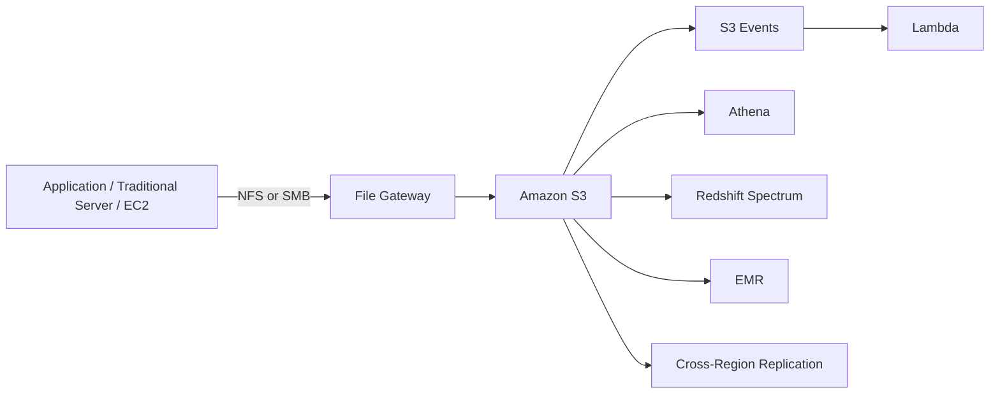

# 138. Storage Gateway - Advanced Concepts

## 🎯 Giới thiệu
Bài này nói về các kiến trúc nâng cao khi dùng **File Gateway**. Điểm cốt lõi là ứng dụng vẫn truy cập theo **NFS/SMB**, nhưng dữ liệu phía sau lại nằm trong **Amazon S3**. Từ đó mở ra nhiều khả năng cho migration, phân tích dữ liệu, backup, replication và compliance.

## 1. File Gateway như một lớp truy cập S3
- **Traditional server** có thể truy cập **File Gateway appliance on-premise** bằng **NFS** hoặc **SMB**.
- Dữ liệu được lưu ở backend trong **Amazon S3**.
- Có thể triển khai trong **VPC** để **EC2 instances** truy cập **Amazon S3** như một **file system** thông qua File Gateway.
- Cách này phù hợp để:
  - Migrate ứng dụng từ **on-premise** lên cloud
  - Giữ nguyên protocol **NFS/SMB**
  - Là bước chuyển tiếp an toàn cho workloads

## 2. Tận dụng dữ liệu sau khi đã vào S3
- Khi dữ liệu đã nằm trong **Amazon S3**, có thể mở rộng xử lý theo nhiều hướng:
  - **S3 Events** gửi sự kiện sang **Lambda**
  - **Athena** query dữ liệu trong S3
  - **Redshift Spectrum** hoặc **EMR** để phân tích dữ liệu
  - **Cross Region Replication** để backup sang region khác cho **disaster recovery**
- Ý nghĩa quan trọng:
  - **Athena** chỉ dùng tài nguyên của **Amazon S3**
  - Vì vậy **không ảnh hưởng performance của File Gateway**

## 3. Các mô hình nâng cao: replica, lifecycle, versioning, Object Lock
### Read only replica
- Có thể replicate file system từ một data center on-premise sang data center khác.
- Một site dùng File Gateway để ghi dữ liệu.
- Site còn lại dùng **read only replica** để ứng dụng đọc dữ liệu nhanh, **low latency**.

### Backup và lifecycle policies
- Dữ liệu ít được dùng hơn theo thời gian có thể áp dụng **S3 lifecycle policies**:
  - Chuyển sang **S3 Standard-IA**
  - Sau đó chuyển tiếp sang **S3 Glacier**
- Mục tiêu:
  - Giảm chi phí
  - Vẫn giữ được NFS interface cho ứng dụng on-premise

### ObjectVersioning và restore
- Nếu bật **Amazon S3 ObjectVersioning**:
  - Có thể lưu nhiều phiên bản object khi file thay đổi
  - Có thể restore một file hoặc cả file system về phiên bản trước
- Khi restore, cần báo cho File Gateway biết có thay đổi.
- Dùng **RefreshCache API** để đồng bộ lại cache và backend.

### S3 Object Lock
- **Amazon S3 Object Lock** giúp File Gateway hoạt động như **Write Once Read Many (WORM)**.
- Khi file bị sửa hoặc rename:
  - File Gateway tạo version mới của object
  - Version cũ đã lock vẫn giữ nguyên
- Hữu ích cho:
  - **Compliance**
  - **Audits**
  - Restore version cũ
  - Đảm bảo dữ liệu gốc không bị xóa

## 📊 Bảng tóm tắt
| Tiêu chí | Mô tả |
|----------|------|
| Giao thức truy cập | **NFS**, **SMB** |
| Backend lưu trữ | **Amazon S3** |
| Mở rộng xử lý | **S3 Events**, **Lambda**, **Athena**, **Redshift Spectrum**, **EMR** |
| Sao lưu / DR | **Cross Region Replication** |
| Tối ưu chi phí | **S3 lifecycle policies** đến **Standard-IA** và **Glacier** |
| Quản lý phiên bản | **Amazon S3 ObjectVersioning** |
| Đồng bộ lại sau restore | **RefreshCache API** |
| Bảo vệ dữ liệu | **Amazon S3 Object Lock**, **WORM** |

## 💡 Mẹo ghi nhớ cho kỳ thi AWS
- Nhớ rằng **File Gateway** cho phép ứng dụng dùng **NFS/SMB** nhưng dữ liệu cuối cùng vẫn nằm trong **S3**.
- Khi dữ liệu ở **S3**, bạn có thể tận dụng:
  - **Athena** để query
  - **Lambda** để xử lý event
  - **Redshift Spectrum / EMR** để phân tích
- **Lifecycle policies** dùng để giảm chi phí theo thời gian.
- **ObjectVersioning** giúp restore phiên bản cũ, còn **RefreshCache API** giúp gateway nhận biết thay đổi.
- **Object Lock** = **WORM**, phù hợp cho compliance và bảo vệ dữ liệu gốc.

## ✅ Kết luận
**File Gateway** không chỉ là lớp trung gian cho **NFS/SMB** lên **S3**, mà còn mở ra nhiều kiến trúc nâng cao: migration, analytics, backup, replication, versioning và data protection. Khi ôn thi AWS, cần nhớ trọng tâm là: **tưởng như file system on-premise, nhưng thực tế dữ liệu nằm trong S3 và có thể tận dụng toàn bộ hệ sinh thái của S3**.
