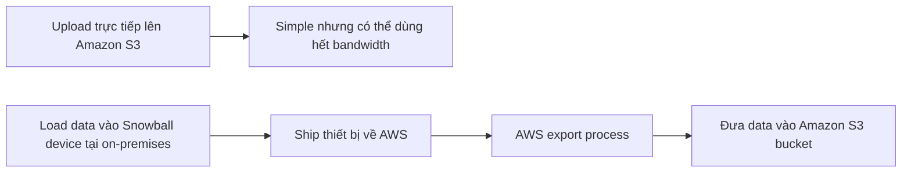

# 139. Snow Family

## 🎯 Giới thiệu
AWS Snowball là một **physical device** cực kỳ **secure** và **portable**, dùng để:

- **collect** và **process data at the edge**
- **migrate data in and out of AWS**
- xử lý các tình huống có **petabytes of data** cần di chuyển

Snowball phù hợp khi việc truyền dữ liệu qua network quá chậm, tốn bandwidth, hoặc không ổn định.

## 1. Snowball dùng khi nào? 🚚
Snowball được khuyến nghị khi:

- cần chuyển lượng dữ liệu rất lớn, ví dụ **petabytes**
- đường truyền **slow**
- **limited connectivity**
- **limited bandwidth**
- **very high network cost**
- phải chia sẻ bandwidth với ứng dụng khác
- kết nối không ổn định
- thời gian transfer qua network kéo dài, ví dụ **over a week**

Ví dụ trong transcript:

- chuyển **100 TB** qua kết nối **1 gigabyte per second** mất khoảng **12 days**

### Luồng di chuyển dữ liệu

## 2. Hai loại Snowball Edge device 🧳
Transcript nêu 2 loại Snowball Edge:

- **Snowball Edge Storage Optimized**
  - storage lớn hơn
  - **210 TB**
- **Snowball Edge Compute Optimized**
  - storage nhỏ hơn
  - **28 TB**
  - dùng cho **compute**

Điểm khác biệt chính trong transcript là **storage**.

## 3. Hai use case chính: Data migration và Edge computing ⚙️
### Data migration
- Cách làm:
  - AWS gửi một **physical Snowball device**
  - bạn **load data** vào thiết bị trong infrastructure của mình
  - sau đó **ship it back to AWS**
  - AWS thực hiện **export process** để đưa data vào ví dụ như **Amazon S3 bucket**

### Edge computing
Snowball cũng dùng cho việc xử lý dữ liệu **while it's being created** tại edge location, ví dụ:

- **truck on the road**
- **ship on the sea**
- **mining station on the ground**

Các nơi này có thể:

- không có internet
- internet hạn chế
- compute power hạn chế

Với **Compute Optimized** device, bạn có thể chạy trực tiếp trên thiết bị:

- **EC2 instances**
- **Lambda functions**

Mục đích:

- **pre-process data**
- làm **machine learning at the edge**
- **transcode media at the edge**

## 📊 Bảng tóm tắt
| Tiêu chí | Mô tả |
|----------|------|
| Mục đích | Di chuyển dữ liệu vào/ra AWS và xử lý dữ liệu tại edge |
| Thiết bị | **Snowball** là physical, secure, portable device |
| 2 loại chính | **Edge Storage Optimized** và **Edge Compute Optimized** |
| Storage | **210 TB** và **28 TB** |
| Use case 1 | **Data migration** khi network chậm, tốn bandwidth, hoặc không ổn định |
| Use case 2 | **Edge computing** tại nơi ít internet/compute |
| Compute trên thiết bị | Có thể chạy **EC2 instances** hoặc **Lambda functions** |
| Kết quả | Có thể đưa data về **Amazon S3 bucket** sau khi ship thiết bị về AWS |

## 💡 Mẹo ghi nhớ cho kỳ thi AWS
- **Snowball = data migration + edge computing**
- Nếu mạng **quá chậm** hoặc **quá tốn bandwidth**, nghĩ đến **Snowball**
- Nhớ cặp từ khóa:
  - **Storage Optimized = 210 TB**
  - **Compute Optimized = 28 TB**
- Nếu cần xử lý dữ liệu ngay tại nơi tạo ra dữ liệu, nhớ:
  - **EC2**
  - **Lambda**
  - **edge location**
- Câu hỏi thi thường xoay quanh:
  - **transfer very large data**
  - **limited connectivity**
  - **process data at the edge**

## ✅ Kết luận
Snowball là giải pháp AWS dùng khi cần **di chuyển dữ liệu lớn** hoặc **xử lý dữ liệu tại edge**. Trong transcript, Snowball được nhấn mạnh như một lựa chọn hiệu quả khi network transfer quá chậm, bandwidth hạn chế, hoặc khi cần chạy **EC2** hay **Lambda** trực tiếp trên thiết bị edge.
