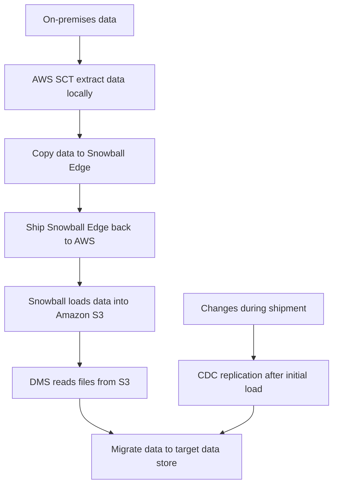

# 141. AWS DMS - Database Migration Services

## 🎯 Giới thiệu
AWS DMS (Database Migration Service) là dịch vụ giúp **migrate database lên AWS nhanh và an toàn**. Theo transcript, DMS có các đặc điểm quan trọng:
- **Resilient** và **self-healing**: job migration có thể tự phục hồi khi gặp lỗi.
- **Source database vẫn available** trong quá trình migration.
- Hỗ trợ cả **homogeneous migration** và **heterogeneous migration**.
- Hỗ trợ **CDC (Continuous Data Replication)** để đồng bộ thay đổi liên tục.

## 1. Khả năng migration của AWS DMS
AWS DMS hỗ trợ nhiều kiểu migration khác nhau:

- **Homogeneous migration**: cùng engine database  
  - Ví dụ: Oracle -> Oracle
- **Heterogeneous migration**: khác engine database  
  - Ví dụ: Microsoft SQL Server -> Aurora
- **CDC**:
  - Có thể dùng cho **one-time migration**
  - Hoặc **continuous migration**

Một điểm cần nhớ:
- DMS cần một **EC2 instance** để chạy replication tasks.
- Mô hình cơ bản:
  - Source database ở on-premises
  - EC2 chạy DMS software
  - DMS đẩy dữ liệu sang target database

## 2. Source, target và AWS SCT
### Nguồn dữ liệu mà DMS hỗ trợ làm source
- On-premises và EC2 databases:
  - Oracle
  - Microsoft SQL Server
  - MySQL
  - MariaDB
  - PostgreSQL
  - MongoDB
  - SAP
  - DB2
- Azure SQL Database
- Amazon RDS databases, bao gồm **Aurora**
- Amazon S3
- MongoDB chạy trên DocumentDB

### Đích dữ liệu mà DMS hỗ trợ làm target
- On-premises và EC2 databases:
  - Oracle
  - Microsoft SQL Server
  - MySQL
  - MariaDB
  - PostgreSQL
  - SAP
- Amazon RDS, bao gồm **Aurora**
- Amazon Redshift
- Amazon DynamoDB
- Amazon S3
- OpenSearch Service
- Kinesis Data Streams
- DocumentDB

### Điểm thi cần nhớ
- **Amazon Redshift, Kinesis Data Streams, OpenSearch Service chỉ là target, không phải source**.
- DMS **không dùng để replicate OpenSearch data đi ra ngoài**; OpenSearch chỉ đóng vai trò target.

### AWS SCT (Schema Conversion Tool)
AWS SCT dùng để **convert database schema** khi đổi engine database:
- OLTP:
  - SQL Server / Oracle -> MySQL / PostgreSQL / Aurora
- OLAP:
  - Teradata / Oracle -> Redshift

Lưu ý quan trọng:
- Nếu migration **cùng engine database** thì **không cần SCT**
  - Ví dụ: on-prem PostgreSQL -> RDS PostgreSQL
  - Đây là **re-platform migration**

## 3. Mạng, kiểu load và kết hợp Snowball + DMS
### Kết nối mà DMS hỗ trợ
- **VPC Peering**
- **VPN**:
  - Site-to-site
  - Software VPN
- **Direct Connect**

### Các kiểu load
- **Full Load**: load toàn bộ một lần
- **Full Load + CDC**: initial load xong rồi tiếp tục đồng bộ thay đổi
- **CDC only**: chỉ stream các thay đổi

### Một số điểm riêng
- Với **Oracle source**, DMS hỗ trợ **TDE** bằng **BinaryReader**
- Với **Oracle target**, DMS hỗ trợ:
  - **BLOBs** trong table có **primary key**
  - **TDE**
- Khi migrate **BLOB data** vào **RDS Oracle**, cần đảm bảo table có **primary key**

### Kết hợp Snowball và DMS
Dùng khi migration rất lớn, vượt quá khả năng truyền qua network.

Flow theo transcript:

Ý chính:
- SCT dùng để extract dữ liệu local
- Dữ liệu được copy vào **Snowball Edge**
- AWS nhận thiết bị và load dữ liệu vào **S3**
- DMS lấy dữ liệu từ S3 để migrate sang target
- Nếu có **CDC**, các thay đổi phát sinh trong lúc vận chuyển sẽ được đồng bộ sau

## 📊 Bảng tóm tắt
| Tiêu chí | Mô tả |
|----------|------|
| Mục đích | Migrate database lên AWS nhanh, an toàn |
| Tính chất | Resilient, self-healing |
| Source vẫn chạy | Có, source database vẫn available trong lúc migrate |
| Kiểu migration | Homogeneous, heterogeneous |
| Đồng bộ liên tục | Hỗ trợ CDC |
| Thành phần chạy DMS | EC2 instance |
| Tool schema conversion | AWS SCT |
| Target quan trọng | Redshift, Kinesis Data Streams, OpenSearch Service |
| Snowball kết hợp | Dùng cho migration dữ liệu rất lớn |

## 💡 Mẹo ghi nhớ cho kỳ thi AWS
- **DMS = Database Migration Service**: nhớ ngay đây là dịch vụ migrate database.
- **Redshift, Kinesis, OpenSearch = target only** trong DMS.
- **SCT dùng khi đổi database engine**, không cần nếu cùng engine.
- **Full Load + CDC** là pattern rất hay gặp trong bài thi.
- **Snowball + DMS** dùng cho migration khối lượng dữ liệu rất lớn.
- **Oracle BLOB target cần primary key** là chi tiết dễ bị hỏi.

## ✅ Kết luận
AWS DMS là dịch vụ dùng để migrate database lên AWS với khả năng **giữ source online**, hỗ trợ **homogeneous/heterogeneous migration**, và có thể kết hợp **CDC** để đồng bộ liên tục. Khi cần đổi schema giữa các engine khác nhau, dùng thêm **AWS SCT**. Với dữ liệu rất lớn, có thể phối hợp **Snowball + DMS** để tối ưu quá trình migration.
