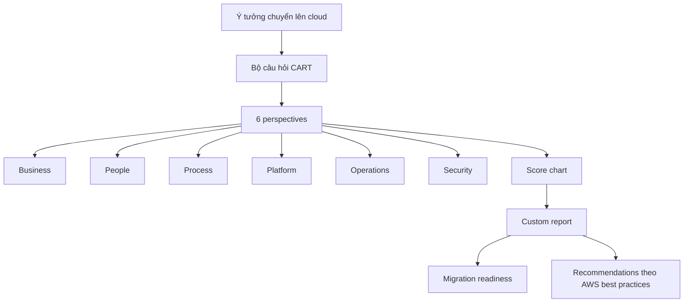

# 142. AWS CART - Cloud Adoption Readiness Tool

## 🎯 Giới thiệu
AWS CART (Cloud Adoption Readiness Tool) là công cụ giúp tổ chức:
- Xây dựng kế hoạch **cloud adoption** và **migration** hiệu quả hơn.
- Biến ý tưởng chuyển lên cloud thành một kế hoạch chi tiết theo **AWS best practices**.
- Nhận **score chart** và **custom report** để đánh giá mức độ sẵn sàng migration.

## 1. Mục đích của CART
- Hỗ trợ tổ chức lập kế hoạch chuyển đổi lên cloud.
- Đánh giá mức độ **migration readiness**.
- Đưa ra các **recommendations** để áp dụng best practices trên AWS.

## 2. Cách CART hoạt động
- Người dùng trả lời một bộ câu hỏi.
- Bộ câu hỏi được chia theo **6 perspectives**:
  - **Business**
  - **People**
  - **Process**
  - **Platform**
  - **Operations**
  - **Security**
- Kết quả được thể hiện dưới dạng biểu đồ và báo cáo tùy chỉnh.

## 3. Ý nghĩa trong kỳ thi AWS
- CART là một công cụ ở mức **high level**.
- Bạn chỉ cần nhớ:
  - Nó giúp đánh giá mức độ sẵn sàng cho cloud migration.
  - Nó dựa trên 6 góc nhìn quan trọng.
  - Nó tạo ra **chart** và **report** kèm khuyến nghị.
- Trong transcript, đây là phần kiến thức **không quá sâu**, chủ yếu để nhận diện khái niệm.

## 📊 Bảng tóm tắt
| Tiêu chí | Mô tả |
|----------|------|
| Tên công cụ | AWS CART (Cloud Adoption Readiness Tool) |
| Mục tiêu | Lập kế hoạch cloud adoption và migration |
| Cách đánh giá | Dựa trên bộ câu hỏi theo 6 perspectives |
| 6 perspectives | Business, People, Process, Platform, Operations, Security |
| Kết quả | Score chart và custom report |
| Giá trị chính | Đánh giá migration readiness và đưa ra recommendations |

## 💡 Mẹo ghi nhớ cho kỳ thi AWS
- Nhớ công thức: **CART = Questions + 6 perspectives + Report + Recommendations**.
- 6 perspectives cần nhớ đúng thứ tự:
  - **Business**
  - **People**
  - **Process**
  - **Platform**
  - **Operations**
  - **Security**
- CART thường được hỏi ở mức **overview**, không phải dịch vụ cấu hình sâu.
- Từ khóa quan trọng cần nhớ: **migration readiness**, **best practices**, **custom report**.

## ✅ Kết luận
AWS CART là công cụ hỗ trợ tổ chức đánh giá mức độ sẵn sàng cho việc chuyển lên cloud và migration. Công cụ này dùng bộ câu hỏi theo 6 perspectives để tạo score chart và custom report, từ đó đề xuất các best practices trên AWS.
