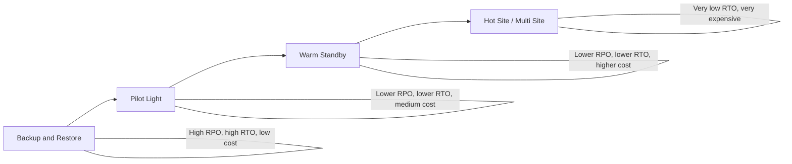

# 143. Disaster Recovery

## 🎯 Giới thiệu
Disaster Recovery (DR) là chủ đề rất quan trọng đối với Solutions Architect và cũng là nội dung dễ xuất hiện trong AWS exam.  
Theo transcript, **disaster** là bất kỳ sự kiện nào gây tác động xấu đến **business continuity** hoặc **finances** của công ty.  
Mục tiêu của **disaster recovery** là chuẩn bị trước và phục hồi sau các sự cố đó.

Hai khái niệm cần nhớ nhất là:

- **RPO (Recovery Point Objective)**: chấp nhận mất bao nhiêu dữ liệu khi xảy ra disaster.
- **RTO (Recovery Time Objective)**: chấp nhận downtime bao lâu trước khi hệ thống hoạt động lại.

## 1. Các chiến lược Disaster Recovery
Transcript nêu 4 chiến lược chính, và chúng khác nhau chủ yếu ở **RPO, RTO, cost**:

### 1.1 Backup and Restore
- Có **high RPO** và **high RTO**.
- Dữ liệu thường được backup định kỳ lên AWS.
- Có thể dùng:
  - **AWS Storage Gateway**
  - **S3**
  - **Glacier**
  - **Snowball**
  - **EBS snapshots**
  - **RDS automated snapshots and backups**
- Khi gặp disaster:
  - Dùng **AMIs** để tạo lại **EC2**
  - Restore từ snapshot để khôi phục **RDS**, **EBS**, **Redshift**
- Ưu điểm:
  - **Rẻ**
  - Không cần duy trì nhiều hạ tầng chạy sẵn
- Nhược điểm:
  - Khôi phục chậm, downtime cao

### 1.2 Pilot Light
- Chỉ giữ **critical core systems** chạy sẵn trên cloud.
- Ví dụ:
  - **RDS** đã chạy và có data replication
  - **EC2** chưa chạy cho đến khi cần failover
- Khi disaster xảy ra:
  - Dùng **Route 53** để failover
  - Tạo lại **EC2** và các thành phần còn lại
- Đặc điểm:
  - **Lower RPO**
  - **Lower RTO**
  - Chi phí tốt hơn so với chạy full system
- Đây là lựa chọn rất phổ biến vì cân bằng giữa chi phí và tốc độ phục hồi

### 1.3 Warm Standby
- Một hệ thống đầy đủ hơn đã chạy sẵn nhưng ở **minimum size**.
- Ví dụ:
  - **RDS** secondary database chạy sẵn
  - **EC2 Auto Scaling group** chạy ở mức tối thiểu
  - **ELB** sẵn sàng
- Khi disaster xảy ra:
  - **Route 53** failover sang cloud
  - Hệ thống scale lên production load
- Đặc điểm:
  - **RTO thấp hơn Pilot Light**
  - **Cost cao hơn**
- Phù hợp khi cần sẵn sàng cao hơn nhưng chưa muốn chạy full scale liên tục

### 1.4 Hot Site / Multi Site
- Đây là phương án có **RTO rất thấp**: chỉ vài phút hoặc vài giây.
- Cả hai bên đều chạy full production scale:
  - On-premise
  - AWS
- Có data replication giữa các site
- Có thể là mô hình **active-active**
- Route 53 có thể route request đến cả hai phía
- Đặc điểm:
  - **RTO thấp nhất**
  - **Cost rất cao**
- Trong mô hình full cloud, transcript nhắc đến:
  - **Multi Region**
  - **Aurora Global Database** replication sang region khác

## 2. Các kỹ thuật hỗ trợ Disaster Recovery
Transcript chia các kỹ thuật hỗ trợ DR thành nhiều nhóm:

### 2.1 Backup
- **EBS Snapshots**
- **RDS automated snapshots and backups**
- Push snapshots định kỳ lên:
  - **S3**
  - **S3 IA**
  - **Glacier**
- Dùng **Lifecycle Policy** để tối ưu chi phí
- Dùng **Cross Region Replication** nếu muốn backup ở nhiều region

### 2.2 High Availability
- **Route 53** để chuyển DNS giữa các region
- Các dịch vụ có tính sẵn sàng cao:
  - **RDS Multi-AZ**
  - **ElastiCache Multi AZ**
  - **EFS**
  - **S3**

### 2.3 Network Recovery
- Nếu đã có **Direct Connect** nhưng đường truyền bị down:
  - Có thể dùng **site-to-site VPN** làm phương án dự phòng

### 2.4 Replication
- **RDS Replication (Cross Region)**
- **Aurora + Global Databases**
- Database replication software từ on-premise sang **RDS**
- **Storage Gateway** cũng được nhắc đến trong bối cảnh replication / backup

### 2.5 Automation
- **CloudFormation**: tạo lại môi trường mới nhanh
- **Elastic Beanstalk**: dựng environment mới nhanh
- **CloudWatch**: có thể trigger recovery hoặc reboot **EC2** khi alarm fail
- **Lambda**: dùng để tự động hóa và tùy biến quy trình recovery
- Mục tiêu là tự động hóa càng nhiều càng tốt để DR hiệu quả hơn

### 2.6 Chaos Testing
- Cách kiểm tra khả năng phục hồi là tạo ra sự cố thử nghiệm
- Ví dụ được nhắc:
  - **Netflix**
  - **simian army**
  - Randomly terminate **EC2 instances** trong production
- Mục đích:
  - Kiểm tra hệ thống có thể chịu failure hay không
  - Đảm bảo hạ tầng đủ “rock solid”

## 3. Flow ôn thi nhanh
- **RPO** càng nhỏ → mất dữ liệu càng ít → thường tốn kém hơn
- **RTO** càng nhỏ → downtime càng ít → thường tốn kém hơn
- Mức DR tăng dần theo chi phí và mức sẵn sàng:
  - **Backup and Restore**
  - **Pilot Light**
  - **Warm Standby**
  - **Hot Site / Multi Site**
- Câu hỏi thi thường xoay quanh:
  - Scenario nào nên chọn chiến lược nào
  - Có cần low cost hay low downtime
  - Có cần active-active hay chỉ cần restore khi sự cố xảy ra

## 📊 Bảng tóm tắt
| Tiêu chí | Mô tả |
|----------|------|
| **Disaster** | Sự kiện gây ảnh hưởng xấu đến business continuity hoặc finances |
| **RPO** | Mức dữ liệu có thể mất chấp nhận được |
| **RTO** | Mức downtime chấp nhận được trước khi hệ thống phục hồi |
| **Backup and Restore** | Rẻ, đơn giản, nhưng RPO và RTO cao |
| **Pilot Light** | Chỉ giữ critical core chạy sẵn, cân bằng chi phí và tốc độ |
| **Warm Standby** | Full system ở minimum size, phục hồi nhanh hơn nhưng tốn hơn |
| **Hot Site / Multi Site** | Active-active, RTO rất thấp nhưng rất đắt |
| **Backup tools** | EBS Snapshots, RDS backups, S3, Glacier, Snowball, Storage Gateway |
| **HA tools** | Route 53, RDS Multi-AZ, ElastiCache Multi AZ, EFS, S3 |
| **Automation tools** | CloudFormation, Elastic Beanstalk, CloudWatch, Lambda |
| **Testing** | Chaos testing như Netflix simian army |

## 💡 Mẹo ghi nhớ cho kỳ thi AWS
- Nhớ thứ tự đánh đổi: **cost tăng dần, RTO giảm dần**
- **Backup and Restore** = rẻ nhất, phục hồi chậm nhất
- **Pilot Light** = chỉ bật phần lõi quan trọng
- **Warm Standby** = có sẵn bản thu nhỏ của hệ thống
- **Hot Site / Multi Site** = sẵn sàng nhất nhưng đắt nhất
- Khi thấy scenario có yêu cầu:
  - **Rẻ** → nghĩ đến Backup and Restore
  - **Phục hồi nhanh hơn nhưng tiết kiệm** → Pilot Light
  - **Cần sẵn sàng cao** → Warm Standby
  - **Gần như không chấp nhận downtime** → Hot Site / Multi Site
- Ghi nhớ các công cụ:
  - Backup: **S3, Glacier, Snowball, EBS snapshots, RDS backups**
  - Failover: **Route 53**
  - Automation: **CloudFormation, Elastic Beanstalk, CloudWatch, Lambda**

## ✅ Kết luận
Disaster Recovery trong AWS xoay quanh việc cân bằng giữa **RPO, RTO, và cost**.  
Transcript nhấn mạnh 4 chiến lược chính là **Backup and Restore**, **Pilot Light**, **Warm Standby**, và **Hot Site / Multi Site**, cùng với các kỹ thuật hỗ trợ như **backup, replication, automation, chaos testing**.  
Trong đề thi, hãy đọc kỹ yêu cầu của scenario để chọn đúng mức DR phù hợp.
