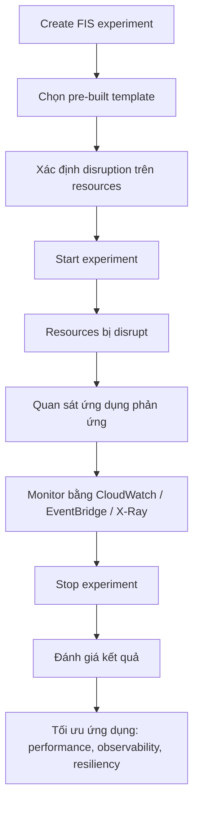

# 144. AWS FIS - Fault Injection Simulator

## 🎯 Giới thiệu
AWS Fault Injection Simulator (FIS) là dịch vụ dùng để chạy **fault injection experiments** trên AWS workloads theo hướng **Chaos Engineering**.

- Mục tiêu: tạo ra các sự cố có chủ đích và rất “disruptive” để xem toàn bộ application stack phản ứng như thế nào.
- Các ví dụ disruption trong transcript:
  - CPU tăng vọt
  - memory bị cạn
  - database failure
- Ý nghĩa:
  - kiểm tra độ vững của ứng dụng
  - phát hiện hidden bugs
  - tìm performance bottlenecks

## 1. FIS dùng để làm gì? 🔥
FIS được dùng để mô phỏng chaos trong infrastructure nhằm kiểm tra khả năng chịu lỗi của hệ thống.

- Tạo ra các tình huống gián đoạn thực tế hơn so với test thông thường
- Quan sát ứng dụng phản ứng ra sao khi gặp sự cố
- Hữu ích cho **advanced monitoring** và **advanced debugging**

### Mermaid: Flow của FIS experiment

## 2. FIS hoạt động như thế nào? ⚙️
Quy trình trong transcript:

- Tạo **experiments**
- Dùng **pre-built templates** để sinh disruption
- Chọn rõ hành vi sẽ xảy ra với từng resource
  - EC2
  - ECS
  - EKS
  - RDS
- Sau khi experiment bắt đầu:
  - resources sẽ bị disrupt
  - theo dõi cách ứng dụng phản ứng
- Theo dõi bằng:
  - **CloudWatch**
  - **EventBridge**
  - **X-Ray**
- Kết thúc experiment:
  - dừng thử nghiệm
  - xem kết quả
  - kiểm tra có vấn đề về performance, observability, resiliency hay không

## 3. Các dịch vụ được nhắc đến 🧩
FIS hỗ trợ một số services trong transcript, ví dụ:

| Service | Disruption ví dụ trong transcript |
|---------|-----------------------------------|
| EC2 | terminate EC2 instances |
| ECS | stop ECS tasks |
| EKS | stop a Kubernetes task |
| RDS | tạo failure cho database |

## 📊 Bảng tóm tắt
| Tiêu chí | Mô tả |
|----------|------|
| Mục đích | Chạy fault injection experiments trên AWS workloads |
| Ý tưởng nền tảng | Chaos Engineering |
| Cách tiếp cận | Tạo disruption có chủ đích để kiểm tra hệ thống |
| Resources được nhắc tới | EC2, ECS, EKS, RDS |
| Công cụ theo dõi | CloudWatch, EventBridge, X-Ray |
| Kết quả mong muốn | Phát hiện hidden bugs, performance bottlenecks, và cải thiện resiliency |

## 💡 Mẹo ghi nhớ cho kỳ thi AWS
- **FIS = Fault Injection Simulator**: nhớ đây là công cụ để “gây lỗi có kiểm soát”.
- Liên tưởng với **Chaos Engineering**: chủ động tạo chaos để test khả năng chịu lỗi.
- Nếu đề bài nói đến:
  - thử nghiệm disruption
  - mô phỏng sự cố
  - kiểm tra resiliency
  - phát hiện bottlenecks
  - dùng template để gây lỗi trên EC2/ECS/EKS/RDS  
  thì nghĩ ngay đến **AWS FIS**.
- Nhớ bộ công cụ theo dõi trong transcript: **CloudWatch, EventBridge, X-Ray**.

## ✅ Kết luận
AWS FIS là dịch vụ native của AWS để chạy **chaos-style experiments** trên workload, nhằm kiểm tra cách ứng dụng phản ứng trước các sự cố có chủ đích. Nó giúp phát hiện bug ẩn, bottlenecks và các vấn đề về observability hoặc resiliency trước khi chúng trở thành sự cố thật.
