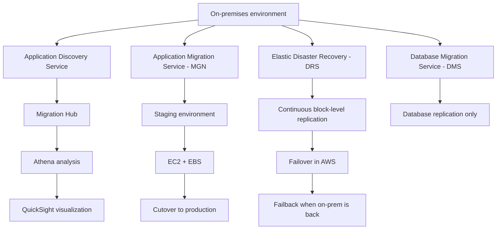

# 145. VM Migrations Services

## 🎯 Giới thiệu
Bài này tóm tắt các AWS services hỗ trợ **on-premises migration** và **disaster recovery** cho VM/server. Trọng tâm là:
- **Application Discovery Service** để khảo sát môi trường trước migration
- **Migration Hub** để theo dõi dữ liệu discovery
- **Application Migration Service (MGN)** để **lift-and-shift / re-host**
- **Elastic Disaster Recovery (DRS)** để **recovery / failover**
- **DMS** để migrate **databases** בלבד

## 1. 🔎 Application Discovery Service
Dùng để **plan migration** bằng cách thu thập thông tin từ **on-premises data centers**.

### Hai kiểu discovery
- **Agentless discovery**
  - Dùng **Application Discovery Agentless Connector**
  - Là **OVA package** deploy trên **VMware host on-premises**
  - Thu thập:
    - inventory của virtual machines
    - configuration
    - performance history như **CPU, memory, disk usage**
  - Làm việc với mọi OS

- **Agent-based discovery**
  - Deploy agent lên:
    - Microsoft server
    - Amazon Linux
    - Ubuntu
    - RedHat
    - CentOS
    - SUSE
  - Thu thập:
    - system and configuration
    - system performance
    - running processes
    - network connections giữa các system
  - Giúp map quan hệ giao tiếp giữa các server để phát hiện dependency ẩn

### Dữ liệu đầu ra
- Export ra **CSV**
- Xem trong **AWS Migration Hub**
- Query bằng **Amazon Athena**

## 2. 📊 Migration Hub, Athena, QuickSight
Sau khi collect dữ liệu từ on-premises server:
- Dữ liệu được lưu định kỳ trong **Amazon S3 buckets**
- Dùng **Athena** để:
  - chạy **predefined queries**
  - chạy **custom queries**
  - phân tích process theo từng server
- Có thể upload thêm nguồn dữ liệu như **CMDB export**
  - CMDB = **Configuration Management Database**
- Có thể tích hợp **QuickSight** để visualize dữ liệu

## 3. 🚚 AWS Application Migration Service (MGN)
**MGN** là service cho **lift and shift / re-host** để đơn giản hóa migration lên AWS.

### Ý chính
- Là evolution của:
  - **CloudEndure Migration**
  - **Server Migration Service (SMS)**
- Nếu đề thi nhắc **CloudEndure Migration** hoặc **SMS** thì ý là cùng service với **MGN**

### Cách hoạt động
- Convert:
  - physical servers
  - virtual servers
  - cloud-based servers
- Để chạy native trên AWS
- Quy trình:
  - tạo **staging environment**
  - dùng **replication agent**
  - dữ liệu/app được replicate liên tục vào staging
  - staging tương ứng với:
    - **EC2 instance**
    - **EBS volumes**
  - khi sẵn sàng, thực hiện **cutover** sang production

### Lợi ích
- Hỗ trợ nhiều platform
- Hỗ trợ nhiều OS và database
- **Minimal downtime**
- **Reduced costs**

## 4. 🛡️ Elastic Disaster Recovery (DRS)
**DRS** rất giống MGN, nhưng mục tiêu là **disaster recovery**.

### Ý chính
- Trước đây là **CloudEndure Disaster Recovery**
- Được rebrand thành AWS service thuần
- Dùng để recover:
  - physical servers
  - virtual servers
  - cloud-based servers
- Áp dụng cho:
  - critical databases như **Oracle, MySQL, SQL Server**
  - enterprise apps như **SAP**
  - protection against **ransomware attacks**

### Cách hoạt động
- **Continuous block-level replication**
- Replication agent đẩy dữ liệu lên cloud trong vài giây
- Khi disaster xảy ra:
  - **failover within minutes**
  - dựng production environment trong AWS
- Khi on-premises phục hồi:
  - có cơ chế **failback**

## 📊 Bảng tóm tắt
| Tiêu chí | Mô tả |
|----------|------|
| Application Discovery Service | Thu thập thông tin on-premises để lập kế hoạch migration, gồm utilization và dependency mapping |
| Agentless discovery | Dùng **Application Discovery Agentless Connector** trên VMware host, thu inventory và performance history |
| Agent-based discovery | Cài agent lên server để lấy process, performance, network connections |
| Migration Hub | Nơi xem và theo dõi dữ liệu discovery |
| Athena | Query dữ liệu discovery lưu trong S3, hỗ trợ predefined và custom queries |
| QuickSight | Dùng để visualize dữ liệu từ Athena |
| MGN | Service cho **lift and shift / re-host**, migrate server vào AWS qua staging environment |
| MGN output | **EC2 instance** và **EBS volumes** sau replication và cutover |
| DRS | Service cho **disaster recovery**, giống MGN nhưng phục vụ recovery/failover |
| DMS | Chỉ dành cho **databases**, hỗ trợ replication giữa on-prem, AWS, và AWS-to-AWS |

## 💡 Mẹo ghi nhớ cho kỳ thi AWS
- **Discovery trước, migration sau**:  
  - **Application Discovery Service** để hiểu hệ thống
  - **Migration Hub** để theo dõi
- **MGN = migrate**
  - Nhớ là **lift-and-shift / re-host**
  - Có **staging environment**, sau đó **cutover**
- **DRS = recover**
  - Nhớ là **disaster recovery**
  - Có **continuous replication**, **failover**, **failback**
- **DMS = databases only**
  - Không dùng cho server/VM migration chung
- Từ khóa thi hay gặp:
  - **CloudEndure Migration** = **MGN**
  - **CloudEndure Disaster Recovery** = **DRS**
  - **SMS** = tiền thân liên quan đến **MGN**

## ✅ Kết luận
Các service trong bài chia theo đúng nhu cầu:
- **Application Discovery Service**: khảo sát và map dependency
- **Migration Hub + Athena + QuickSight**: phân tích và hiển thị dữ liệu discovery
- **MGN**: migrate server/VM lên AWS theo kiểu **lift-and-shift**
- **DRS**: **disaster recovery** với replication liên tục và failover nhanh
- **DMS**: chỉ dùng cho **database migration/replication**
