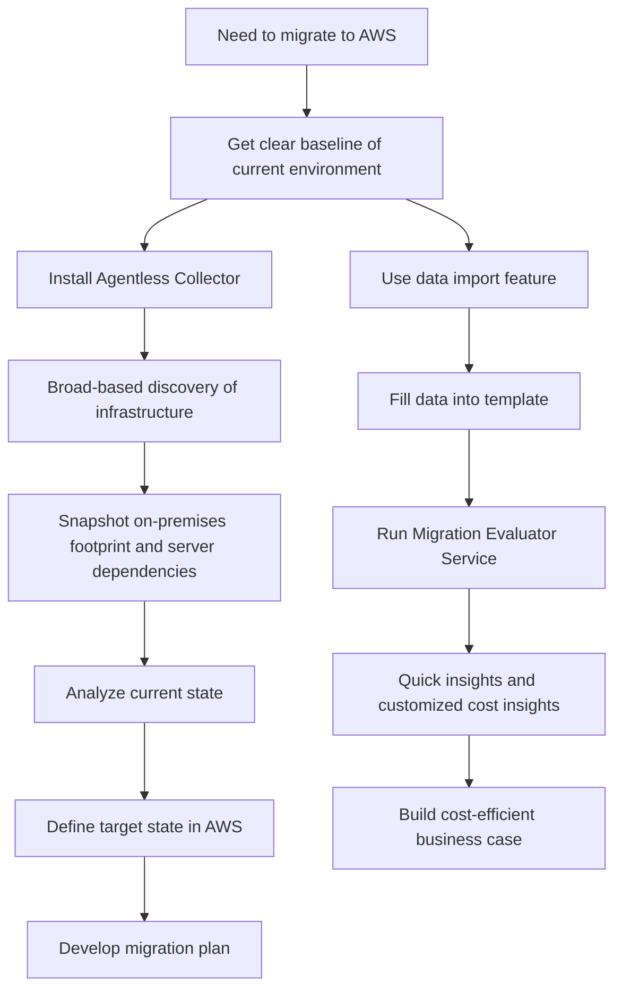

# 146. AWS Migration Evaluator

## 🎯 Giới thiệu
AWS Migration Evaluator là dịch vụ giúp bạn xây dựng **business case dựa trên dữ liệu** cho việc **migrate lên AWS**. Mục tiêu là hiểu rõ hiện trạng hệ thống trước khi di chuyển, từ đó đánh giá chi phí và tính khả thi của migration.

## 1. Mục tiêu chính của Migration Evaluator
- Tạo **baseline rõ ràng** về những gì organization đang chạy hiện tại.
- Hiểu các **workloads** đang tồn tại.
- Thu thập dữ liệu để hỗ trợ quyết định migration **cost-efficient** và phù hợp với business.

## 2. Cách thu thập và phân tích dữ liệu
- Cài **Agentless Collector** để thực hiện **broad-based discovery** toàn bộ infrastructure.
- Chụp lại:
  - **On-premises footprint**
  - **Server dependencies**
  - Các thông tin liên quan đến hiện trạng hệ thống
- Sau đó:
  - **Analyze current state**
  - **Define target state in AWS**
  - **Develop a migration plan**

## 3. Nguồn dữ liệu và đầu ra
- Có thể:
  - Cài **Collector** để tự động thu thập dữ liệu
  - Hoặc dùng **data import feature**
- Với data import:
  - Có **tool** và **template**
  - Bạn đưa dữ liệu hiện có vào template phù hợp
- Dữ liệu này giúp chạy **Migration Evaluator Service** để:
  - Nhận **quick insights**
  - Xem **customized cost insights**
  - Đảm bảo migration hiệu quả về chi phí và tốt cho business
- Nếu cần, có thể nhận **expert guidance from AWS** cho business case

## 4. Flow hoạt động

## 📊 Bảng tóm tắt
| Tiêu chí | Mô tả |
|----------|------|
| Mục đích | Xây dựng business case dựa trên dữ liệu cho migration lên AWS |
| Công cụ thu thập | Agentless Collector hoặc data import feature |
| Dữ liệu chính | Current state, on-premises footprint, server dependencies |
| Kết quả phân tích | Quick insights, customized cost insights |
| Giá trị mang lại | Hỗ trợ migration cost-efficient và phù hợp business |
| Hỗ trợ thêm | Có thể nhận expert guidance từ AWS |

## 💡 Mẹo ghi nhớ cho kỳ thi AWS
- Nhớ từ khóa: **Migration Evaluator = data-driven business case**.
- Quy trình chính:
  - **Discover current state**
  - **Analyze**
  - **Define target state**
  - **Plan migration**
- **Agentless Collector** dùng để discovery diện rộng, không cần tập trung vào agent.
- Dịch vụ này nhấn mạnh vào **cost insights** và **business case**, không chỉ là kiểm kê hệ thống.

## ✅ Kết luận
AWS Migration Evaluator giúp bạn hiểu rõ hệ thống hiện tại, thu thập dữ liệu migration, và tạo **business case** cho việc chuyển đổi lên AWS một cách **cost-efficient** và có cơ sở dữ liệu rõ ràng.
