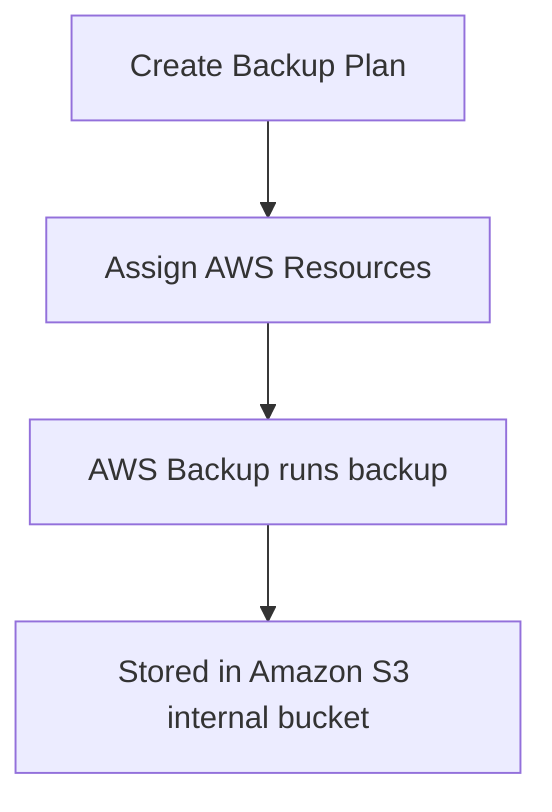

# 147. AWS Backup

## 🎯 Giới thiệu
- AWS Backup là một **fully managed service**.
- Mục tiêu là **centrally manage** và **automate backups** trên nhiều AWS services.
- Dùng để có **central view** cho backup strategy, thay vì phải viết **custom scripts** hoặc làm **manual processes**.
- Dịch vụ này hỗ trợ nhiều AWS services và danh sách này có thể mở rộng theo thời gian.

## 1. Phạm vi hỗ trợ 📦
AWS Backup hỗ trợ nhiều loại tài nguyên quan trọng, gồm:
- `Amazon EC2`
- `EBS`
- `Amazon S3`
- `RDS` và các database engines được hỗ trợ
- `Aurora`
- `DynamoDB`
- `DocumentDB`
- `Amazon Neptune`
- `EFS`
- `FSx`, bao gồm `Lustre`
- `Windows File Server`
- `AWS Storage Gateway`, ví dụ `Volume Gateway`

## 2. Backup Plans và luồng sao lưu 🔁
AWS Backup cho phép bạn tạo **Backup Plans** để xác định cách backup sẽ chạy.

Các điểm chính:
- Hỗ trợ **cross-region backups** để đẩy backup sang region khác cho disaster recovery.
- Hỗ trợ **cross-account backups** nếu bạn dùng nhiều account trong AWS strategy.
- Hỗ trợ **point in time recovery** cho các service được hỗ trợ, ví dụ `Aurora`.
- Hỗ trợ **on-demand backups** và **scheduled backups**.
- Có thể dùng **tag-based backup policies** để chỉ backup các resource có tag phù hợp, ví dụ `production`.
- Trong **Backup Plan**, bạn có thể cấu hình:
  - **frequency**: mỗi 12 giờ, weekly, monthly, hoặc theo `cron expression`
  - **Backup Window**
  - chuyển backup sang **Cold Storage**
  - **Retention Period**

### Mermaid - Flow backup

## 3. Vault Lock và bảo vệ dữ liệu 🔒
Một tính năng quan trọng của AWS Backup là **Vault Lock**.

- Vault Lock áp dụng **WORM policy**: **Write Once Read Many**
- Backup lưu trong **Backup Vault** sẽ **không thể bị xóa**
- Mục đích là bảo vệ backup khỏi:
  - xóa nhầm
  - xóa có chủ đích
  - các thay đổi làm giảm hoặc thay đổi **retention period**
- Ngay cả **root user** cũng không thể xóa backup khi Vault Lock được bật
- Điều này tạo ra **strong guarantees** cho tính an toàn của backup

## 📊 Bảng tóm tắt
| Tiêu chí | Mô tả |
|----------|------|
| Loại dịch vụ | `fully managed service` |
| Mục tiêu | Centralize và automate backups trên AWS |
| Cách vận hành | Dùng `Backup Plans` thay cho custom scripts/manual processes |
| Hỗ trợ | Nhiều service như `EC2`, `EBS`, `S3`, `RDS`, `Aurora`, `DynamoDB`, `EFS`, `FSx`... |
| Khả năng backup | `cross-region`, `cross-account`, `on-demand`, `scheduled`, `point in time recovery` |
| Quản lý theo tag | `tag-based backup policies` |
| Lưu trữ | Backup được lưu vào `Amazon S3` internal bucket của AWS Backup |
| Bảo vệ | `Vault Lock` với `WORM` policy |
| Mức độ an toàn | Ngăn xóa backup, kể cả bởi `root user` khi bật Vault Lock |

## 💡 Mẹo ghi nhớ cho kỳ thi AWS
- Nhớ 3 từ khóa: **centralize**, **automate**, **managed**.
- `Backup Plans` là nơi cấu hình:
  - tần suất backup
  - backup window
  - cold storage transition
  - retention
- `Cross-region` và `cross-account` là điểm quan trọng cho disaster recovery.
- `Vault Lock = WORM = cannot delete`.
- Khi thấy câu hỏi về bảo vệ backup khỏi xóa nhầm hoặc xóa ác ý, nghĩ ngay đến `Vault Lock`.

## ✅ Kết luận
- AWS Backup là dịch vụ trung tâm để quản lý và tự động hóa backup trên nhiều AWS services.
- Nó hỗ trợ nhiều kiểu backup linh hoạt như `scheduled`, `on-demand`, `cross-region`, `cross-account`.
- `Backup Plans` giúp chuẩn hóa chiến lược backup, còn `Vault Lock` giúp tăng độ an toàn bằng cơ chế `WORM`.
