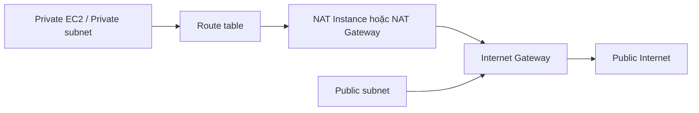
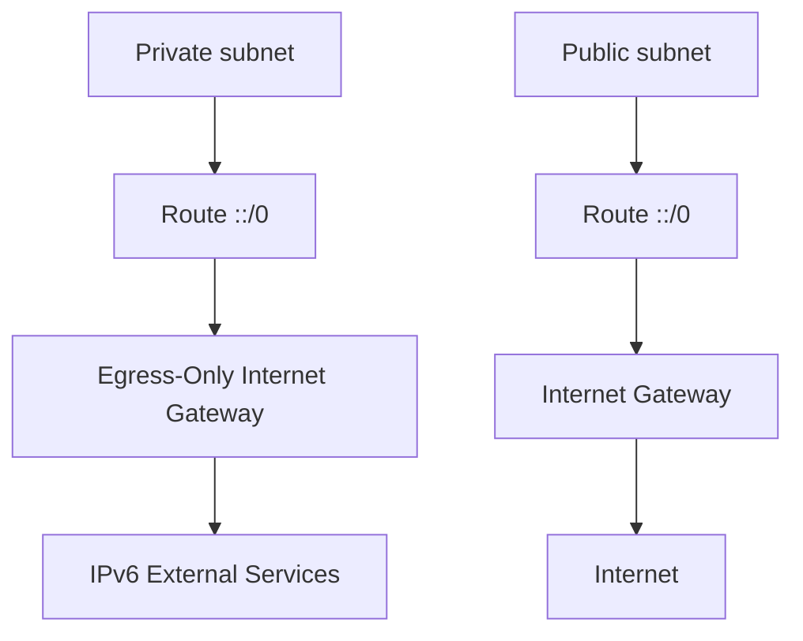

# 148. VPC - Basics

## 🎯 Giới thiệu
Bài này ôn lại các **VPC basics** quan trọng cho kỳ thi AWS. Nội dung tập trung vào:
- **CIDR**, **private/public IP**
- Cấu trúc **VPC**, **subnet**, **route table**
- Kết nối Internet qua **IGW**, **NAT Instance**, **NAT Gateway**
- Kiểm soát mạng bằng **NACL** và **Security Group**
- Ghi log bằng **VPC Flow Logs**
- Truy cập private instance qua **Bastion Host** hoặc **SSM Session Manager**
- Tổng quan **IPv6** trong VPC

## 1. CIDR, IP và VPC
- **CIDR** là một block IP, viết dưới dạng `IP/number`.
- Số sau dấu `/` quyết định phạm vi IP.
- Ví dụ: `192.168.0.0/26` tương ứng 64 IP, từ `192.168.0.0` đến `192.168.0.63`.

### Private IP
- Private IP chỉ dùng trong private network.
- Các dải private IP hợp lệ:
  - `10.0.0.0/8`
  - `172.16.0.0` đến `172.31.255.255`
  - `192.168.0.0` đến `192.168.255.255`
- Ngoài các dải này thì là **public IP**.

### VPC và Subnet
- **VPC** được định nghĩa bởi một hoặc nhiều **CIDR blocks** và không thể thay đổi.
- Trong VPC, mỗi CIDR phải có:
  - kích thước tối thiểu: `/28`
  - kích thước tối đa: `/16`
- VPC là môi trường private, nên chỉ chấp nhận **private IP CIDR range**.
- **Subnet** là một phần con của CIDR trong VPC.
- Instance trong subnet sẽ nhận private IP theo CIDR của subnet.
- AWS reserve:
  - **4 IP đầu**
  - **1 IP cuối**
  trong mỗi subnet cho mục đích networking.

## 2. Route Table, IGW và NAT
- **Route table** quyết định traffic đi đến đâu và được gắn với subnet cụ thể.
- Khi có nhiều route, AWS luôn chọn **route cụ thể nhất**.
  - Prefix càng dài (`/` càng lớn) thì càng ưu tiên.

### Internet Gateway và Public/Private Subnet
- **Internet Gateway (IGW)** kết nối VPC với Internet.
- IGW highly available và scale horizontally.
- Instance muốn ra Internet cần có **public IPv4** hoặc **public IPv6** và được gắn với IGW.
- **Public subnet**:
  - route `0.0.0.0/0` đi tới **IGW**
  - instance có public IPv4 để giao tiếp Internet
- **Private subnet**:
  - không đi Internet trực tiếp
  - traffic ra ngoài đi qua **NAT Instance** hoặc **NAT Gateway**
  - NAT phải nằm trong public subnet
  - route `0.0.0.0/0` của private subnet trỏ tới NAT

### NAT Instance
- Là **EC2 instance** chạy trong **public subnet**.
- Private subnet route traffic Internet qua NAT Instance.
- Đặc điểm:
  - không resilient nếu chỉ có 1 instance
  - bandwidth phụ thuộc instance type
  - rẻ hơn
  - failover phải tự quản lý
- Cần **disable source/destination check** trên EC2.
- NAT Instance nên được gán **Elastic IP** để phía ngoài thấy traffic từ một IP cố định.
- Có thể dùng Elastic IP để **whitelist** với bên thứ ba.

### NAT Gateway
- Là giải pháp **managed**.
- Bandwidth tăng theo thời gian.
- Resilient trong **single AZ**.
- Muốn quản lý failover across AZ thì deploy NAT Gateway ở nhiều AZ.
- Mỗi NAT Gateway có thể gán **Elastic IP** riêng.
- Kiến trúc nhiều AZ giúp có setup **highly available** hơn.

## 3. Network Control, Logging và IPv6
### NACL
- **Network ACL (NACL)** là **stateless firewall** ở **subnet level**.
- Có cả **allow** và **deny** rules.
- Vì stateless nên **return traffic** phải được allow rõ ràng.
- Hữu ích khi muốn block nhanh và rẻ một IP cụ thể.
- Nhưng khó hơn vì phải khai báo rule cho cả inbound và outbound.

### Security Group
- **Security Group** áp dụng ở **instance level**.
- Chỉ có **allow rules**, không có deny rules.
- Là **stateful**, nên return traffic được tự động cho phép.
- Security Group có thể reference:
  - Security Group khác trong cùng region
  - cả trong **peered VPC**
  - và **cross accounts**

### VPC Flow Logs
- Dùng để log network traffic đi qua VPC.
- Có 3 level:
  - **VPC level**
  - **Subnet level**
  - **ENI level** (`Elastic Network Interface`)
- Hữu ích để debug vì sao traffic bị fail hoặc bị deny.
- Có thể gửi log tới:
  - **CloudWatch Logs**
  - **Amazon S3**

### Bastion Host
- Dùng để **SSH** vào private EC2 instances.
- Cách hoạt động:
  - SSH vào **Bastion Host** trong public subnet
  - rồi từ đó SSH tiếp vào private instance
- Đây là **two-hop SSH**.
- AWS không có managed bastion host.
- Bạn phải tự quản lý:
  - failover
  - recovery
  - security
- Cách mới tốt hơn là dùng **SSM Session Manager**:
  - điều khiển instance từ xa
  - không cần SSH
  - security model tốt hơn

### IPv6
- Tất cả **IPv6 addresses** đều là **public**.
- IPv6 ra đời vì IPv4 đang cạn kiệt.
- IPv6 có số lượng địa chỉ cực lớn: `3.4 x 10^38`.
- Vì không gian địa chỉ quá lớn, việc scan toàn bộ gần như không khả thi.
- VPC hỗ trợ IPv6:
  - tạo **IPv6 CIDR** cho VPC
  - dùng **Internet Gateway** để hỗ trợ IPv6 traffic
- Trong public subnet:
  - instance có IPv6 tương ứng CIDR của VPC
  - route table thêm `::/0` trỏ tới IGW
- Trong private subnet:
  - nếu muốn đi ra service chỉ reachable bằng IPv6
  - dùng **Egress-Only Internet Gateway**
  - route `::/0` từ private subnet tới Egress-Only Internet Gateway

## 📊 Bảng tóm tắt
| Tiêu chí | Mô tả |
|----------|------|
| CIDR | Block IP, xác định bằng `IP/number`, dùng trong VPC, subnet, route tables, security groups |
| Private IP | Chỉ dùng trong private network, thuộc các dải `10.0.0.0/8`, `172.16.0.0/12`, `192.168.0.0/16` |
| VPC | Tập các CIDR blocks, private, CIDR trong VPC có size từ `/28` đến `/16` |
| Subnet | Phần con của CIDR trong VPC, AWS reserve 5 IP mỗi subnet |
| Route table | Điều khiển đường đi của traffic, ưu tiên route cụ thể nhất |
| IGW | Kết nối VPC với Internet, dùng cho public subnet và IPv6 |
| NAT Instance | EC2 tự quản lý, rẻ hơn nhưng kém resilient, cần disable source/destination check |
| NAT Gateway | Managed, scale tốt hơn, resilient hơn, có thể gắn Elastic IP |
| NACL | Stateless firewall ở subnet level, có allow và deny |
| Security Group | Stateful firewall ở instance level, chỉ allow rules |
| VPC Flow Logs | Ghi traffic ở VPC/subnet/ENI level, xuất ra CloudWatch Logs hoặc S3 |
| Bastion Host | Cách SSH vào private instances qua public EC2 |
| SSM Session Manager | Cách thay thế Bastion Host, không cần SSH |
| IPv6 | Public by default, dùng `::/0`, hỗ trợ bởi IGW và Egress-Only IGW |

## 💡 Mẹo ghi nhớ cho kỳ thi AWS
- **Public subnet = route `0.0.0.0/0` tới IGW**
- **Private subnet = route `0.0.0.0/0` tới NAT**
- **NAT Instance** = tự quản lý, phải **disable source/destination check**
- **NAT Gateway** = managed, phù hợp hơn cho HA
- **NACL = subnet level, stateless, allow + deny**
- **Security Group = instance level, stateful, chỉ allow**
- **Bastion Host** là kiểu SSH cũ; **SSM Session Manager** là hướng mới tốt hơn
- **IPv6** dùng `::/0`, và trong transcript, IPv6 address đều là **public**

## ✅ Kết luận
Phần **VPC - Basics** tập trung vào nền tảng mạng trong AWS: hiểu **CIDR**, phân biệt **public/private IP**, thiết kế **VPC/subnet/route table**, và chọn đúng cơ chế kết nối Internet như **IGW**, **NAT Instance**, **NAT Gateway**. Ngoài ra, cần nắm rõ khác biệt giữa **NACL** và **Security Group**, biết cách xem traffic bằng **VPC Flow Logs**, và hiểu vai trò của **IPv6**, **Bastion Host**, **SSM Session Manager** trong kiến trúc VPC.
