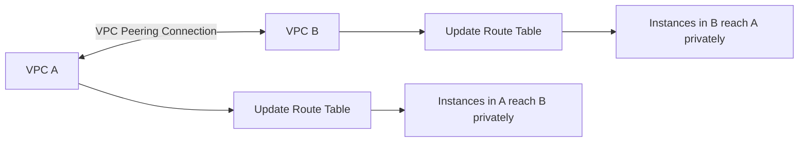
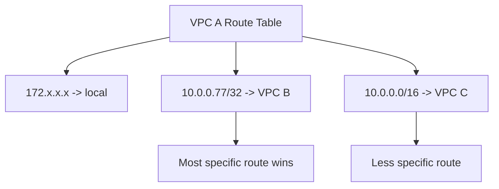

# 149. VPC Peering

## 🎯 Giới thiệu
- **VPC Peering** dùng để kết nối **2 VPC** một cách **private** qua **internal AWS network**.
- Mục tiêu là làm cho hai VPC hoạt động như thể ở trong cùng một network.
- Sau khi tạo peering connection, cần **update route tables** để traffic đi đúng qua đường peering.
- Yêu cầu quan trọng:
  - **Non-overlapping CIDR** giữa các VPC
  - Có thể dùng **cross-account** và **inter-region**
  - Có thể **reference Security Group** từ peered VPC để quản lý rule dễ hơn

## 1. Khái niệm cốt lõi về VPC Peering
- Khi VPC A peered với VPC B:
  - Instance trong A có thể **communicate privately** với B
  - Và ngược lại
- Đây là cách kết nối trực tiếp giữa các VPC, nhưng **không phải transit**.

### Mermaid: luồng kết nối cơ bản


## 2. Quy tắc quan trọng cần nhớ
- **CIDR không được overlap**
  - Chỉ cần **1 CIDR overlap** là không thể peer
  - Điều này áp dụng cho cả **IPv4** và **IPv6**
- **Không transitive**
  - Nếu A peered với B, và A peered với C, thì **B không thể nói chuyện với C** qua A
  - Muốn B giao tiếp với C thì phải tạo **peering connection riêng**
- **Longest prefix match**
  - Route nào **specific hơn** sẽ được ưu tiên
  - Ví dụ:
    - `10.0.0.77/32` ưu tiên hơn `10.0.0.0/16`
    - Route `/32` là **most specific route**

### Mermaid: longest prefix match


## 3. Các cấu hình hợp lệ và không hợp lệ
- **Hợp lệ**
  - VPC A peered với VPC B
  - VPC A peered với VPC C
  - B và C phải có CIDR không overlap với A
- **Không hợp lệ**
  - Hai VPC có overlapping CIDR
  - Kỳ vọng dùng A làm trung gian để B đi tới C
  - Kỳ vọng dùng peering để đi qua:
    - **Site-to-site VPN**
    - **Direct Connect**
    - **Internet Gateway**
    - **NAT Gateway**
    - **Gateway VPC endpoint for S3 và DynamoDB**

### Mermaid: no transitive / no edge-to-edge routing
```mermaid
flowchart LR
    B[VPC B] <-->|Peering| A[VPC A]
    A <-->|Peering| C[VPC C]
    B -.x.-> C[Không đi qua A để reach C]

    A --> IGW[Internet Gateway]
    A --> NAT[NAT Gateway]
    B -.x.-> IGW
    B -.x.-> NAT
```

- **No Edge to Edge routing** nghĩa là:
  - Nếu B peered với A, B **không thể** đi qua A để tới:
    - **Corporate network**
    - **Internet Gateway**
    - **NAT Gateway**
    - **site-to-site VPN**
    - **Direct Connect**
    - **gateway VPC endpoints for S3 và DynamoDB**

## 📊 Bảng tóm tắt
| Tiêu chí | Mô tả |
|----------|------|
| Mục đích | Kết nối 2 VPC private qua internal AWS network |
| CIDR | Không được overlap, kể cả chỉ 1 CIDR |
| Tính chất | Không transitive |
| Routing | Phải update route tables ở mỗi VPC subnet |
| Ưu tiên route | Longest prefix match, route specific hơn thắng |
| Phạm vi | Có thể cross-account và inter-region |
| Security Group | Có thể reference Security Group từ peered VPC |
| Giới hạn | Không dùng để đi qua IGW, NAT, VPN, Direct Connect, gateway endpoint |

## 💡 Mẹo ghi nhớ cho kỳ thi AWS
- **Peering = private connection giữa 2 VPC**
- **No overlap, no transitive**
- **Update route table là bắt buộc**
- **Longest prefix match**: `/32` thắng `/16`
- **No Edge to Edge routing**:
  - Không dùng peering để làm trung gian cho **Internet**, **NAT**, **VPN**, **Direct Connect**
- Nếu đề bài hỏi “VPC B đi Internet qua VPC A bằng NAT Gateway”, thì đây là **invalid configuration**

## ✅ Kết luận
- **VPC Peering** là cách kết nối **private** giữa hai VPC qua AWS network nội bộ.
- Cần nhớ 3 điểm thi rất quan trọng:
  - **Non-overlapping CIDR**
  - **Không transitive**
  - **Không edge-to-edge routing**
- Khi route table có nhiều route khớp, hãy chọn **most specific route** theo **longest prefix match**.
