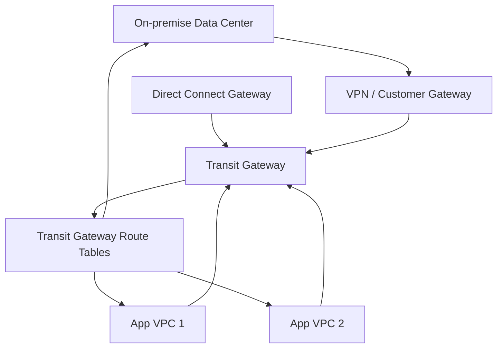
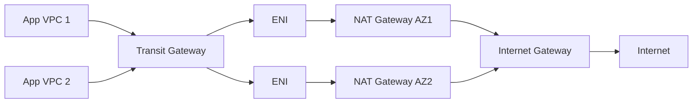
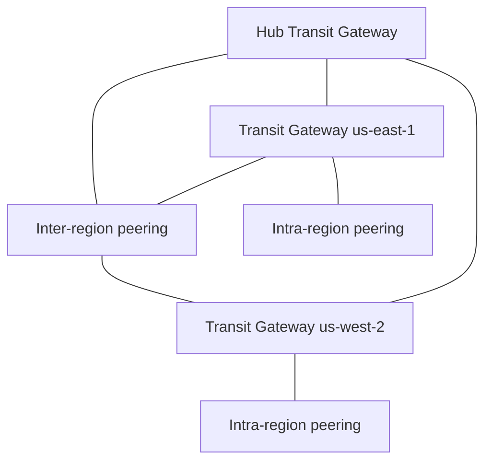

# 150. Transit Gateway

## 🎯 Giới thiệu
Transit Gateway là giải pháp AWS hiện đại để đơn giản hóa network topology khi số lượng VPC, account, VPN, Direct Connect, on-premise kết nối ngày càng nhiều.

- Mục tiêu chính: tạo mô hình **hub-and-spoke** để kết nối nhiều VPC, on-premise data center và các kết nối mạng khác.
- Thay vì phải tạo nhiều **VPC Peering** hoặc nhiều đường kết nối riêng lẻ, traffic đi qua **Transit Gateway** như một trung tâm.
- Transit Gateway là **regional resource**.
- Có thể **peer across Regions** giữa các Transit Gateway.
- Có thể chia sẻ Transit Gateway giữa nhiều account bằng **AWS RAM**.
- Hỗ trợ **IP multicast** trong AWS network theo nội dung transcript.

## 1. Tổng quan về Transit Gateway
- Dùng để kết nối:
  - nhiều VPC
  - on-premise data center qua **VPN** và **Customer Gateway**
  - **Direct Connect Gateway**
- Tạo **transitive peering** giữa hàng nghìn VPC và hệ thống on-premise.
- Hỗ trợ **edge-to-edge routing** và **transitivity**.
- Cho phép kiểm soát luồng traffic bằng **Transit Gateway Route Tables**.

### Mermaid: luồng kết nối tổng quát

## 2. Route Tables và mô hình Egress VPC
- Transit Gateway cho phép cấu hình **route tables** ở cấp Transit Gateway để quyết định:
  - VPC nào được nói chuyện với VPC nào
  - attachment nào được phép route đến attachment nào
- Trong ví dụ transcript:
  - Có một **Egress VPC** chứa **NAT Gateway**
  - NAT Gateway được triển khai ở **2 AZ** để tăng tính high availability
  - Các **ENI** kết nối Egress VPC với Transit Gateway
  - **App VPCs** gửi internet traffic qua Transit Gateway rồi đi qua Egress VPC
- Lợi ích:
  - tập trung hóa tài nguyên
  - không cần tạo NAT Gateway và Internet Gateway riêng cho từng VPC
  - giữ các VPC khác ở trạng thái private nhưng vẫn cho phép ra Internet qua Egress VPC
- Nếu route table không cho phép, các App VPC có thể **không nói chuyện với nhau** dù cùng gắn vào Transit Gateway.

### Mermaid: luồng internet egress qua Transit Gateway

## 3. Sharing, Cross-Region và Peering
- Transit Gateway có thể chia sẻ bằng **AWS RAM**:
  - trong nhiều account
  - trong **AWS Organization**
- Quy trình theo transcript:
  - Account A tạo và chia sẻ Transit Gateway
  - Account B chấp nhận request
  - Account B tạo attachment VPC của chính mình vào Transit Gateway
- Transit Gateway hỗ trợ nhiều mô hình peering:
  - **Inter-region peering**
  - **Intra-region peering**
- Có thể kết nối:
  - Transit Gateway ở `us-east-1`
  - Transit Gateway ở `us-west-2`
  - rồi dùng **inter-region transit gateway peering** để traffic stay within AWS
- Có thể xây dựng:
  - **in-region peering mesh**
  - **inter-region peering mesh**
  - hub Transit Gateway để nối nhiều region
- Chi phí theo transcript:
  - bị tính **hourly** cho mỗi peering attachment
  - **không có data processing charges**
  - nhưng dữ liệu đi cross-region thì vẫn có standard charges

### Mermaid: peering giữa nhiều Region

## 📊 Bảng tóm tắt
| Tiêu chí | Mô tả |
|----------|------|
| Mục đích | Đơn giản hóa network topology bằng hub-and-spoke |
| Kết nối được | VPC, on-premise, VPN, Direct Connect Gateway |
| Tính chất | Regional resource, có thể peer across Regions |
| Quản trị traffic | Dùng Transit Gateway Route Tables để kiểm soát luồng đi |
| Chia sẻ | Dùng **AWS RAM** để share sang nhiều account / Organization |
| Mô hình đặc biệt | Hỗ trợ **IP multicast** theo transcript |
| Kiến trúc egress | Có thể centralize internet access qua **Egress VPC** và **NAT Gateway** |
| Peering | Hỗ trợ **inter-region** và **intra-region peering** |
| Chi phí | Tính hourly cho peering attachment; cross-region có standard charges theo transcript |

## 💡 Mẹo ghi nhớ cho kỳ thi AWS
- Nhớ câu: **Transit Gateway = hub trung tâm cho nhiều VPC và on-premise**.
- Khi thấy bài toán network càng ngày càng rối, nghĩ ngay đến **Transit Gateway** thay vì nối từng VPC bằng nhiều peering.
- **Route tables** là chìa khóa để quyết định VPC nào được phép giao tiếp.
- **AWS RAM** dùng để share Transit Gateway giữa nhiều account.
- Nếu cần mô hình đi Internet tập trung, nhớ **Egress VPC + NAT Gateway + Transit Gateway**.
- Nếu đề bài nhắc tới **IP multicast**, transcript nêu rõ Transit Gateway là lựa chọn cần dùng.
- Phân biệt:
  - **Inter-region peering**: nối giữa các Region
  - **Intra-region peering**: nối trong cùng Region

## ✅ Kết luận
Transit Gateway là giải pháp AWS để kết nối nhiều VPC, VPN, Direct Connect và on-premise theo mô hình hub-and-spoke. Điểm quan trọng nhất trong transcript là khả năng **centralized routing**, **route table control**, **AWS RAM sharing**, và **cross-region peering** để làm network scale đơn giản hơn nhưng vẫn kiểm soát được luồng traffic.
