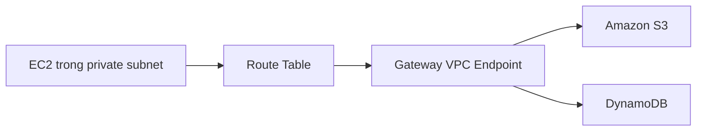
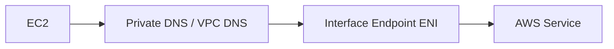

# 151. VPC Endpoints

## 🎯 Giới thiệu
- **VPC Endpoints** cho phép kết nối tới AWS services qua **private network** thay vì đi qua **public internet**.
- Khi dùng VPC Endpoints, bạn **không cần** `Internet Gateway`, `NAT Instance` hoặc `NAT Gateway` để truy cập AWS services.
- VPC Endpoints có tính **horizontal scaling** và **redundant**.
- Có 2 loại chính:
  - **VPC Endpoint Gateway**
  - **VPC Endpoint Interface**

## 1. VPC Endpoint Gateway
- Chỉ dùng cho:
  - **Amazon S3**
  - **DynamoDB**
- Mỗi **VPC** phải tạo **1 gateway endpoint** riêng.
- Cần **update route table** để hoạt động.
- Route table sẽ áp dụng cho tất cả instance kế thừa route table đó.
- Luồng hoạt động:
  - EC2 trong private subnet truy cập S3/DynamoDB
  - Route table chuyển traffic tới `VPCE`
  - Traffic đi **privately** trong AWS network
- Có thể dùng **public host name** của S3 như bình thường:
  - DNS sẽ resolve ra IP
  - Route table sẽ điều hướng sang VPC Endpoint thay vì public internet
- Điều kiện quan trọng:
  - **DNS resolution** phải được bật trong VPC
- Giới hạn:
  - Không thể mở rộng ra ngoài VPC
  - Không đi qua:
    - `VPN`
    - `Direct Connect`
    - `Transit Gateway`
    - `VPC Peering`
- Không thể share gateway endpoint ngoài phạm vi VPC của chính nó.

## 2. VPC Endpoint Interface
- Dùng cho **tất cả services**, bao gồm cả `S3` và `DynamoDB`.
- Khi tạo endpoint, AWS provision một **ENI (Elastic Network Interface)**.
- ENI này phải nằm trong **một subnet**.
- Có thể gán **Security Groups** cho ENI, nên linh hoạt về bảo mật hơn.
- Để truy cập private endpoint:
  - Cần bật **private DNS**
  - Public hostname của service sẽ resolve sang **private endpoint interface host name**
- Điều kiện trong VPC:
  - `enable DNS host name` phải bật
  - `enable DNS support` phải bật
- Nếu không bật private DNS:
  - Phải dùng một trong các **VPC endpoint full domain name** để truy cập privately
- Ví dụ với **Athena**:
  - Có nhiều VPC hostnames
  - Các hostname này trỏ về ENI
  - Public hostname của Athena sẽ trở thành **CNAME** cho một trong các hostname đó
- Interface endpoint có thể được dùng qua:
  - `Direct Connect`
  - `site-to-site VPN`
- Interface endpoints là **shareable**.

## 3. Các điểm cần nhớ khi troubleshoot
- Nếu VPC Endpoint gặp lỗi, hãy kiểm tra:
  - **DNS settings** trong VPC
  - **Route tables** để নিশ্চিত rằng có route từ EC2 tới endpoint
- Đây là 2 hướng kiểm tra quan trọng nhất được nhắc đến trong bài.

## 📊 Bảng tóm tắt
| Tiêu chí | Mô tả |
|----------|------|
| Mục đích | Truy cập AWS services qua private network |
| Cần Internet Gateway / NAT | Không cần |
| VPC Endpoint Gateway | Chỉ cho `S3` và `DynamoDB` |
| VPC Endpoint Interface | Dùng cho mọi service |
| Cấu hình mạng | Gateway cần sửa route table, Interface dùng ENI |
| Bảo mật | Interface hỗ trợ Security Groups |
| DNS | Cần DNS resolution; Interface cần private DNS |
| Phạm vi | Gateway chỉ trong VPC; Interface có thể dùng qua `Direct Connect` và `VPN` |
| Tính chia sẻ | Gateway không share ngoài VPC; Interface có thể share |

## 💡 Mẹo ghi nhớ cho kỳ thi AWS
- **Gateway = chỉ `S3` + `DynamoDB` + route table**
- **Interface = ENI + Security Group + private DNS**
- Nếu đề bài nói:
  - truy cập `S3/DynamoDB` qua private route table → nghĩ ngay **Gateway Endpoint**
  - truy cập service khác như `CloudWatch`, `Athena` privately → nghĩ ngay **Interface Endpoint**
- Luôn nhớ 2 setting cho Interface Endpoint:
  - `enable DNS host name`
  - `enable DNS support`
- Nếu câu hỏi nhắc đến `VPN`, `Direct Connect`, `Transit Gateway`, `VPC Peering`:
  - **Gateway Endpoint không đi qua được**
  - **Interface Endpoint thì có thể**

## ✅ Kết luận
- `VPC Endpoints` giúp truy cập AWS services bằng đường **private**, giảm phụ thuộc vào internet public.
- `Gateway Endpoint` phù hợp cho `S3` và `DynamoDB`.
- `Interface Endpoint` linh hoạt hơn, dùng cho hầu hết services và hỗ trợ `ENI`, `Security Groups`, `private DNS`.
- Khi ôn thi, hãy tập trung vào 3 ý: **loại endpoint**, **dịch vụ hỗ trợ**, và **cách traffic đi qua network**.
