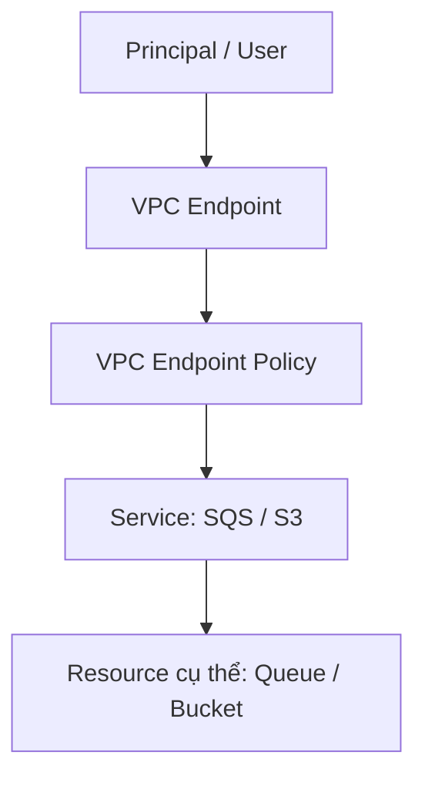
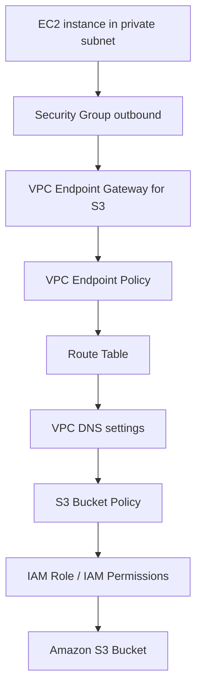

# 152. VPC Endpoint Policies

## 🎯 Giới thiệu
- **VPC Endpoint Policy** là một **JSON document** dùng để kiểm soát quyền truy cập vào một service thông qua **VPC endpoint**.
- Đây là một lớp bảo vệ bổ sung ở **VPC endpoint level**.
- Policy này **không thay thế**:
  - **IAM user policies**
  - **service-specific policies** như **S3 bucket policy** hoặc **SQS queue policy**
- Nếu người dùng truy cập service qua **public route** thay vì qua VPC endpoint, thì **VPC endpoint policy không được áp dụng**.

## 1. Cách hoạt động của VPC Endpoint Policies
- Có thể dùng VPC endpoint policy để:
  - Chỉ cho phép một **principal** cụ thể
  - Chỉ cho phép một action cụ thể như **SQS SendMessage**
  - Chỉ truy cập một resource cụ thể, ví dụ một **queue**
- Khi policy được gắn vào **VPC endpoint**:
  - Chỉ user được phép mới truy cập được service qua endpoint đó
  - Chỉ các action được cho phép mới hoạt động
- Đây là một cơ chế kiểm soát truy cập thêm, không phải cơ chế thay thế cho IAM.

## 2. VPC Endpoint Policy với S3 và condition keys
- VPC Endpoint Policy cũng có thể áp dụng cho **S3 bucket**.
- Có thể giới hạn:
  - Chỉ truy cập một bucket cụ thể, ví dụ **my_secure_bucket**
  - Chỉ cho phép **GetObject** và **PutObject**
  - Chỉ cho phép truy cập qua **VPC endpoint**
- Với **Amazon Linux 2 repositories**:
  - **EC2 instances** khi update Linux OS thực chất đang lấy object từ một **Amazon-owned S3 bucket**
  - VPC endpoint policy có thể cho phép truy cập private tới repository này qua endpoint

### Kết hợp với S3 bucket policy
- Có thể kết hợp **VPC endpoint policy** và **S3 bucket policy** để khóa chặt truy cập.
- Trong **S3 bucket policy**, có thể dùng condition:
  - `aws:sourceVpce`
  - `aws:sourceVpc`
- Ý nghĩa theo transcript:
  - `aws:sourceVpce`: chỉ cho phép traffic đến từ **một VPC endpoint cụ thể**
  - `aws:sourceVpc`: dùng khi có **nhiều VPC endpoints** và muốn áp dụng điều kiện ở mức **VPC**
- Nếu policy dùng các condition này:
  - Traffic đi qua VPC endpoint sẽ được cho phép
  - Traffic không đi qua VPC endpoint sẽ bị từ chối
- Điều này giúp **lock down S3 bucket** để chỉ dùng được từ **VPC endpoints**

### Phân biệt với SourceIp
- `aws:SourceIp` chỉ áp dụng cho **public IP**
- Không dùng `SourceIp` để giới hạn bằng **private IP**
- Nếu muốn restrict truy cập trong **private VPC endpoint**:
  - Dùng `aws:SourceVpce` hoặc `aws:SourceVpc`
- Nếu muốn restrict theo **public IP**:
  - Dùng `aws:SourceIp`

| Condition | Áp dụng cho | Mục đích |
|----------|-------------|----------|
| `aws:sourceVpce` | Private traffic qua VPC endpoint | Giới hạn theo một endpoint cụ thể |
| `aws:sourceVpc` | Private traffic qua VPC endpoints | Giới hạn theo một VPC |
| `aws:SourceIp` | Public IP | Giới hạn theo public IP |

## 3. Troubleshooting kết nối EC2 private subnet tới S3
- Khi một **EC2 instance** trong **private subnet** truy cập **Amazon S3** qua đường private, có nhiều điểm có thể lỗi.

### Các điểm cần kiểm tra
1. **Security group của instance**
   - Kiểm tra **outbound rules**
   - Nếu outbound không cho phép traffic đi ra thì kết nối sẽ fail

2. **VPC endpoint gateway**
   - Cần tạo **VPC endpoint gateway** cho **Amazon S3**
   - Endpoint này có **VPC endpoint policy**
   - Policy phải cho phép EC2 instance truy cập S3

3. **Route tables**
   - Cần cập nhật route table để request tới S3 đi qua **VPC endpoint gateway**
   - Nếu không có route, EC2 instance không thể nói chuyện với gateway endpoint

4. **VPC DNS settings**
   - Phải bật DNS resolution để việc resolve hoạt động đúng

5. **S3 bucket policy**
   - Phải kiểm tra bucket policy có thực sự cho phép truy cập hay không

6. **IAM permissions**
   - EC2 instance có thể có **EC2 instance role**
   - Role này có thể cho phép hoặc không cho phép truy cập S3
   - Cần kiểm tra IAM permissions

## 📊 Bảng tóm tắt
| Tiêu chí | Mô tả |
|----------|------|
| Mục đích | Kiểm soát access vào service thông qua VPC endpoint |
| Cấp độ áp dụng | VPC endpoint level |
| Không thay thế | IAM user policies và service-specific policies |
| Ví dụ action | `SQS SendMessage`, `GetObject`, `PutObject` |
| Điều kiện chặn truy cập | `aws:sourceVpce`, `aws:sourceVpc`, `aws:SourceIp` |
| `SourceIp` | Chỉ dùng cho public IP |
| `sourceVpce` / `sourceVpc` | Dùng cho private traffic qua VPC endpoint |
| Troubleshooting S3 private access | Security group, VPC endpoint gateway, route table, DNS, bucket policy, IAM role |

## 💡 Mẹo ghi nhớ cho kỳ thi AWS
- Nhớ rằng **VPC Endpoint Policy** là một lớp kiểm soát thêm, **không thay thế IAM**.
- Nếu traffic đi qua **public route**, VPC endpoint policy **không áp dụng**.
- Muốn khóa S3 chỉ cho private access:
  - Dùng **VPC endpoint policy**
  - Kết hợp thêm **S3 bucket policy**
  - Ưu tiên các condition như `aws:sourceVpce` hoặc `aws:sourceVpc`
- `aws:SourceIp` chỉ dành cho **public IP**, không phải private IP.
- Khi debug kết nối **EC2 private subnet -> S3**, luôn kiểm tra theo thứ tự:
  - Security group
  - VPC endpoint gateway
  - Route table
  - DNS
  - Bucket policy
  - IAM role

## ✅ Kết luận
- **VPC Endpoint Policies** giúp kiểm soát truy cập service ở mức **VPC endpoint**.
- Chúng đặc biệt hữu ích khi muốn giới hạn truy cập đến **SQS** hoặc **S3** qua private path.
- Với **S3**, việc bảo vệ hiệu quả nhất thường là kết hợp:
  - **VPC endpoint policy**
  - **S3 bucket policy**
  - **IAM permissions**
- Nắm rõ các điểm kiểm tra khi troubleshooting là rất quan trọng cho kỳ thi AWS.
