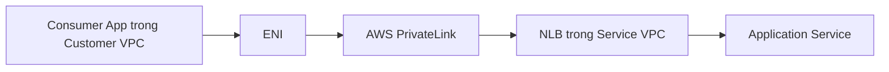

# 153. PrivateLink

## 🎯 Giới thiệu
- **AWS PrivateLink** còn được gọi là **VPC Endpoint Services**.
- Đây là cách **secure** và **scalable** để expose service tới **nhiều VPC**:
  - trong cùng account
  - hoặc từ account khác
- Mục tiêu chính:
  - giữ traffic **private**
  - tránh dùng **VPC peering**
  - không cần public exposure qua **Internet Gateway**, **NAT Gateway/NAT instance**, hay route tables phức tạp

## 1. PrivateLink hoạt động như thế nào
- Mô hình thường có:
  - **Service VPC**: nơi host application/service
  - **Customer VPC**: nơi consumer app truy cập service
- Thay vì:
  - **VPC peering**: làm các instance hai bên có thể giao tiếp quá rộng
  - **public internet**: khiến service phải public
- PrivateLink dùng:
  - **Network Load Balancer (NLB)** ở Service VPC
  - **ENI (Elastic Network Interface)** ở Customer VPC
- Luồng traffic:
  - consumer trong Customer VPC chỉ nói chuyện với **ENI**
  - **ENI** forward traffic tới **NLB**
  - **NLB** forward traffic tới application service
- Điểm quan trọng:
  - chỉ cần **one NLB**
  - có thể có **rất nhiều ENI** cho nhiều customer VPC
  - nếu **NLB** nằm trên nhiều **Availability Zone**, thì **ENI** cũng cần ở nhiều AZ để đảm bảo **fault tolerance**

## 2. PrivateLink với Amazon S3 và Direct Connect
- Tình huống:
  - corporate data center muốn truy cập **Amazon S3** qua **Direct Connect**
- Có 2 hướng được nhắc đến:
  - dùng **public VIF** để đi tới public URL của S3 qua Direct Connect
  - dùng đường private qua **VPC endpoint**
- Nếu muốn traffic đi qua VPC:
  - **gateway endpoint** không dùng được trong case này vì gateway endpoint chỉ hoạt động **từ trong VPC**
  - corporate data center qua Direct Connect không thể access gateway endpoint
- Vì vậy cần:
  - tạo **interface VPC endpoint** cho **Amazon S3**
  - endpoint này gắn với **PrivateLink**
- Để Direct Connect truy cập PrivateLink:
  - phải tạo **private VIF**
- Kết quả:
  - toàn bộ traffic vẫn **private**
  - đi qua VPC vào **Amazon S3 bucket**

## 3. PrivateLink VPC endpoints cross-region
- PrivateLink cũng hỗ trợ **cross-region**
- Ví dụ trong transcript:
  - muốn access **S3 bucket** ở `eu-west-1`
  - có **EC2 instances** ở `ap-east-1`
  - truy cập từ `us-east-1`
- Thay vì cần **VPC peering**, có thể:
  - tạo **VPC interface endpoint** cho **Amazon S3** trực tiếp trong VPC ở `us-east-1`
  - link endpoint đó tới service ở **region khác**
- Kết quả:
  - có **private connectivity**
  - không cần **VPC peering**
- Với application:
  - nếu expose **EC2 instances** qua **NLB**
  - thì cũng có thể tạo **VPC endpoint** cho application tương tự
  - và vẫn dùng được **cross-region**
- Ý nghĩa:
  - tăng **security**
  - kiến trúc sạch hơn, gọn hơn

## 📊 Bảng tóm tắt
| Tiêu chí | Mô tả |
|----------|------|
| Tên gọi | **AWS PrivateLink** / **VPC Endpoint Services** |
| Mục tiêu | Expose service một cách **private**, **secure**, **scalable** |
| Thành phần chính | **NLB**, **ENI**, **VPC endpoint** |
| Luồng truy cập | Consumer app -> **ENI** -> **NLB** -> Service |
| Điểm mạnh | Không cần **VPC peering**, không cần public internet |
| S3 + Direct Connect | Dùng **interface VPC endpoint** + **private VIF** |
| Gateway endpoint | Chỉ dùng từ trong VPC, không phù hợp với corporate data center qua Direct Connect |
| Cross-region | Có thể link **VPC interface endpoint** tới service ở region khác |

## 💡 Mẹo ghi nhớ cho kỳ thi AWS
- **PrivateLink = private service access qua ENI và NLB**
- Gặp bài toán:
  - nhiều VPC cần truy cập service
  - muốn tránh **VPC peering**
  - không muốn public service
  - nhớ ngay tới **PrivateLink**
- Với **Direct Connect + S3**:
  - nếu cần private path từ on-premises, nhớ **interface VPC endpoint** và **private VIF**
  - không dùng **gateway endpoint** cho corporate data center
- Với **cross-region**:
  - PrivateLink giúp tránh phải dùng **VPC peering**
  - phù hợp để giữ kiến trúc gọn và private
- Nếu service nằm sau **NLB**, đó là dấu hiệu rất mạnh của **PrivateLink**

## ✅ Kết luận
- **AWS PrivateLink** là cách rất **secure** và **scalable** để expose service cho nhiều VPC hoặc nhiều account.
- Cốt lõi cần nhớ:
  - **ENI** ở phía consumer
  - **NLB** ở phía service
  - traffic đi **private**
  - dùng được cho **Direct Connect**, **S3**, và cả **cross-region**
- Đây là chủ đề quan trọng cần nắm chắc cho kỳ thi AWS.
