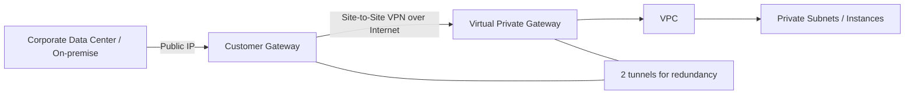
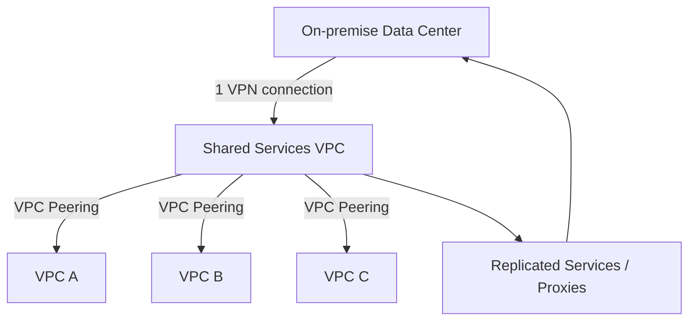

# 154. AWS S2S VPN

## 🎯 Giới thiệu
- **Site-to-Site VPN** là một kiểu **AWS managed VPN** dùng để kết nối **corporate data center / on-premise network** với **VPC** qua **public internet**.
- Mục tiêu là cho hai bên giao tiếp bằng **private IP**, nhưng luồng thực tế vẫn đi trên internet và được **encrypted**.
- Khi thiết kế, cần chuẩn bị:
  - On-premise: **software/hardware VPN appliance** có **public IP**
  - AWS: **Virtual Private Gateway (VGW)** gắn vào **VPC**
  - **Customer Gateway (CGW)** trỏ tới public IP của VPN appliance on-premise
  - Một **VPN connection** giữa CGW và VGW
- AWS sẽ tạo **2 tunnels** để **redundancy**, và cả hai đều dùng **IPSec**.
- Nếu cần mở rộng tốc độ/phạm vi toàn cầu, có thể dùng **AWS Global Accelerator** để accelerate.

## 1. Kiến trúc cơ bản của Site-to-Site VPN
- **VGW** là resource cấp **VPC**.
- **CGW** là đại diện cho phía on-premise, được cấu hình bằng **public IP** của VPN appliance.
- VPN connection kết nối **on-premise** với **AWS**.
- Mỗi kết nối VPN có:
  - **Primary tunnel**
  - **Secondary tunnel** để dự phòng
- Toàn bộ traffic của VPN được bảo vệ bằng **IPSec**.

## 2. Routing: Static routing và Dynamic routing (BGP)
- Để instance trong **private subnet** giao tiếp đúng qua **VGW**, cần cấu hình **route table** ở cả hai phía.
- Phía AWS:
  - Route table phải trỏ CIDR của corporate network về **VGW**
- Phía on-premise:
  - Router phải trỏ CIDR của subnet private về **CGW**

### Hai kiểu routing
| Kiểu | Đặc điểm |
|------|----------|
| **Static routing** | Tự sửa route table thủ công ở cả hai phía. Dễ hiểu nhưng khó bảo trì khi mạng thay đổi. |
| **Dynamic routing (BGP)** | Route được chia sẻ tự động giữa các network. Cần khai báo **ASN** cho cả **CGW** và **VGW**. |
| **eBGP** | Khi BGP đi qua internet thì được gọi là **eBGP**. |

- Khi bật **BGP**, route tables sẽ được cập nhật **tự động**.
- Ý chính cần nhớ: **static = manual**, **BGP = automatic**.

## 3. Internet access, VPN CloudHub và Shared Services VPC
### 3.1. Internet access qua VPN
- **Không thể** dùng **NAT Gateway** trong VPC để cho traffic từ **site-to-site VPN** hoặc **Direct Connect** đi ra internet.
- Lý do theo transcript: **NAT Gateway** có hạn chế, không cho source network từ **site-to-site VPN / Direct Connect** đi qua ra **Internet Gateway**.
- Tuy nhiên, nếu dùng **NAT Instance** thì có thể làm được vì có **nhiều quyền kiểm soát phần mềm hơn**.
- Một mô hình khác là:
  - Private subnet trong VPC đi qua **VGW**
  - Sang **CGW**
  - Rồi đi ra internet qua **on-premise NAT**
- Mô hình này hợp lệ khi muốn toàn bộ internet traffic đi qua **corporate data center**.

### 3.2. VPN CloudHub
- **VPN CloudHub** dùng để kết nối nhiều **Customer Gateways** với nhau.
- Có thể kết nối tối đa **10 Customer Gateway cho mỗi VGW**.
- Dùng cho mô hình **hub-and-spoke** chi phí thấp:
  - Kết nối nhiều site như **New York**, **Los Angeles**, **Miami**
  - Các site giao tiếp qua **VGW** và các VPN connections
- Ứng dụng:
  - Kết nối primary network giữa nhiều chi nhánh
  - **Failover** khi kết nối trực tiếp giữa các site gặp sự cố
- Dù dùng CloudHub, traffic vẫn đi qua **public internet** và được **IPSec encrypted**.

### 3.3. Nhiều VPC và Shared Services VPC
- Với nhiều VPC, AWS khuyến nghị tạo **một VPN connection riêng cho từng customer VPC**.
- Nếu có nhiều VPC, cách này sẽ trở nên phức tạp.
- Một giải pháp là dùng **Shared Services VPC**:
  - Chỉ cần **1 site-to-site VPN** giữa on-premise và **Shared Services VPC**
  - Replicate **services / applications / databases** từ on-premise lên Shared Services VPC
  - Hoặc triển khai **proxies** trong Shared Services VPC để proxy request về on-premise
- Sau đó, các VPC khác sẽ **VPC peering** với Shared Services VPC.
- Vì **VPC peering is not transitive**, các VPC khác không truy cập trực tiếp on-premise.
- Chúng chỉ truy cập được các service đã được **replicate** hoặc đi qua **proxy** trong Shared Services VPC.

## 📊 Bảng tóm tắt
| Tiêu chí | Mô tả |
|----------|------|
| Mục đích | Kết nối **on-premise** với **VPC** qua **public internet** nhưng vẫn **encrypted** |
| Thành phần chính | **VGW**, **CGW**, **VPN connection**, **VPN appliance** |
| Bảo mật | Dùng **IPSec** |
| Dự phòng | Có **2 tunnels** cho redundancy |
| Routing | **Static routing** hoặc **Dynamic routing (BGP)** |
| BGP | Tự động chia sẻ route, cần **ASN** cho CGW và VGW |
| Internet access | **NAT Gateway** không phù hợp cho traffic từ VPN/Direct Connect; **NAT Instance** hoặc **on-prem NAT** có thể dùng |
| VPN CloudHub | Kết nối nhiều **Customer Gateways** qua một **VGW**, tối đa **10 CGW/VGW** |
| Multi-VPC pattern | AWS khuyến nghị **1 VPN connection cho mỗi VPC**; có thể tối ưu bằng **Shared Services VPC** |

## 💡 Mẹo ghi nhớ cho kỳ thi AWS
- **S2S VPN = on-premise ↔ VPC qua internet, nhưng encrypted**
- **VGW** gắn vào **VPC**, **CGW** đại diện phía **customer/on-premise**
- Nhớ **2 tunnels + IPSec** = redundancy và bảo mật
- **Static routing** là chỉnh tay, **BGP** là tự động
- **NAT Gateway** không dùng để đẩy traffic từ **VPN/Direct Connect** ra internet theo mô tả trong transcript
- **VPN CloudHub** = nhiều site, một **VGW**, mô hình **hub-and-spoke**
- **Shared Services VPC** giúp giảm số lượng VPN connections khi có nhiều VPC

## ✅ Kết luận
- **AWS Site-to-Site VPN** là giải pháp kết nối **on-premise** với **VPC** an toàn qua **public internet**.
- Các điểm cần nhớ khi ôn thi:
  - **VGW + CGW**
  - **2 tunnels**
  - **IPSec**
  - **Static routing vs BGP**
  - **CloudHub**
  - **Shared Services VPC** cho kiến trúc nhiều VPC
- Đây là nền tảng để hiểu các mô hình kết nối mạng hybrid trong AWS.
