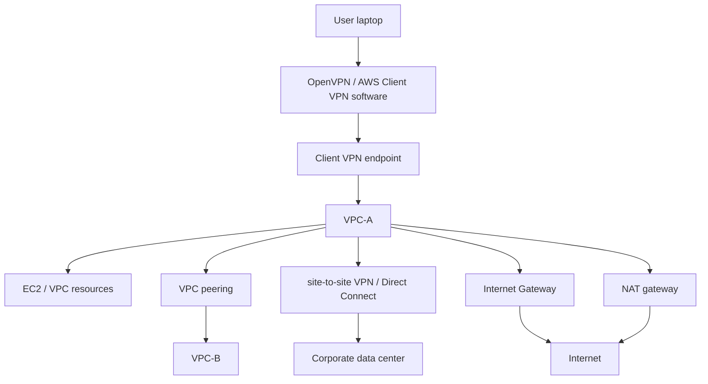

# 155. AWS Client VPN

## 🎯 Giới thiệu
- AWS Client VPN cho phép bạn kết nối từ máy tính cá nhân vào private network trên AWS và on-premises bằng **OpenVPN**.
- Bạn cài software trên máy tính, sau đó tạo kết nối qua **public internet** vào **VPC**.
- Sau khi kết nối, bạn có thể truy cập **EC2 instances** bằng **private IP**.
- Nếu đã bật thêm kết nối như **site-to-site VPN** hoặc **Direct Connect**, Client VPN còn có thể đi qua AWS để truy cập tài nguyên trong corporate data center.

## 1. Cách hoạt động của AWS Client VPN
- Người dùng cài Client VPN software trên máy.
- Máy tính kết nối qua public internet đến **Client VPN endpoint** trong AWS.
- Từ đó, traffic đi vào VPC và truy cập resource nội bộ bằng private IP.
- Client VPN đóng vai trò như một điểm vào private vào AWS.

## 2. Các mô hình truy cập mà Client VPN hỗ trợ
- **Truy cập VPC resources**
  - Kết nối vào một VPC rồi truy cập các resource trong đó.
- **Truy cập VPC khác qua VPC peering**
  - Chỉ cần một Client VPN connection vào **VPC-A**.
  - Nhờ **VPC peering**, có thể truy cập tài nguyên ở **VPC-B** thông qua VPC-A.
- **Truy cập on-premises**
  - Nếu có **site-to-site VPN** hoặc **Direct Connect**, Client VPN endpoint trong VPC cho phép đi tới corporate data center.
  - Traffic sẽ đi qua AWS để đến on-premises.
- **Truy cập internet**
  - Client VPN cũng có thể cho phép internet access.
  - Khi endpoint gắn với public subnets và **internet gateway**, user vừa vào được VPC resources vừa ra internet.
  - Với private subnets, có thể dùng **NAT gateway** để tạo kiến trúc tương tự.

## 3. Kiến trúc kết nối tổng quát

- Chỉ cần có Client VPN endpoint, nhiều kiểu network architecture trên AWS đều có thể hoạt động.
- Client VPN có thể kết hợp với:
  - **VPC peering**
  - **site-to-site VPN**
  - **Direct Connect**
  - **Transit Gateway**
  - **Internet Gateway**
  - **NAT gateway**

## 📊 Bảng tóm tắt
| Tiêu chí | Mô tả |
|----------|------|
| Mục đích | Tạo kết nối private từ máy người dùng vào AWS và on-premises |
| Giao thức / công cụ | **OpenVPN** |
| Kết nối ban đầu | Qua **public internet** vào **Client VPN endpoint** |
| Truy cập resource | Có thể vào **EC2** và các resource khác bằng **private IP** |
| Mở rộng sang on-premises | Kết hợp với **site-to-site VPN** hoặc **Direct Connect** |
| Mở rộng sang VPC khác | Dùng **VPC peering** hoặc **Transit Gateway** |
| Internet access | Có thể đi ra internet qua **internet gateway** hoặc **NAT gateway** |

## 💡 Mẹo ghi nhớ cho kỳ thi AWS
- Ghi nhớ: **Client VPN = endpoint riêng cho user vào private network**.
- Nếu đề bài nói **user laptop cần truy cập VPC private resources**, hãy nghĩ đến **AWS Client VPN**.
- Nếu đề bài nói **truy cập on-premises qua AWS**, nhớ rằng Client VPN có thể kết hợp với **site-to-site VPN** hoặc **Direct Connect**.
- Nếu đề bài có cả **VPC peering**, **Transit Gateway**, hoặc **internet access**, Client VPN vẫn có thể là điểm vào trung tâm.
- Keyword quan trọng cần nhớ: **OpenVPN**, **private IP**, **Client VPN endpoint**, **VPC peering**, **Direct Connect**, **Transit Gateway**, **NAT gateway**.

## ✅ Kết luận
- AWS Client VPN cho phép tạo một kết nối private từ máy tính cá nhân vào AWS.
- Nó hỗ trợ truy cập **VPC resources**, **on-premises resources**, và cả **internet** tùy theo kiến trúc.
- Đây là giải pháp linh hoạt cho nhiều mô hình network khác nhau trong AWS.
