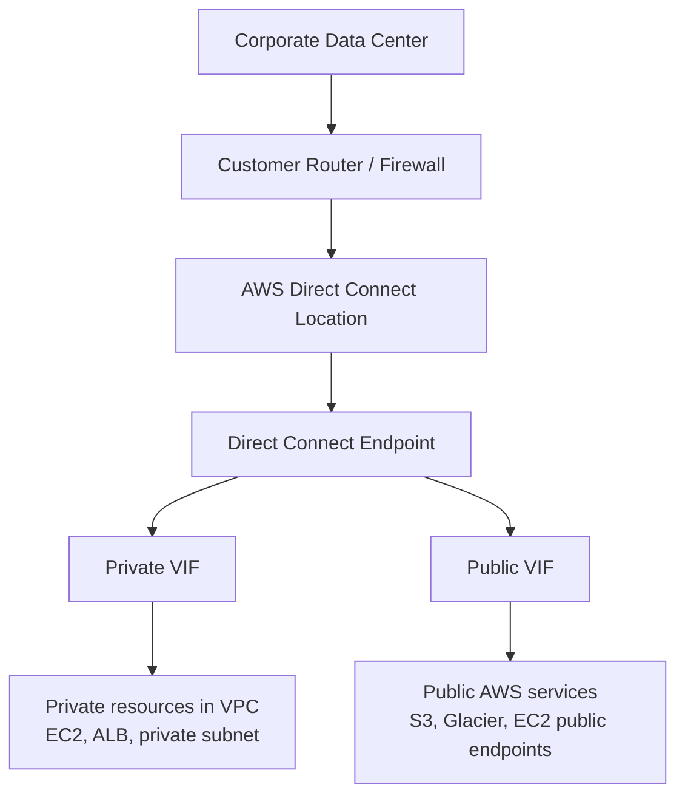
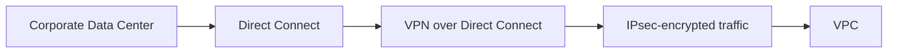
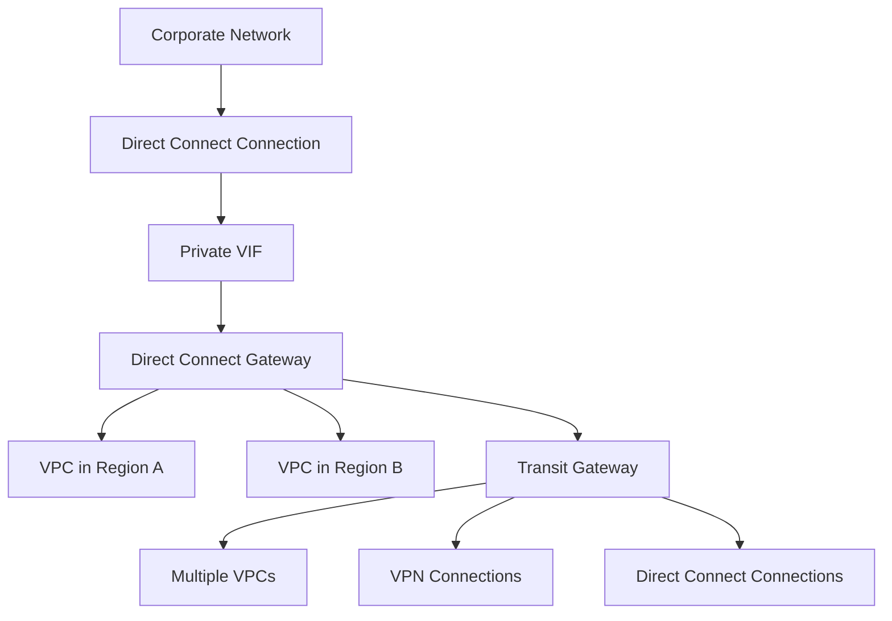

# 156. Direct Connect

## 🎯 Giới thiệu
AWS Direct Connect là một kết nối **dedicated, private** từ mạng bên ngoài vào **VPC** của bạn. Kết nối này được thiết lập giữa **data center** và **AWS Direct Connect locations**.

Điểm chính:
- Là kết nối **private**, không đi qua Internet service provider
- Giúp **giảm public network cost**
- Tăng **bandwidth** vào AWS
- Tăng **stability** của kết nối
- Thường **đắt hơn VPN** vì là kết nối riêng

---

## 1. Tổng quan về Direct Connect 🚀
Direct Connect cho phép truy cập AWS thông qua **private network path** thay vì Internet công cộng.

### Ý nghĩa quan trọng cho thi AWS
- **Bypass ISP** hoàn toàn
- Dùng **private connection** để truy cập AWS services
- Mặc định **không redundant**
- Cần cấu hình:
  - một **failover Direct Connect connection** thứ hai, hoặc
  - dùng **VPN as failover**

### Mermaid: luồng kết nối tổng quát

---

## 2. VIF, loại kết nối và cách sử dụng 🔌
Direct Connect có **3 loại virtual interface (VIF)**:

### Public VIF
- Dùng để kết nối tới **public AWS endpoints**
- Ví dụ:
  - **S3**
  - **EC2 services**
  - các dịch vụ AWS public khác

### Private VIF
- Dùng để kết nối tới **resource private trong VPC**
- Ví dụ:
  - **EC2 instances**
  - **ALB**
  - private subnet

### Transit VIF
- Dùng để kết nối tới resources trong VPC thông qua **transit gateway**

### VPC interface endpoint
- Có thể được truy cập thông qua **private VIF**

### Loại kết nối Direct Connect
| Loại | Băng thông | Cách tạo | Ghi nhớ |
|------|------------|----------|---------|
| **Dedicated connection** | từ **1 Gbps** đến **400 Gbps** | AWS request trước, sau đó hoàn tất bởi **AWS Direct Partner** | Có **physical Ethernet port** dành riêng cho customer |
| **Hosted connection** | từ **50 Mbps** đến **25 Gbps** | Request trực tiếp qua **AWS Direct Connect partners** | Có thể **add/remove capacity on demand** |

### Lưu ý thi cử
- Xây dựng Direct Connect thường mất **hơn 1 tháng**
- Cần tính trước thời gian triển khai

---

## 3. Bảo mật, Redundancy, LAG và Direct Connect Gateway 🔐

### Encryption
Mặc định, **data in transit is not encrypted** trên Direct Connect.

Nếu muốn mã hóa:
- Kết hợp **Direct Connect + VPN**
- Mục tiêu là có **IPsec-encrypted private connection**
- VPN sẽ leverage **public VIF**
- Cách này:
  - tăng bảo mật
  - nhưng **phức tạp hơn**

### Mermaid: Direct Connect + VPN encryption

### LAG - Link Aggregation Group
LAG dùng để:
- Tăng **speed**
- Hỗ trợ **failover**
- Gộp nhiều Direct Connect connections thành **một logical connection**

Thông tin quan trọng:
- Tối đa **4 connections**
- Chạy theo kiểu **active-active**
- Các connection trong LAG phải:
  - là **dedicated connections**
  - có **same bandwidth**
  - terminate tại **same AWS Direct Connect connection endpoint**
- Có thể đặt **minimum number of connections**
- Mặc định minimum là **1**

### Direct Connect Gateway
Dùng khi bạn muốn:
- Kết nối Direct Connect tới **one or more VPCs**
- Qua **nhiều region**
- Có thể **across accounts**

Ý nghĩa:
- Không cần tạo Direct Connect riêng cho từng region
- Kết nối Direct Connect vào **một region**
- Sau đó đưa **private VIF** vào **Direct Connect gateway**
- Gateway sẽ phân phối kết nối tới các VPC cần truy cập

### Direct Connect Gateway + Transit Gateway
- **Transit gateway** dùng để liên kết:
  - nhiều **VPCs**
  - **VPN connections**
  - **Direct Connect connections**
- Nếu muốn nối **transit gateway** với Direct Connect:
  - phải đi qua **Direct Connect gateway**

### Mermaid: Direct Connect Gateway và Transit Gateway

---

## 📊 Bảng tóm tắt
| Tiêu chí | Mô tả |
|----------|------|
| Bản chất | Kết nối **private, dedicated** từ remote network vào **VPC** |
| Lợi ích | Giảm public network cost, tăng bandwidth và stability |
| Nhược điểm | Đắt hơn VPN, không redundant mặc định |
| VIF | Có **Public VIF**, **Private VIF**, **Transit VIF** |
| Mã hóa | Mặc định không encrypted; muốn mã hóa thì kết hợp với **VPN** |
| Redundancy | Dùng **failover Direct Connect** hoặc **VPN as failover** |
| LAG | Gộp tối đa **4 dedicated connections** để tăng speed và failover |
| Gateway | **Direct Connect gateway** giúp kết nối nhiều VPC, nhiều region, nhiều account |
| Transit Gateway | Muốn nối **TGW** với Direct Connect thì phải qua **Direct Connect gateway** |

---

## 💡 Mẹo ghi nhớ cho kỳ thi AWS
- **Direct Connect = private connection riêng**, không đi qua ISP
- **Public VIF** dùng cho **public AWS endpoints**
- **Private VIF** dùng cho **private resources trong VPC**
- **Transit VIF** dùng khi đi qua **Transit Gateway**
- **Direct Connect mặc định không redundant**
- Muốn **encryption** thì nhớ combo **Direct Connect + VPN**
- **LAG** = gom nhiều connection để tăng tốc và failover
- Muốn scale nhiều VPC, nhiều region, nhiều account thì dùng **Direct Connect gateway**
- Muốn nối **Transit Gateway** với Direct Connect thì **bắt buộc qua Direct Connect gateway**

---

## ✅ Kết luận
Direct Connect là lựa chọn cho kết nối **private, ổn định, bandwidth cao** vào AWS. Điểm cần nhớ nhất là phân biệt **public VIF / private VIF / transit VIF**, hiểu khi nào cần **VPN for encryption**, khi nào cần **LAG**, và khi nào phải dùng **Direct Connect gateway** để mở rộng qua nhiều VPC, region, hoặc account.
