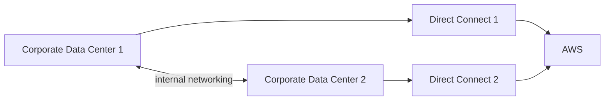
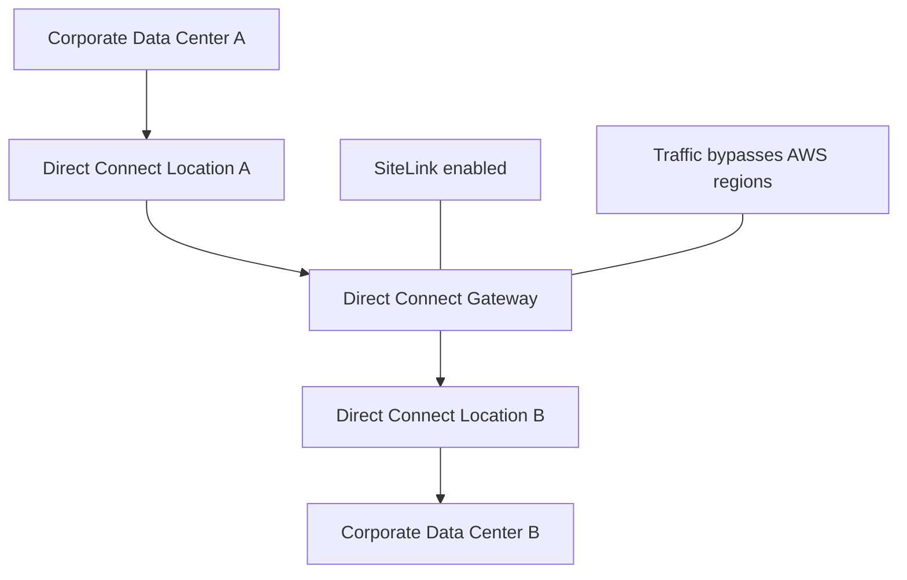

# 157. On-Premise Redundant Connections

## 🎯 Giới thiệu
Bài này nói về cách thiết kế **redundant connections** giữa **on-premises data center** và **AWS** để tăng khả năng **failover** khi một đường kết nối bị down. Các mô hình chính được nhắc đến gồm:

- **active-active VPN**
- **Direct Connect redundancy**
- **hybrid backup VPN + Direct Connect**
- **Direct Connect Gateway SiteLink**

## 1. Active-Active VPN Redundancy
- Có **2 Corporate Data Centers** và cả hai đều kết nối vào AWS bằng **dedicated VPN connection**.
- Hai data center này cũng có **internal connectivity** với nhau.
- Nếu một VPN connection bị down:
  - traffic có thể đi từ **Corporate Data Center 1 -> Corporate Data Center 2 -> AWS**
  - hoặc ngược lại
- Đây là mô hình **redundant active-active VPN connection**.

## 2. Direct Connect Redundancy
- Mô hình tương tự cũng áp dụng cho **Direct Connect**.
- Có **2 Direct Connect connections** trên 2 Corporate Data Centers.
- Hai data center được nối với nhau qua **internal networking**.
- Nếu một **Direct Connect location** bị down:
  - data center còn lại vẫn có thể vào AWS qua location còn lại
- Ý chính: vẫn giữ được đường vào AWS dù một kết nối hoặc location bị lỗi.

## 3. Hybrid Backup VPN + Direct Connect và SiteLink
- Có thể **mix** cả **VPN** và **Direct Connect** để tạo **hybrid backup VPN location**.
- Các Corporate Data Centers nối với nhau, đồng thời kết nối ra ngoài bằng cả **VPN** và **Direct Connect**.
- Nếu một thành phần thất bại:
  - vẫn có **failover route** qua **Corporate Data Center 1** hoặc **Corporate Data Center 2**

### Direct Connect Gateway SiteLink
- **Direct Connect Gateway SiteLink** cho phép gửi dữ liệu:
  - từ một **Direct Connect location** sang một location khác
  - **bypassing the AWS regions**
- Cách hoạt động:
  - on-premises data centers kết nối trực tiếp tới các **Direct Connect locations**
  - phía AWS tạo **Direct Connect Gateway**
  - khi bật **SiteLink**, traffic đi theo đường:
    - **Corporate Data Center -> Direct Connect -> Gateway -> Direct Connect -> customer router**
  - dữ liệu được gửi qua **fastest path** giữa các Direct Connect locations
- Điểm quan trọng: kết nối **Corporate Data Center A** với **Corporate Data Center B** mà **không đi qua AWS regions**

## 📊 Bảng tóm tắt
| Tiêu chí | Mô tả |
|----------|------|
| Mục tiêu | Tạo kết nối **redundant** giữa on-premises và AWS |
| VPN | Dùng **active-active setup** với 2 VPN connections |
| Direct Connect | Dùng 2 **Direct Connect connections** để dự phòng |
| Hybrid backup | Kết hợp **VPN** và **Direct Connect** để có **failover route** |
| SiteLink | Cho phép đi giữa các **Direct Connect locations** mà **bypass AWS regions** |
| Kết nối nội bộ | Các Corporate Data Centers cần có **internal connectivity/networking** |

## 💡 Mẹo ghi nhớ cho kỳ thi AWS
- **VPN active-active**: nhớ logic “1 đường down vẫn còn đường kia qua data center còn lại”.
- **Direct Connect redundancy**: ý tưởng giống VPN redundancy, nhưng dùng **Direct Connect**.
- **Hybrid backup**: khi đề bài nói “mix VPN + Direct Connect”, nghĩ ngay đến **failover**.
- **SiteLink**: từ khóa quan trọng là **between Direct Connect locations** và **bypassing AWS regions**.
- Khi gặp câu hỏi về **on-premises connectivity redundancy**, hãy tìm các tín hiệu:
  - **2 data centers**
  - **internal connectivity**
  - **failover**
  - **Direct Connect Gateway**
  - **SiteLink**

## ✅ Kết luận
Bài học tập trung vào cách thiết kế kết nối **on-premises to AWS** có **redundancy** bằng **VPN**, **Direct Connect**, và **hybrid setup**. Ngoài ra, **Direct Connect Gateway SiteLink** là tính năng quan trọng giúp kết nối giữa các **Direct Connect locations** mà không cần đi qua **AWS regions**.
