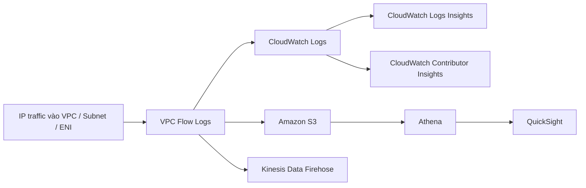
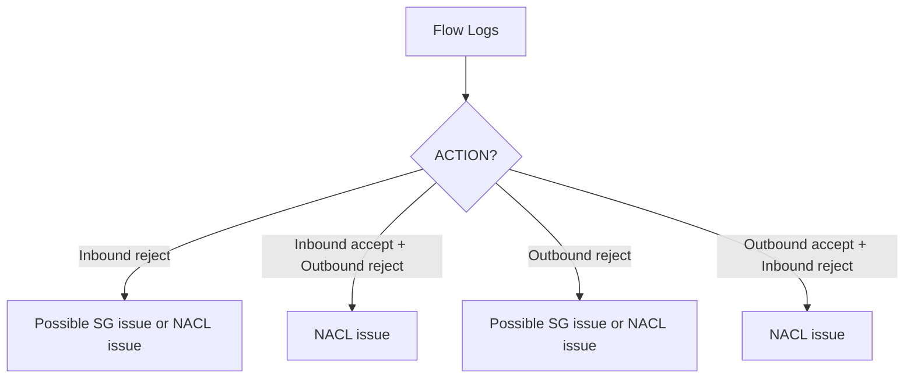

# 158. VPC Flow Logs

## 🎯 Giới thiệu
VPC Flow Logs dùng để thu thập thông tin về IP traffic đi vào các interface trong VPC.  
Có 3 cấp độ tạo flow logs:

- `VPC level`
- `Subnet level`
- `ENI level`

Mục đích chính:

- Monitoring và troubleshooting connectivity issues trong VPC
- Phân tích usage patterns
- Phát hiện hành vi bất thường như malicious behavior, port scans

Flow logs có thể được gửi tới:

- Amazon S3
- CloudWatch Logs
- Kinesis Data Firehose

Ngoài ra, VPC Flow Logs còn ghi nhận traffic của một số AWS managed interfaces như:

- ELB
- RDS
- ElastiCache
- Redshift
- WorkSpaces
- NAT gateway
- Transit gateway

## 1. Nội dung và ý nghĩa của VPC Flow Logs
VPC Flow Logs là metadata về network packets đi vào VPC, gồm các trường chính:

- `version`
- `account-id`
- `interface-id`
- `source address`
- `destination address`
- `source port`
- `destination port`
- `protocol`
- `packets`
- `bytes`
- `start`
- `action`
- `log-status`

Những trường quan trọng để đọc nhanh:

- `source address` và `destination address`
  - Giúp xác định IP gây vấn đề
  - Hữu ích khi một IP bị deny lặp lại nhiều lần
- `srcport` và `dstport`
  - Giúp xác định port có vấn đề
- `action`
  - Chỉ có 2 giá trị: `accept` hoặc `reject`
  - Cho biết request thành công hay thất bại ở `SG` hoặc `NACL`

### Mermaid: Luồng tổng quát của Flow Logs

## 2. Cách truy vấn và troubleshooting
Có 2 cách chính để query Flow Logs:

- `Athena` trên `S3`
  - Phù hợp cho phân tích bằng SQL
- `CloudWatch Logs Insights`
  - Phù hợp cho streaming analysis

### Troubleshooting `Security Group` và `NACL`
Khi dùng Flow Logs để debug, trọng tâm là field `ACTION`.

Nhớ rằng:

- `NACL` là `stateless`
- `Security Group` là `stateful`

Logic thường gặp:

- `Inbound reject`
  - Có thể do `NACL` hoặc `Security Group`
- `Inbound accept` nhưng `Outbound reject`
  - Chỉ có thể là `NACL issue`
  - Vì `Security Group` stateful nên outbound sẽ được cho phép tự động khi inbound đã accept
- `Outbound reject`
  - Có thể do `NACL` hoặc `Security Group`
- `Outbound accept` nhưng `Inbound reject`
  - Chỉ có thể là `NACL issue`

### Mermaid: Flow debug SG/NACL bằng `ACTION`

### Ví dụ phân tích vận hành
- Dùng `CloudWatch Contributor Insights`
  - Tìm `top 10 IP addresses` tạo nhiều network traffic nhất
- Dùng `metric filter` trong `CloudWatch Logs`
  - Theo dõi `SSH` hoặc `RDP`
  - Nếu tăng bất thường thì tạo `CloudWatch alarm`
  - Gửi cảnh báo vào `Amazon SNS`

## 3. Trường hợp đặc biệt với NAT gateway
Một tình huống dễ gây hiểu nhầm:

- VPC Flow Logs có thể hiển thị `ACTION = ACCEPT` cho traffic từ public IP vào VPC
- Nhưng `NAT gateway` không chấp nhận traffic từ internet

Giải thích theo transcript:

- Traffic có thể được phép ở `Security Group` hoặc `NACL` của NAT gateway
- Sau đó traffic đi tới NAT gateway và bị drop
- Vì vậy, bạn có thể thấy một phần flow trong logs, nhưng không phải là NAT gateway thật sự “accept” traffic từ internet

Cách kiểm tra:

- Dùng `CloudWatch Logs Insights`
- Filter:
  - `destination address` nằm trong VPC CIDR
  - `source address` là public IP đang cố truy cập
- Sum `bytes` theo `source address` và `destination address`
- Mục tiêu là xem có traffic nào từ public IP đi vào VPC hay không

Kết quả quan sát:

- Sẽ thấy traffic xuất hiện ở `private IP` của NAT gateway
- Nhưng sẽ không có thêm các dòng khác
- Vì unsolicited traffic vào NAT gateway đã bị drop

## 📊 Bảng tóm tắt
| Tiêu chí | Mô tả |
|----------|------|
| Mục đích | Monitor, troubleshoot connectivity issues, phân tích traffic, phát hiện malicious behavior |
| Phạm vi | `VPC`, `Subnet`, `ENI` |
| Đích gửi | `S3`, `CloudWatch Logs`, `Kinesis Data Firehose` |
| Dữ liệu chính | `source/destination address`, `srcport/dstport`, `protocol`, `bytes`, `action`, `log-status` |
| Query | `Athena` trên `S3` hoặc `CloudWatch Logs Insights` |
| Debug SG/NACL | Dựa vào `ACTION` và tính chất `stateful/stateless` |
| Phân tích nâng cao | `CloudWatch Contributor Insights`, `metric filter`, `SNS`, `QuickSight` |
| Case đặc biệt | NAT gateway có thể hiện `ACCEPT` trong log nhưng traffic vẫn bị drop sau đó |

## 💡 Mẹo ghi nhớ cho kỳ thi AWS
- `VPC Flow Logs` = quan sát `IP traffic` ở mức `VPC / Subnet / ENI`
- Nhớ 3 destination chính: `S3`, `CloudWatch Logs`, `Kinesis Data Firehose`
- Khi debug:
  - `SG` = `stateful`
  - `NACL` = `stateless`
- Nếu thấy `Inbound accept` nhưng `Outbound reject` thì nghĩ ngay đến `NACL`
- Nếu cần phân tích lâu dài: dùng `Athena` trên `S3`
- Nếu cần phân tích nhanh theo thời gian thực hơn: dùng `CloudWatch Logs Insights`
- `ACTION` là field quan trọng nhất để đọc nhanh vấn đề
- NAT gateway có thể gây hiểu nhầm: thấy `ACCEPT` trong log không có nghĩa là nó thật sự nhận internet traffic hoàn toàn

## ✅ Kết luận
VPC Flow Logs là công cụ quan trọng để theo dõi traffic trong `VPC`, hỗ trợ troubleshooting và phát hiện bất thường. Khi làm bài thi AWS, hãy tập trung vào 3 điểm: nơi thu thập log (`VPC/Subnet/ENI`), nơi lưu/query (`S3`, `CloudWatch Logs`, `Athena`), và cách dùng `ACTION` để phân biệt lỗi `Security Group` hay `NACL`.
