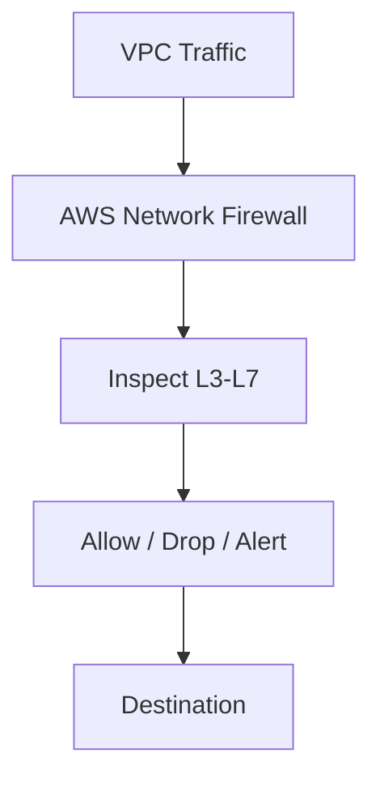
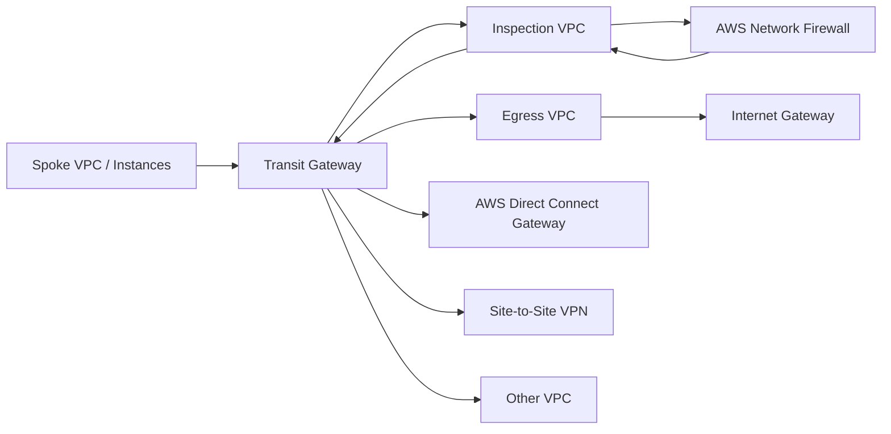

# 159. AWS Network Firewall

## 🎯 Giới thiệu
- **AWS Network Firewall** là dịch vụ dùng để bảo vệ **toàn bộ VPC** bằng firewall được AWS quản lý.
- Nó cung cấp khả năng kiểm tra và kiểm soát lưu lượng từ **layer 3 đến layer 7**.
- Dịch vụ này được nhắc đến như một bước tiếp theo sau các cơ chế bảo vệ mạng đã biết như:
  - **NACL**
  - **VPC Security Groups**
  - **AWS WAF**
  - **AWS Shield / Shield Advanced**
  - **AWS Firewall Manager**

## 1. Phạm vi bảo vệ và khả năng kiểm tra traffic
- AWS Network Firewall có thể inspect traffic theo nhiều hướng:
  - **VPC to VPC**
  - **Outbound to internet**
  - **Inbound from internet**
  - **To/from Direct Connect**
  - **To/from Site-to-Site VPN**
- Mục tiêu là bảo vệ lưu lượng của toàn VPC với các rule chi tiết.
- Bên trong, service này dùng **AWS Gateway Load Balancer**, nhưng AWS quản lý appliance thay vì người dùng phải tự triển khai appliance bên thứ ba.

## 2. Rule, kiểm soát và logging
- Có thể quản lý tập trung qua **AWS Firewall Manager** trên nhiều account và nhiều VPC.
- AWS Network Firewall hỗ trợ:
  - **Thousands of rules** ở cấp VPC
  - Filter theo **IP** và **port**
  - Filter theo **protocol**
    - Ví dụ: chặn **SMB** outbound
  - Filter theo **domain**
    - Ví dụ: chỉ cho phép outbound tới domain nội bộ hoặc một số third-party repository được phép
  - **Pattern matching** bằng **regex**
- Khi match rule, có thể chọn:
  - **Allow**
  - **Drop**
  - **Alert**
- Có **active flow inspections**, tức có thể dùng như một **intrusion prevention capability**.
- Rule matches có thể gửi tới:
  - **Amazon S3**
  - **CloudWatch Logs**
  - **Kinesis Data Firehose**
  để phân tích.

## 3. Kiến trúc triển khai với Transit Gateway
- Khi có nhiều VPC, inspection VPC, egress VPC, on-premises data center, VPN và Direct Connect, điểm trung tâm cần nghĩ đến là **AWS Transit Gateway**.
- Mô hình thường dùng:
  - **Inspection VPC**: nơi đặt **AWS Network Firewall**
  - **Egress VPC**: đi ra internet qua **Internet Gateway**
  - Kết nối tới on-prem qua **Site-to-Site VPN** hoặc **AWS Direct Connect Gateway**
- Luồng tổng quát:
  - Instance trong VPC gửi traffic tới **Transit Gateway**
  - Transit Gateway route traffic tới **Inspection VPC**
  - Traffic đi qua **AWS Network Firewall**
  - Sau đó quay lại **Transit Gateway**
  - Rồi mới đi tới:
    - **Egress VPC** để ra internet
    - hoặc **VPN / Direct Connect Gateway** để tới on-prem
- Kiểu kiến trúc này áp dụng cho:
  - **North-South traffic**: từ VPC ra internet hoặc đi tới on-prem
  - **East-West traffic**: từ VPC này sang VPC khác
- Điểm chính là mọi traffic đều đi theo chuỗi:
  - **Transit Gateway → Network Firewall → Transit Gateway → đích cuối**

## 📊 Bảng tóm tắt
| Tiêu chí | Mô tả |
|----------|------|
| Mục đích | Bảo vệ toàn bộ VPC bằng firewall do AWS quản lý |
| Phạm vi kiểm tra | Layer 3 đến Layer 7 |
| Hướng traffic | VPC-to-VPC, internet in/out, Direct Connect, Site-to-Site VPN |
| Quản lý rule | Có thể quản lý tập trung qua AWS Firewall Manager |
| Loại rule | IP, port, protocol, domain, regex |
| Hành động | Allow, Drop, Alert |
| Logging | S3, CloudWatch Logs, Kinesis Data Firehose |
| Kiến trúc trung tâm | AWS Transit Gateway |
| Mô hình điển hình | Inspection VPC + Egress VPC + VPN/Direct Connect |

## 💡 Mẹo ghi nhớ cho kỳ thi AWS
- **AWS Network Firewall = firewall cho cả VPC**, không chỉ một dịch vụ đơn lẻ.
- Nhớ cụm **“Transit Gateway ở giữa, Inspection VPC ở giữa luồng”**.
- Khi thấy yêu cầu:
  - inspect traffic giữa nhiều VPC
  - kiểm soát outbound internet
  - kiểm tra traffic tới on-prem
  - logging rule matches  
  thì nghĩ đến **AWS Network Firewall**.
- Từ khóa cần nhớ:
  - **Layer 3 to Layer 7**
  - **Allow / Drop / Alert**
  - **AWS Firewall Manager**
  - **Gateway Load Balancer**
  - **S3 / CloudWatch Logs / Kinesis Data Firehose**
- Với sơ đồ phức tạp, hãy tự hỏi:
  - traffic có đi qua **Transit Gateway** không?
  - có **inspection VPC** không?
  - có **egress VPC** hoặc **VPN / Direct Connect** không?

## ✅ Kết luận
- **AWS Network Firewall** là dịch vụ dùng để bảo vệ và kiểm tra traffic ở mức sâu cho toàn VPC.
- Dịch vụ này hỗ trợ rule chi tiết, logging linh hoạt, và quản lý tập trung qua **AWS Firewall Manager**.
- Trong kiến trúc nhiều VPC hoặc kết nối on-prem, **AWS Transit Gateway** thường là trung tâm để điều hướng traffic qua **inspection VPC** trước khi tới đích cuối.
