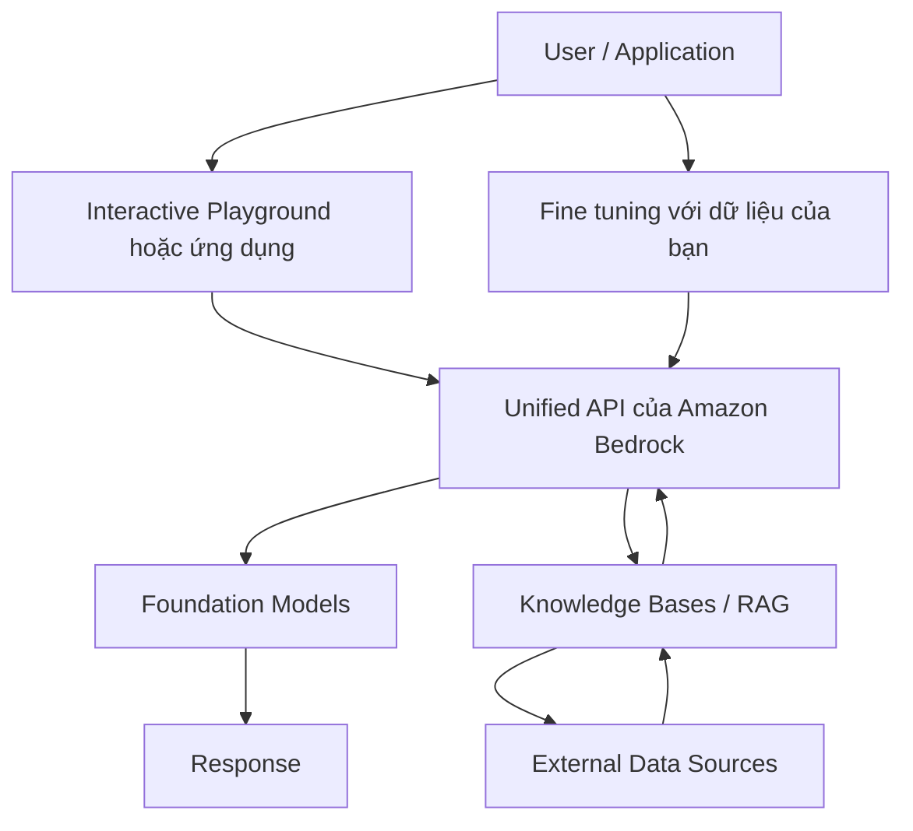

# 160. Amazon Bedrock

## 🎯 Giới thiệu
- Amazon Bedrock là service trên AWS dùng để xây dựng **generative AI applications**.
- Đây là một **fully managed service**, nghĩa là AWS quản lý phần vận hành cho bạn.
- Bạn có thể:
  - làm việc với nhiều **foundation models**
  - cấu hình để đạt kết quả mong muốn
  - dùng các tính năng nâng cao như **RAG**, **LLM agents**
  - hưởng các tính năng về **security**, **privacy**, **governance**, và **responsible AI**
- Bedrock dùng **pay-per-use pricing model**.
- Dữ liệu dùng để train hoặc fine-tune nằm trong **your account** và **never leaves your account**.

## 1. Tổng quan về Amazon Bedrock
- Bedrock là một lớp trung gian để truy cập nhiều model theo cách chuẩn hóa.
- AWS cung cấp **unified API**, nên ứng dụng chỉ cần nói chuyện với Bedrock theo một cách duy nhất.
- Bedrock giúp bạn tương tác với nhiều model phía sau mà không cần tự quản lý hạ tầng dịch vụ.

## 2. Foundation Models trên Bedrock
- Transcript nêu các nhà cung cấp / model có mặt trên Bedrock:
  - **AI21 Labs**
  - **Cohere**
  - **Stability.ai**
  - **Amazon**
  - **Anthropic**
  - **Meta**
  - **Mitral AI**
- Theo thời gian, sẽ có thêm nhiều **foundation models** và công ty khác được bổ sung.
- Khi bạn dùng một model:
  - Bedrock sẽ tạo một bản copy của **foundation model (FM)** dành riêng cho bạn
  - trong một số trường hợp, bạn có thể dùng dữ liệu riêng để **fine tune** model theo nhu cầu

## 3. Cách hoạt động của Bedrock
- Ở trung tâm là các **foundation models**.
- Người dùng chọn model trong **interactive playground**.
- Sau đó có thể gửi câu hỏi vào model.
- Bedrock có thể mở rộng sang:
  - **knowledge bases / RAG** để trả lời liên quan và chính xác hơn bằng cách lấy dữ liệu từ nguồn dữ liệu bên ngoài
  - **fine tuning** bằng dữ liệu riêng của bạn
- Tất cả được truy cập qua **unified API**.

## 📊 Bảng tóm tắt
| Tiêu chí | Mô tả |
|----------|------|
| Mục đích | Dùng để xây dựng generative AI applications trên AWS |
| Quản lý dịch vụ | **Fully managed service** |
| API | **Unified API** cho tất cả model |
| Dữ liệu | Dữ liệu train/fine tune nằm trong **your account**, không rời khỏi account |
| Pricing | **Pay-per-use** |
| Foundation models | AI21 Labs, Cohere, Stability.ai, Amazon, Anthropic, Meta, Mitral AI |
| Tính năng nâng cao | **RAG**, **LLM agents** |
| Yếu tố bảo vệ | **Security**, **privacy**, **governance**, **responsible AI** |

## 💡 Mẹo ghi nhớ cho kỳ thi AWS
- Nhớ 3 ý chính của Bedrock:
  - **Fully managed**
  - **Unified API**
  - **Data stays in your account**
- Khi gặp câu hỏi về truy cập nhiều **foundation models** theo cách chuẩn hóa, nghĩ ngay đến **Amazon Bedrock**.
- Nếu đề bài nói về:
  - **RAG / knowledge bases**
  - **fine tuning**
  - **generative AI applications**
  thì Bedrock là từ khóa cần nhớ.
- Bedrock không phải là một model duy nhất, mà là service để dùng nhiều model khác nhau qua cùng một cách truy cập.

## ✅ Kết luận
- Amazon Bedrock là service AWS để xây dựng **generative AI applications**.
- Nó cung cấp **fully managed service**, **unified API**, hỗ trợ nhiều **foundation models**, và giữ dữ liệu trong **your account**.
- Bedrock còn hỗ trợ **RAG**, **LLM agents**, và khả năng **fine tune** theo dữ liệu của bạn.
