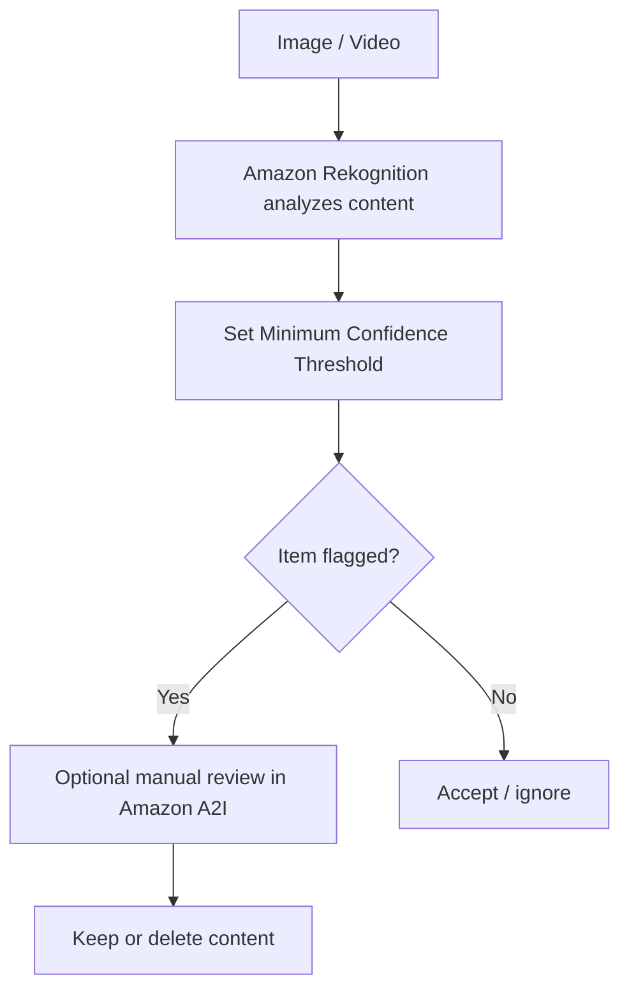

# 161. Rekognition Overview

## 🎯 Giới thiệu
Amazon Rekognition là service dùng **machine learning** để nhận diện **objects, people, texts, scenes** trong **images** và **videos**.

- Tập trung vào **image/video analysis**
- Hỗ trợ:
  - **facial analysis**
  - **facial search** và **verification**
  - **labeling**
  - **content moderation**
  - **text detection**
  - **celebrity recognition**
  - **tracking/pathing** trong video

## 1. Các khả năng chính của Rekognition
Rekognition có thể tự động phân tích hình ảnh và video để tìm ra nhiều loại thông tin:

- **Object / scene detection**: nhận diện các thành phần trong ảnh
- **Labeling**: gắn nhãn nội dung trong ảnh, ví dụ dogs, golden retrievers
- **Content moderation**: kiểm tra nội dung có phù hợp hay không
- **Text detection**: đọc text xuất hiện trong ảnh
- **Face detection and analysis**:
  - nhận diện khuôn mặt
  - xác định **gender**
  - ước lượng **age range**
  - nhận diện **emotions**
- **Face search and verification**: đối chiếu khuôn mặt với database
- **Celebrity recognition**: nhận diện người nổi tiếng
- **Pathing / tracking**: theo dõi chuyển động trong video, ví dụ phân tích trận đấu thể thao

## 2. Content Moderation flow
Một phần quan trọng cần nhớ cho kỳ thi là **content moderation**.

- Mục tiêu: phát hiện nội dung **inappropriate, unwanted, offensive** trong images/videos
- Ứng dụng:
  - social network
  - broadcast media
  - advertising
  - e-commerce
- Mục tiêu cuối cùng là tạo **safe user experience**

### Mermaid: luồng xử lý content moderation

### Ý nghĩa của các bước
- **Amazon Rekognition** phân tích image/video
- Bạn cấu hình **Minimum Confidence Threshold**
- Threshold càng thấp thì càng có nhiều kết quả bị flag
- Confidence percentage cho biết Rekognition tự tin đến mức nào rằng nội dung đó thật sự offensive/inappropriate
- Sau khi flag, có thể dùng **Amazon Augmented AI (A2I)** để **manual review**
- Quy trình này giúp:
  - tự động phát hiện nội dung nhạy cảm
  - sau đó review thủ công trước khi giữ hoặc xóa
  - hỗ trợ tuân thủ quy định nếu cần kiểm tra nội dung trước khi đăng lên ứng dụng

## 3. Các điểm cần nhớ khi ôn thi
- Rekognition = **images + videos**
- Dùng **machine learning** để phân tích nội dung
- Các nhóm tính năng hay gặp:
  - **labeling**
  - **content moderation**
  - **text detection**
  - **face detection / analysis**
  - **face search / verification**
  - **celebrity recognition**
  - **pathing**
- **Content moderation** là ý quan trọng nhất trong transcript này
- **A2I** được dùng cho **optional manual review**

## 📊 Bảng tóm tắt
| Tiêu chí | Mô tả |
|----------|------|
| Dịch vụ | Amazon Rekognition |
| Loại dữ liệu | Images và Videos |
| Công nghệ | Machine learning |
| Chức năng chính | Detect objects, people, texts, scenes |
| Face features | Facial analysis, face search, verification |
| Nội dung nổi bật | Content moderation |
| Review thủ công | Amazon Augmented AI (A2I) |
| Use case | Social network, broadcast media, advertising, e-commerce, sports video analysis |

## 💡 Mẹo ghi nhớ cho kỳ thi AWS
- Nhớ công thức: **Rekognition = Image/Video + ML**
- Khi thấy câu hỏi về:
  - **face detection**
  - **celebrity recognition**
  - **content moderation**
  - **text detection**
  thì nghĩ ngay đến **Amazon Rekognition**
- Khi đề cập đến **manual review** sau khi auto-flag nội dung, nhớ tới **Amazon A2I**
- **Minimum Confidence Threshold** là keyword quan trọng trong luồng moderation

## ✅ Kết luận
Amazon Rekognition là service phân tích **images** và **videos** bằng **machine learning**, nổi bật với **face analysis**, **content moderation**, **text detection** và **celebrity recognition**. Trong transcript này, phần quan trọng nhất cần nhớ là luồng **content moderation** với **Minimum Confidence Threshold** và khả năng review thủ công bằng **Amazon A2I**.
