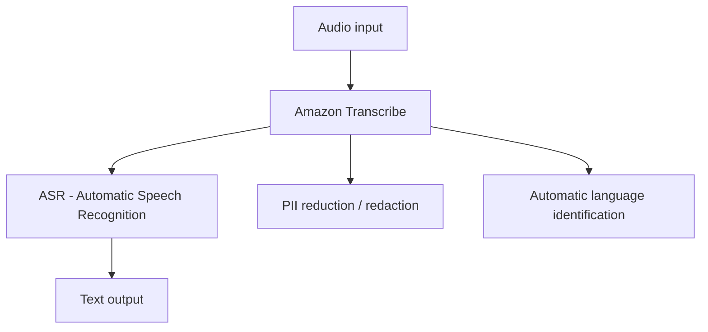

# 162. Transcribe Overview

## 🎯 Giới thiệu
Amazon Transcribe là dịch vụ tự động chuyển **speech** thành **text** từ file audio hoặc luồng âm thanh streaming. Dịch vụ này dùng deep learning với **ASR (Automatic Speech Recognition)** để chuyển giọng nói thành văn bản nhanh và chính xác.

## 1. Cách hoạt động của Amazon Transcribe
- Người dùng đưa vào **audio**.
- Amazon Transcribe tự động tạo **transcript** dạng text.
- Có thể dùng cho **streaming transcription** ngay khi âm thanh đang phát.
- Trong demo, khi bật streaming, lời nói được chuyển trực tiếp thành text.

## 2. Tính năng chính
- **PII removal / redaction**:
  - Có thể tự động ẩn hoặc loại bỏ **PII (Personally Identifiable Information)**.
  - Ví dụ được nhắc đến: **name**, **age**, **Social Security Number**, **phone number**.
- **Automatic language identification**:
  - Hỗ trợ nhận diện ngôn ngữ tự động cho **multilingual audio**.
  - Có thể nhận ra nhiều ngôn ngữ như **English**, **French**, **Spanish**.

## 3. Use cases
- Transcribe **customer service calls**.
- Tự động tạo **closed captioning** và **subtitling**.
- Tạo **metadata** cho media assets để xây dựng một **searchable archive**.

## 📊 Bảng tóm tắt
| Tiêu chí | Mô tả |
|----------|------|
| Mục đích | Tự động chuyển **speech** thành **text** |
| Công nghệ | **ASR (Automatic Speech Recognition)** |
| Tính năng nổi bật | **PII redaction**, **automatic language identification** |
| Input | Audio hoặc streaming audio |
| Output | Transcript dạng text |
| Use cases | Customer service calls, closed captioning, subtitling, metadata cho media assets |

## 💡 Mẹo ghi nhớ cho kỳ thi AWS
- **Transcribe = speech to text**.
- Nhớ 2 keyword hay xuất hiện trong đề thi: **ASR** và **PII redaction**.
- Nếu đề bài nói về:
  - **call center transcripts**
  - **caption/subtitle**
  - **searchable media archive**
  thì rất dễ liên quan đến **Amazon Transcribe**.
- Tính năng quan trọng:
  - **Automatic language identification** cho audio đa ngôn ngữ.
  - **Redact PII** để ẩn thông tin nhạy cảm.

## ✅ Kết luận
Amazon Transcribe là dịch vụ dùng để chuyển âm thanh thành văn bản bằng **ASR**, hỗ trợ **streaming transcription**, **PII removal/redaction**, và **automatic language identification**. Đây là dịch vụ phù hợp cho transcript cuộc gọi, caption/subtitle, và tạo metadata cho kho nội dung media.
