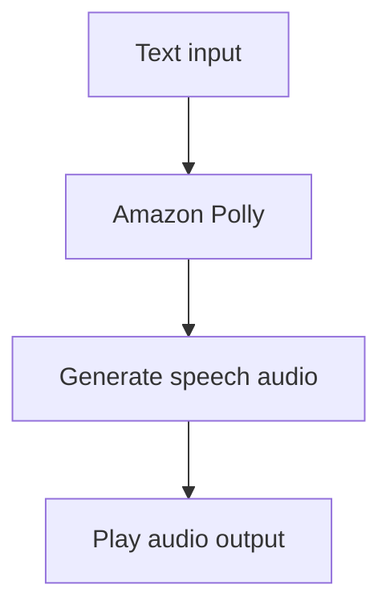

# 163. Polly Overview

## 🎯 Giới thiệu
- **Amazon Polly** là dịch vụ dùng **deep learning** để **turn text into speech**.
- Mục tiêu là tạo ra ứng dụng có thể **nói chuyện** và sinh ra **audio** từ đoạn text nhập vào.
- Có thể thử trực tiếp trên **console** của Polly.
- Polly hỗ trợ giọng **neural network**, được mô tả là **natural** và **human-like** nhất.

## 1. Cách Amazon Polly hoạt động
- Bạn nhập **text** vào Polly.
- Polly sẽ tạo ra **speech audio** tương ứng.
- Người dùng có thể chọn **voice** mong muốn.
- Ví dụ trong bài giảng:
  - Text: “Hey, my name is Stephane and I love AWS.”
  - Polly tạo ra giọng đọc thành audio.

## 2. Pronunciation lexicons
- Dùng để **customize pronunciation** cho:
  - **Stylized words**
  - **Acronyms**
- Ví dụ:
  - Tên kiểu “Stephane” có cách viết đặc biệt, cần lexicon để đọc đúng.
  - **AWS** không nên bị đọc thành “A-W-S”, mà thành **Amazon Web Services**.
- Cách dùng:
  - Tạo **lexicon**
  - **Upload lexicon**
  - Áp dụng trong **SynthesizeSpeech operation**

## 3. SSML (Speech Synthesis Markup Language)
- **SSML** cho phép tùy biến cách speech được tạo ra.
- Có thể dùng để:
  - **Emphasize** một từ hoặc cụm từ
  - **Phonetic pronunciation**
  - Thêm **breathing sounds**
  - **Whispering**
  - Chọn kiểu nói **Newscaster speaking style**
- Ý chính:
  - Nếu chỉ cần chỉnh **cách phát âm** của từ đặc biệt hoặc acronym, dùng **Pronunciation lexicons**
  - Nếu muốn tùy biến sâu hơn cách đọc, dùng **SSML**

## 📊 Bảng tóm tắt
| Tiêu chí | Mô tả |
|----------|------|
| Dịch vụ | **Amazon Polly** |
| Chức năng chính | **Turn text into speech** |
| Công nghệ | **Deep learning** |
| Đầu ra | **Speech audio** |
| Tùy biến phát âm | **Pronunciation lexicons** |
| Tùy biến cách đọc | **SSML (Speech Synthesis Markup Language)** |
| Ví dụ acronym | **AWS** -> **Amazon Web Services** |
| Ví dụ SSML | **Break**, **whispering**, **emphasis** |

## 💡 Mẹo ghi nhớ cho kỳ thi AWS
- **Lexicon** = chỉnh **phát âm** cho từ đặc biệt, stylized word, acronym.
- **SSML** = chỉnh **cách nói** của speech, ví dụ whisper, break, emphasis.
- Nhớ cặp đối chiếu:
  - **Pronunciation lexicons** -> pronunciation
  - **SSML** -> speech style / speech control
- Polly = **text to speech** trên AWS.

## ✅ Kết luận
- **Amazon Polly** chuyển **text thành speech** bằng **deep learning**.
- Dịch vụ này hỗ trợ **voice** tự nhiên, có thể đọc qua **console**.
- Hai phần quan trọng cần nhớ cho exam là:
  - **Pronunciation lexicons** để sửa cách phát âm
  - **SSML** để tùy biến cách tạo speech nâng cao
