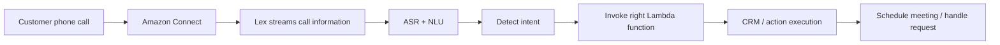

# 165. Lex + Connect Overview

## 🎯 Giới thiệu
- Bài này nói về 2 dịch vụ AWS thường đi cùng nhau trong **smart contact center**:
  - **Amazon Lex**: xử lý giọng nói và ngôn ngữ tự nhiên.
  - **Amazon Connect**: xây dựng **contact center** trên cloud.
- Mục tiêu chính:
  - Biến cuộc gọi thoại thành dữ liệu có thể hiểu được.
  - Tự động nhận diện **intent**.
  - Kích hoạt workflow phù hợp để xử lý yêu cầu của khách hàng.

## 1. Amazon Lex
- **Amazon Lex** là công nghệ giống như thứ đứng sau các thiết bị **Alexa** của Amazon.
- Lex cung cấp:
  - **ASR (Automatic Speech Recognition)**: chuyển **speech** thành **text**.
  - **Natural Language Understanding**: hiểu câu nói và xác định **intent** của người dùng/caller.
- Lex được dùng để xây dựng:
  - **chatbots**
  - **call center bots**

## 2. Amazon Connect
- **Amazon Connect** là một **visual contact center**.
- Các khả năng chính:
  - Nhận cuộc gọi.
  - Tạo **contact flows**.
  - Hoạt động hoàn toàn **cloud-based**.
  - Tích hợp với:
    - **CRM systems**
    - các **AWS services**
- Điểm nổi bật được nhấn mạnh trong transcript:
  - Không có **upfront payment**.
  - Rẻ hơn khoảng **80%** so với các giải pháp contact center truyền thống.

## 3. Flow kết hợp Lex + Connect
- Khi có một cuộc gọi đến số do **Amazon Connect** định nghĩa:
  - Cuộc gọi đi vào **Connect**.
  - **Lex** stream thông tin từ cuộc gọi.
  - Lex hiểu nội dung và xác định **intent**.
  - Sau đó gọi đúng **Lambda function**.
  - **Lambda** có thể tương tác với **CRM** hoặc hệ thống khác để thực hiện hành động, ví dụ:
    - lên lịch cuộc họp
    - ghi thông tin vào hệ thống
- Ý tưởng cốt lõi:
  - **Lex** = hiểu lời nói
  - **Connect** = quản lý contact center

## 📊 Bảng tóm tắt
| Tiêu chí | Mô tả |
|----------|------|
| Amazon Lex | Dịch vụ nhận diện giọng nói và hiểu ngôn ngữ tự nhiên |
| ASR | Chuyển **speech** thành **text** |
| NLU | Hiểu câu nói và xác định **intent** |
| Amazon Connect | **Visual contact center** trên cloud |
| Tích hợp | Kết nối với **CRM** và các **AWS services** |
| Flow chính | Cuộc gọi -> Connect -> Lex -> intent -> Lambda -> hành động |
| Điểm nhấn chi phí | Không có **upfront payment**, rẻ hơn khoảng **80%** so với giải pháp truyền thống |

## 💡 Mẹo ghi nhớ cho kỳ thi AWS
- **Lex = speech / intent / chatbot**
- **Connect = contact center / call flow**
- Nhớ cặp này theo cách:
  - **Lex hiểu cuộc gọi**
  - **Connect quản lý cuộc gọi**
- Nếu đề bài nói về:
  - chuyển lời nói thành text
  - hiểu ý định người gọi
  - bot cho call center  
  -> nghĩ ngay tới **Amazon Lex**
- Nếu đề bài nói về:
  - contact center trên cloud
  - contact flows
  - tích hợp CRM  
  -> nghĩ ngay tới **Amazon Connect**

## ✅ Kết luận
- **Amazon Lex** dùng để xử lý **speech** và hiểu **intent**.
- **Amazon Connect** dùng để xây dựng **cloud contact center**.
- Kết hợp hai dịch vụ này giúp tạo ra một hệ thống gọi điện thông minh, có thể tự động hiểu yêu cầu và kích hoạt hành động phù hợp qua **Lambda** và **CRM**.
