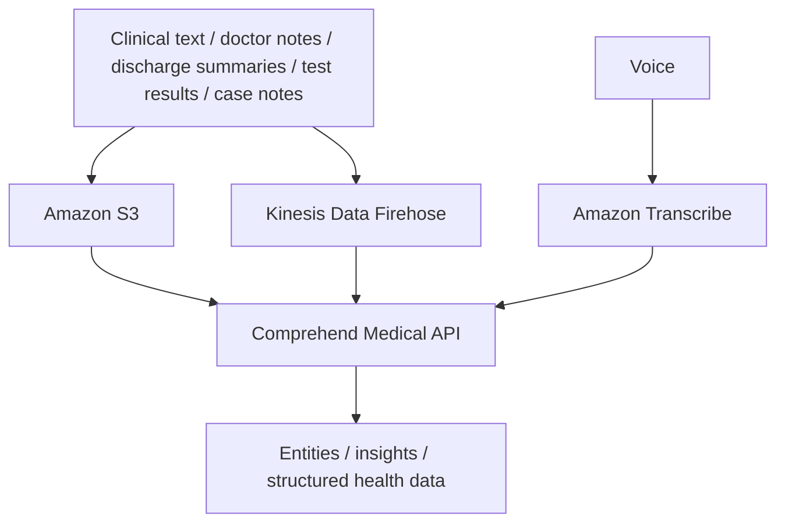

# 167. Comprehend Medical Overview

## 🎯 Giới thiệu
- **Amazon Comprehend Medical** là dịch vụ dùng **NLP (Natural Language Processing)** để phát hiện và trích xuất thông tin hữu ích từ **unstructured clinical text**.
- Dịch vụ này có thể nhận diện **Protected Health Information (PHI)** trong tài liệu thông qua **DetectPHI API**.
- Mục tiêu chính là biến dữ liệu y tế dạng text khó đọc thành thông tin có cấu trúc hơn để dễ phân tích.

## 1. Dữ liệu đầu vào và mục đích xử lý
- Comprehend Medical làm việc với các nội dung như:
  - doctor notes
  - discharge summaries
  - test results
  - case notes
- Dịch vụ dùng để:
  - phát hiện thông tin quan trọng trong text
  - tìm **PHI**
  - trích xuất **entities** từ dữ liệu y tế

## 2. Cách tích hợp trong kiến trúc
- Theo luồng kiến trúc được mô tả:
  - lưu document trong **Amazon S3**
  - gọi **Comprehend Medical API** để phân tích
- Có thể xử lý theo hướng real time với **Kinesis Data Firehose**
- Nếu dữ liệu là âm thanh:
  - dùng **Amazon Transcribe** để chuyển voice thành text
  - sau đó đưa text vào **Amazon Comprehend Medical**

## 3. Kết quả phân tích
- Từ input text, Comprehend Medical có thể tạo ra các **entities** như:
  - age
  - procedure name
  - date/time liên quan đến procedure
  - tên molecule
  - strength
  - dosage
  - route
  - frequency
- Kết quả là dữ liệu trở nên **organized** hơn và có thể bắt đầu được cấu trúc hóa từ text thô.
- Giá trị chính: lấy thông tin từ **unstructured text** và tạo ra **insights** bằng machine learning.

## 📊 Bảng tóm tắt
| Tiêu chí | Mô tả |
|----------|------|
| Dịch vụ | Amazon Comprehend Medical |
| Chức năng chính | Detect và return useful information từ unstructured clinical text |
| Kỹ thuật sử dụng | NLP / machine learning |
| Dữ liệu đầu vào | Doctor notes, discharge summaries, test results, case notes |
| Khả năng nổi bật | DetectPHI API để nhận diện PHI |
| Kiến trúc tích hợp | S3 -> Comprehend Medical API |
| Xử lý real time | Có thể dùng Kinesis Data Firehose |
| Chuyển giọng nói thành text | Dùng Amazon Transcribe trước khi phân tích |
| Kết quả | Entities, insights, và dữ liệu y tế có cấu trúc hơn |

## 💡 Mẹo ghi nhớ cho kỳ thi AWS
- Nhớ mối liên hệ: **clinical text -> Comprehend Medical -> entities/insights**
- Nếu đề bài nhắc đến **PHI** trong tài liệu y tế, hãy nghĩ ngay đến **DetectPHI API**
- Nếu dữ liệu gốc là audio, luồng đúng là: **Amazon Transcribe -> Comprehend Medical**
- Nếu cần nhắc tới kiến trúc, nhớ các điểm chính:
  - **S3** để lưu document
  - **Kinesis Data Firehose** cho real time
  - **Comprehend Medical** để phân tích text

## ✅ Kết luận
- **Amazon Comprehend Medical** giúp trích xuất thông tin hữu ích từ **unstructured clinical text** bằng **NLP**.
- Dịch vụ hỗ trợ phát hiện **PHI**, tạo **entities**, và biến dữ liệu y tế dạng text thành thông tin có cấu trúc hơn.
- Đây là dịch vụ quan trọng khi cần phân tích dữ liệu y tế trong bài toán lưu trữ, real time, hoặc chuyển voice thành text trước khi xử lý.
