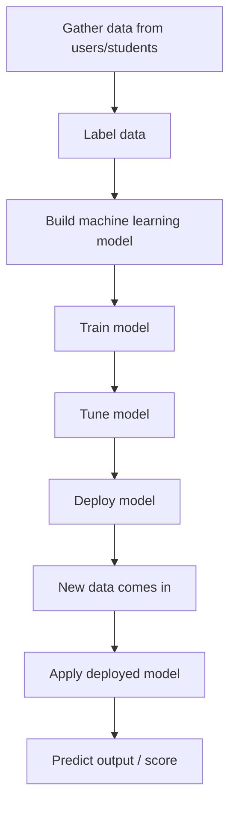

# 168. SageMaker AI Overview

## 🎯 Giới thiệu
Amazon SageMaker là một **fully managed service** dành cho **developers** và **data scientists** để **build machine learning model**.

- Đây là dịch vụ ML cấp cao hơn so với các service ML có mục đích rất cụ thể như:
  - translate text
  - transcribe audio
  - convert text to audio
  - analyze text
- SageMaker tập trung vào việc hỗ trợ toàn bộ quy trình tạo model, vì việc này:
  - phức tạp hơn
  - cần nhiều bước
  - thường phải provision servers để xử lý computation

## 1. SageMaker hỗ trợ quy trình Machine Learning như thế nào
SageMaker giúp trong toàn bộ chuỗi công việc để tạo và sử dụng model:

- **Labeling**: gán nhãn dữ liệu
- **Building**: xây dựng machine learning model
- **Training**: huấn luyện model
- **Tuning**: tinh chỉnh model để phù hợp dữ liệu tốt hơn
- **Deploying**: triển khai model để dùng với dữ liệu mới

### Mermaid: Flow của quy trình ML trong SageMaker

## 2. Ví dụ minh họa trong transcript
Transcript dùng ví dụ dự đoán **score trong kỳ thi AWS Certified CLAP practitioner exam**:

- Thu thập dữ liệu từ nhiều student
  - years of experience in IT
  - years of experience with AWS
  - thời gian học course
  - số practice exams đã làm
- Sau đó **labeling** dữ liệu:
  - xác định các cột tương ứng với ý nghĩa gì
  - gán **score thực tế** của từng student
- Từ dữ liệu lịch sử:
  - build model để dự đoán score
- Tiếp theo:
  - train
  - tune
- Khi có student mới:
  - nhập dữ liệu mới
  - model dự đoán score, ví dụ **906**

## 3. Ý chính để ôn thi
- SageMaker là dịch vụ dành cho **developers** và **data scientists**
- Mục tiêu chính: **build, train, tune, deploy machine learning models**
- SageMaker giúp xử lý các bước khó và nhiều công đoạn trong ML
- Toàn bộ quy trình có thể thực hiện trong SageMaker

## 📊 Bảng tóm tắt
| Tiêu chí | Mô tả |
|----------|------|
| Loại dịch vụ | Fully managed service cho ML |
| Đối tượng | Developers, data scientists |
| Mục đích | Build machine learning model |
| Các bước chính | Labeling, building, training, tuning, deploying |
| Điểm nhấn | Hỗ trợ toàn bộ quy trình ML trong một nơi |
| Ví dụ | Dự đoán score của student dựa trên dữ liệu lịch sử |

## 💡 Mẹo ghi nhớ cho kỳ thi AWS
- Nhớ cụm: **Labeling -> Building -> Training -> Tuning -> Deploying**
- SageMaker không chỉ là nơi tạo model, mà còn hỗ trợ **toàn bộ lifecycle** của model
- Nếu đề bài nói về **data scientists tạo và huấn luyện ML model**, hãy nghĩ đến **SageMaker**
- Nếu câu hỏi nhắc đến việc xử lý nhiều bước ML phức tạp trong một dịch vụ managed, đây là dấu hiệu rất mạnh của **SageMaker**

## ✅ Kết luận
Amazon SageMaker là **fully managed service** giúp **developers** và **data scientists** xây dựng machine learning model từ đầu đến cuối, bao gồm **labeling, building, training, tuning, và deploying**. Đây là dịch vụ phù hợp khi cần quản lý toàn bộ quy trình ML trong một nơi duy nhất.
