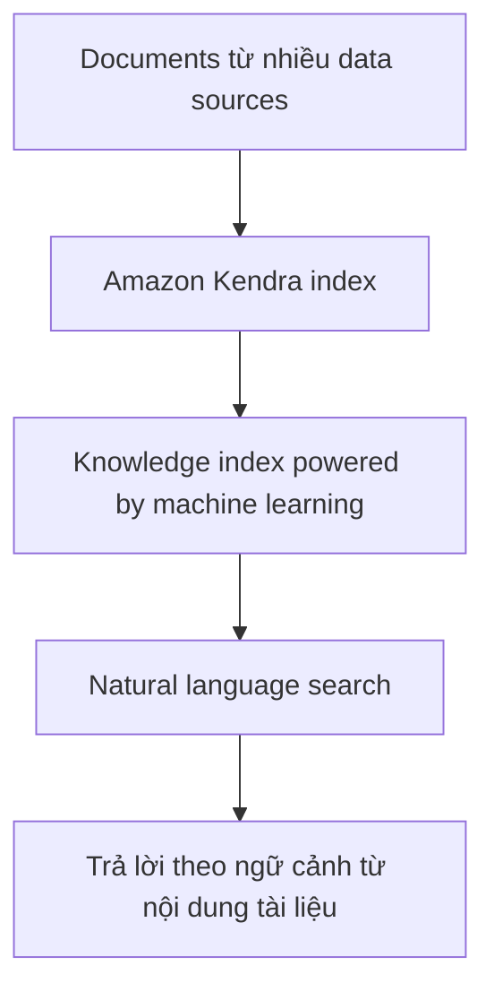

# 169. Kendra Overview

## 🎯 Giới thiệu
Amazon Kendra là một **fully-managed document search service** trên AWS, được **powered by machine learning**.

- Mục tiêu chính: **extract answers from within a document**
- Hỗ trợ nhiều loại tài liệu như:
  - `text`
  - `PDF`
  - `HTML`
  - `PowerPoints`
  - `Microsoft Word`
  - `FAQs`
- Các nguồn dữ liệu/tài liệu này được **indexed by Amazon Kendra**
- Kendra xây dựng bên trong một **knowledge index** powered by machine learning

## 1. Khả năng search bằng ngôn ngữ tự nhiên 🔎
Kendra cung cấp **natural language search capabilities**, giống như cách bạn tìm kiếm trên Google.

- Người dùng có thể hỏi bằng câu tự nhiên
- Kendra có thể trả lời trực tiếp từ nội dung tài liệu
- Ví dụ trong transcript:
  - Hỏi: “Where is the IT support desk?”
  - Trả lời: “1st floor”

## 2. Học từ tương tác người dùng 📈
Kendra có thể **learn from user interaction and feedback** để cải thiện kết quả tìm kiếm.

- Cơ chế này được gọi là **incremental learning**
- Mục đích:
  - Promote preferred search results
  - Tối ưu trải nghiệm tìm kiếm theo hành vi người dùng

## 3. Fine-tune kết quả tìm kiếm 🎯
Bạn có thể **fine tune** search results theo các tiêu chí tùy chỉnh.

- Ví dụ được nhắc trong transcript:
  - **importance of data**
  - **freshness**
  - các **custom filters** khác
- Điều này giúp điều chỉnh kết quả theo nhu cầu cụ thể

## 📊 Bảng tóm tắt
| Tiêu chí | Mô tả |
|----------|------|
| Dịch vụ | `Amazon Kendra` |
| Loại dịch vụ | `fully-managed document search service` |
| Công nghệ | `machine learning` |
| Chức năng chính | Trích xuất câu trả lời từ trong tài liệu |
| Nguồn dữ liệu | Text, PDF, HTML, PowerPoints, Microsoft Word, FAQs |
| Cơ chế tìm kiếm | `natural language search` |
| Cải thiện kết quả | `incremental learning` từ user interaction và feedback |
| Tùy biến | Fine tune theo freshness, importance of data, custom filters |

## 💡 Mẹo ghi nhớ cho kỳ thi AWS
- Gặp câu hỏi về **document search service** thì nghĩ ngay đến **Amazon Kendra**
- Nếu đề bài nhấn mạnh:
  - **natural language search**
  - **answers from within documents**
  - **machine learning powered index**
  thì đó là dấu hiệu rất rõ của **Kendra**
- Nhớ thêm các từ khóa:
  - `incremental learning`
  - `custom filters`
  - `freshness`

## ✅ Kết luận
Amazon Kendra là dịch vụ tìm kiếm tài liệu được quản lý hoàn toàn, dùng machine learning để tạo **knowledge index**, hỗ trợ **natural language search**, học từ phản hồi người dùng, và cho phép tinh chỉnh kết quả theo các tiêu chí tùy chỉnh.
