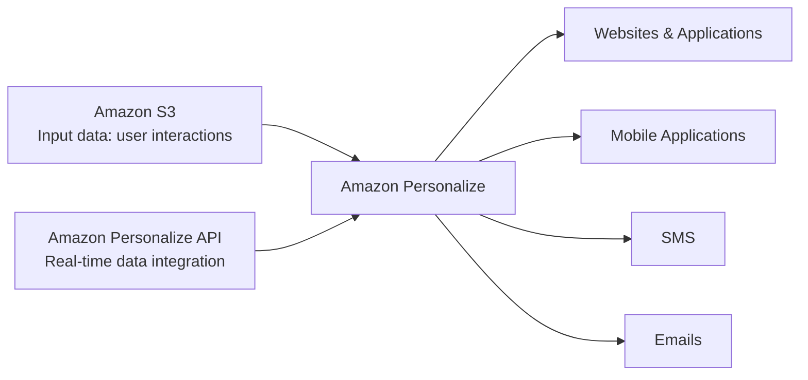

# 170. Personalize Overview

## 🎯 Giới thiệu
Amazon Personalize là một **fully managed machine learning service** dùng để xây dựng ứng dụng có **real-time personalized recommendations**.

- Mục tiêu: tạo ra các gợi ý cá nhân hóa như:
  - **personalized product recommendation**
  - **re-ranking**
  - **customized direct marketing**
- Đây là công nghệ tương tự như Amazon.com dùng để đề xuất sản phẩm dựa trên:
  - lịch sử tìm kiếm
  - hành vi mua hàng
  - user interest

## 1. Cách Amazon Personalize hoạt động
Amazon Personalize nhận dữ liệu đầu vào từ **Amazon S3**.

- Dữ liệu ví dụ:
  - user interactions
  - các dữ liệu hành vi liên quan khác
- Có thể dùng **Amazon Personalize API** để tích hợp dữ liệu real-time vào service
- Sau đó service cung cấp **customized personalized API** cho:
  - websites
  - applications
  - mobile applications
- Ngoài ra còn có thể dùng cho:
  - **SMS**
  - **emails**

## 2. Giá trị và đặc điểm chính
Amazon Personalize giúp bạn xây dựng ML recommendation system nhanh hơn rất nhiều.

- Mất **days, not months** để xây dựng model
- Không cần tự:
  - build
  - train
  - deploy ML solutions
- Có thể dùng giải pháp đóng gói sẵn từ AWS

### Các điểm cần nhớ
- Đây là service thiên về **recommendations** và **personalization**
- Không phải service để tự thiết kế toàn bộ pipeline ML từ đầu
- Tập trung vào kết quả cá nhân hóa cho người dùng cuối

## 3. Use cases và ý nghĩa trong kỳ thi
Các use cases được nhắc đến trong transcript:

- **retail stores**
- **media**
- **entertainment**

### Dấu hiệu nhận biết khi đi thi
Nếu đề bài nhắc đến:
- machine learning service
- recommendations
- personalized recommendations
- product suggestion
- personalized marketing

=> Chọn **Amazon Personalize**

## 📊 Bảng tóm tắt
| Tiêu chí | Mô tả |
|----------|------|
| Dịch vụ | Amazon Personalize |
| Loại dịch vụ | Fully managed machine learning service |
| Mục đích | Xây dựng real-time personalized recommendations |
| Input data | Amazon S3, user interactions |
| Tích hợp | Amazon Personalize API, websites, applications, mobile apps, SMS, emails |
| Ưu điểm | Xây dựng model nhanh, không cần tự build/train/deploy ML solutions |
| Use cases | Retail, media, entertainment |
| Mẹo thi | Thấy recommendation/personalization thì nghĩ ngay đến Amazon Personalize |

## 💡 Mẹo ghi nhớ cho kỳ thi AWS
- **Personalize = cá nhân hóa gợi ý**
- **S3 + user interactions + Personalize API** là luồng tích hợp quan trọng
- Từ khóa cần phản xạ nhanh:
  - **recommendations**
  - **personalized**
  - **real-time**
  - **Amazon S3**
- Nếu câu hỏi nhấn mạnh “build apps with personalized recommendations”, đáp án gần như chắc chắn là **Amazon Personalize**

## ✅ Kết luận
Amazon Personalize là AWS machine learning service dành cho **real-time personalized recommendations**. Dịch vụ này lấy dữ liệu từ **S3**, hỗ trợ tích hợp **real-time**, và có thể phục vụ cho **web, mobile, SMS, email**. Trong kỳ thi AWS, chỉ cần thấy bài toán recommendation cá nhân hóa thì ưu tiên nghĩ đến **Amazon Personalize**.
