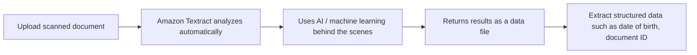

# 171. Textract Overview

## 🎯 Giới thiệu
Amazon Textract là dịch vụ dùng để **extract text, handwriting, và data** từ các **scanned documents**.  
Dịch vụ này hoạt động phía sau bằng **AI / machine learning** để tự động phân tích tài liệu và trả kết quả dưới dạng **data file**.

## 1. Khả năng chính của Amazon Textract
- Extract **text** từ tài liệu scan
- Extract **handwriting**
- Extract **data** từ:
  - **forms**
  - **tables**
- Làm việc với:
  - **PDFs**
  - **images**
  - các tài liệu đã scan khác

## 2. Flow xử lý tài liệu

- Ví dụ: upload **driver license** vào Amazon Textract
- Hệ thống sẽ tự động phân tích
- Kết quả có thể dùng để lấy ra:
  - **date of birth**
  - **document ID**
  - các trường dữ liệu khác

## 3. Use cases tiêu biểu
Amazon Textract được dùng trong nhiều lĩnh vực:
- **Financial services**
  - xử lý **invoices**
  - xử lý **financial reports**
- **Healthcare**
  - **medical records**
  - **insurance claims**
- **Public sector**
  - **tax forms**
  - **ID documents**
  - **passports**

## 📊 Bảng tóm tắt
| Tiêu chí | Mô tả |
|----------|------|
| Dịch vụ | Amazon Textract |
| Mục đích | Extract text, handwriting, và data từ scanned documents |
| Công nghệ nền | AI / machine learning |
| Đầu vào | PDFs, images, scanned documents |
| Đầu ra | Data file với thông tin được trích xuất |
| Dữ liệu có thể lấy | Forms, tables, date of birth, document ID |
| Use cases | Financial services, healthcare, public sector |

## 💡 Mẹo ghi nhớ cho kỳ thi AWS
- **Textract = extract text/data** từ tài liệu scan.
- Nhớ rằng Textract không chỉ đọc text mà còn xử lý được **handwriting**, **forms**, và **tables**.
- Khi thấy câu hỏi về **document analysis tự động** từ **PDFs/images**, nghĩ ngay đến **Amazon Textract**.
- Gắn với các use case thường gặp: **invoices**, **medical records**, **tax forms**, **ID documents**.

## ✅ Kết luận
Amazon Textract là dịch vụ chuyên dùng để tự động trích xuất **text, handwriting, và data** từ tài liệu scan bằng **AI / machine learning**. Dịch vụ đặc biệt hữu ích khi cần xử lý **forms**, **tables**, **PDFs**, và các tài liệu như **driver license**, **invoices**, **medical records**, hay **tax forms**.
