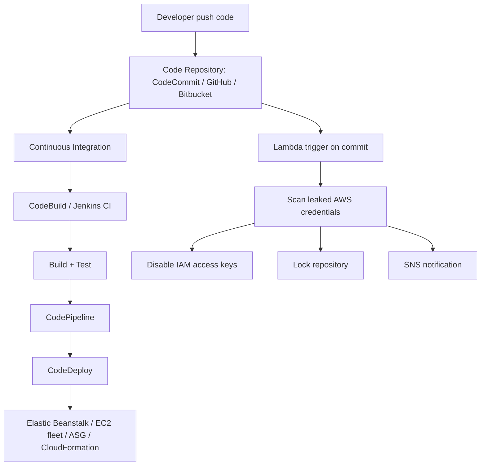

# 174. CICD

## 🎯 Giới thiệu
CICD là một chủ đề quan trọng trong exam developer và cũng cần nắm từ góc nhìn Solution Architecture. Mục tiêu chính là:
- Test code sớm, phát hiện bug sớm
- Deploy thường xuyên và an toàn hơn
- Tự động hóa toàn bộ luồng từ `code` → `build` → `test` → `deploy` → `provision`

## 1. Continuous Integration
Continuous Integration là bước kiểm tra code ngay khi developer push code lên repository.

- Developer thường push code rất thường xuyên lên:
  - `GitHub`
  - `CodeCommit`
  - `Bitbucket`
- Một `build` hoặc `test server` sẽ lấy code về để:
  - `build`
  - `test`
  - xác nhận code hợp lệ
- Dịch vụ hỗ trợ:
  - `AWS CodeBuild`
  - `Jenkins CI`
  - các CI server khác
- Lợi ích:
  - phát hiện bug sớm
  - phản hồi nhanh cho developer
  - giảm việc developer phải tự chạy test trên máy local
  - giúp release nhanh hơn

## 2. Continuous Delivery và triển khai
Continuous Delivery là đảm bảo phần mềm có thể release đáng tin cậy bất cứ khi nào cần.

- Mục tiêu là deploy thường xuyên và nhanh
- Tư duy chuyển từ:
  - 1 release mỗi 3 tháng
  - sang nhiều release mỗi ngày
- Việc này thường cần tự động hóa deployment lên infrastructure
- Dịch vụ liên quan:
  - `AWS CodeDeploy`
  - `Jenkins Continuous Delivery`
  - `Spinnaker`

### Vai trò của các dịch vụ AWS
- `CodeCommit`: code repository của AWS
- `CodeBuild`: build và test code
- `CodeDeploy`: deploy code
- `CodePipeline`: orchestration toàn bộ pipeline
- `Elastic Beanstalk`: có thể dùng để provision infrastructure và deploy dần vào `EC2`
- `CloudFormation`: có thể tạo `EC2 fleet`, sau đó dùng `CodeDeploy` để deploy code lên đó

### Pipeline theo branch
- Mỗi branch nên có một `CodePipeline` riêng
- Không có một pipeline duy nhất cho cả `dev` và `prod`
- Mỗi pipeline có thể có:
  - `CodeBuild` riêng
  - `CodeDeploy` riêng
  - `Elastic Beanstalk environment` riêng
- Luồng điển hình:
  - `dev branch` được build/test
  - deploy vào `dev environment`
  - khi ổn định thì merge sang `prod branch`
  - `prod branch` chạy pipeline riêng để deploy production

## 3. Các tích hợp và pattern quan trọng
### CodeCommit + Lambda
- Mỗi commit vào `CodeCommit` có thể trigger `Lambda`
- Use case được nêu:
  - scan leaked AWS credentials
  - nếu phát hiện, `Lambda` có thể:
    - disable access keys trong `IAM`
    - lock `CodeCommit repository`
    - gửi notification qua `SNS`

### Manual approval
- `CodePipeline` có thể có `manual approval stage`
- Dùng khi cần kiểm soát trước khi đẩy lên bước tiếp theo

### Unit test
- Có thể chạy unit test bằng:
  - `CodeCommit`
  - `CodeBuild`
  - `CodePipeline`

### Docker image
- `CodeBuild` có thể build và lưu `Docker image` vào `ECR`
- Script trong `CodeBuild` sẽ build image và push lên `Amazon ECR`

### CloudFormation deployment
- Có thể tự động deploy `CloudFormation templates` bằng `CodePipeline`
- Quy trình:
  - push template vào `CodeCommit`
  - `CodePipeline` deploy stage triển khai template

### GitHub integration với CodePipeline
- Có 2 version được nhắc đến:

| Version | Cách hoạt động | Nhận xét |
|----------|----------------|----------|
| Version 1 | `CodePipeline` định kỳ check `GitHub` | Kém hiệu quả hơn |
| Version 1 | `GitHub` gửi `HTTP webhook` đến `CodePipeline` | Hiệu quả hơn |
| Version 2 | Kết nối qua `CodeStar Source Connection` | `GitHub application` để tự động nhận thay đổi |

## 📊 Bảng tóm tắt
| Tiêu chí | Mô tả |
|----------|------|
| Mục tiêu CICD | Tự động hóa `code` → `build` → `test` → `deploy` |
| Continuous Integration | Test code ngay sau khi push lên repository |
| Continuous Delivery | Đảm bảo release nhanh và đáng tin cậy |
| `CodeCommit` | AWS code repository |
| `CodeBuild` | Build và test code |
| `CodeDeploy` | Deploy ứng dụng |
| `CodePipeline` | Orchestrate toàn bộ pipeline |
| `Elastic Beanstalk` | Có thể provision và deploy dần vào `EC2` |
| `Lambda` + `CodeCommit` | Trigger khi commit, ví dụ scan AWS credentials |
| `GitHub` integration | Có webhook hoặc `CodeStar Source Connection` |

## 💡 Mẹo ghi nhớ cho kỳ thi AWS
- Nhớ chuỗi chính: `CodeCommit` → `CodeBuild` → `CodeDeploy` → `CodePipeline`
- Mỗi branch có một pipeline riêng, đặc biệt `dev` và `prod`
- `CodeBuild` là service trọng tâm cho build và test trên AWS
- `CodePipeline` là phần orchestration, không phải nơi build trực tiếp
- `Lambda` có thể được trigger bởi commit trong `CodeCommit`
- `GitHub` integration có 2 hướng: polling/webhook ở version 1, `CodeStar Source Connection` ở version 2
- `Elastic Beanstalk` có thể dùng cho deploy gradual lên `EC2`

## ✅ Kết luận
CICD trong AWS tập trung vào tự động hóa luồng phát triển phần mềm, giảm lỗi sớm, và deploy thường xuyên hơn. Với exam, cần nhớ rõ vai trò của `CodeCommit`, `CodeBuild`, `CodeDeploy`, `CodePipeline`, cách tách `dev/prod` theo branch, và các tích hợp như `Lambda`, `ECR`, `CloudFormation`, `GitHub`.
