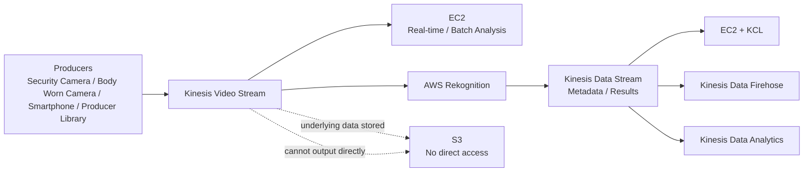

# 176. Kinesis Video Streams

## 🎯 Giới thiệu
- **Kinesis Video Streams** dùng để xử lý luồng video từ các **streaming device**.
- Mỗi **streaming device** sẽ tương ứng với **1 Kinesis video stream**.
- Các thiết bị này được gọi là **producers**.
- Ví dụ producer:
  - security camera
  - body worn camera
  - smart phone
  - **Kinesis Video Streams Producer Library**

## 1. Mô hình producer và stream
- Ý chính: **1 device = 1 video stream**.
- Nếu một công ty có **1,000 cameras** thì cần **1,000 video streams**.
- Đây là điểm dễ bị hỏi trong exam: không phải một stream cho nhiều device, mà là **mỗi device một stream**.

## 2. Storage và cách đọc dữ liệu
- **Underlying data** được lưu trong **S3**, nhưng **không có quyền truy cập trực tiếp** vào dữ liệu đó.
- **Không thể output stream data trực tiếp vào S3**.
- Muốn đưa dữ liệu vào S3, cần:
  - **consume** video stream
  - xây dựng **custom solution** để gửi dữ liệu vào S3
- Có thể dùng **Kinesis Video Stream Parser Library** để đọc stream.

## 3. Consumer, Rekognition và kiến trúc phân tích
- Video stream có thể được tiêu thụ bởi:
  - **EC2 instances** để phân tích real-time hoặc batch
  - **AWS Rekognition** để làm **facial detection**
- Với **Rekognition**:
  - video được phân tích
  - Rekognition dùng **Internal Rekognition Face Collection**
  - kết quả metadata được đẩy ra thành **new stream**
- Từ **Kinesis Data Streams** tạo ra sau Rekognition, có thể tiếp tục dùng:
  - **EC2** với **KCL library**
  - **Kinesis Data Firehose**
  - **Kinesis Data Analytics**

## 📊 Bảng tóm tắt
| Tiêu chí | Mô tả |
|----------|------|
| Producer | Mỗi streaming device tạo ra 1 Kinesis video stream |
| Ví dụ device | Security camera, body worn camera, smartphone, Producer Library |
| Storage | Underlying data stored in S3 nhưng không truy cập trực tiếp |
| Output sang S3 | Không thể output trực tiếp, phải qua custom solution |
| Consumer | EC2, Rekognition |
| Rekognition flow | Phân tích video, dùng Internal Rekognition Face Collection, tạo metadata stream |
| Hậu xử lý | Kinesis Data Streams có thể đi tiếp vào EC2 + KCL, Firehose, Analytics |

## 💡 Mẹo ghi nhớ cho kỳ thi AWS
- Nhớ câu: **1 streaming device = 1 Kinesis video stream**.
- **Không được output trực tiếp vào S3** từ Kinesis Video Streams.
- Muốn đưa dữ liệu vào S3 thì phải **consume** rồi tự xây **custom solution**.
- **Rekognition** có thể đọc video để làm **facial detection** và tạo **metadata stream**.
- Khi thấy bài hỏi kiến trúc video + AI, hãy nhớ chuỗi:
  - **Kinesis Video Streams → Rekognition → Kinesis Data Streams → EC2 / Firehose / Analytics**

## ✅ Kết luận
- **Kinesis Video Streams** phù hợp cho các luồng video từ từng device riêng lẻ.
- Dữ liệu video có thể được xử lý bởi **EC2** hoặc **AWS Rekognition**.
- Điểm quan trọng nhất cho exam là:
  - **1 device = 1 stream**
  - **không xuất trực tiếp sang S3**
  - có thể dùng **Rekognition** để trích xuất metadata và đẩy sang **Kinesis Data Streams** để xử lý tiếp.
