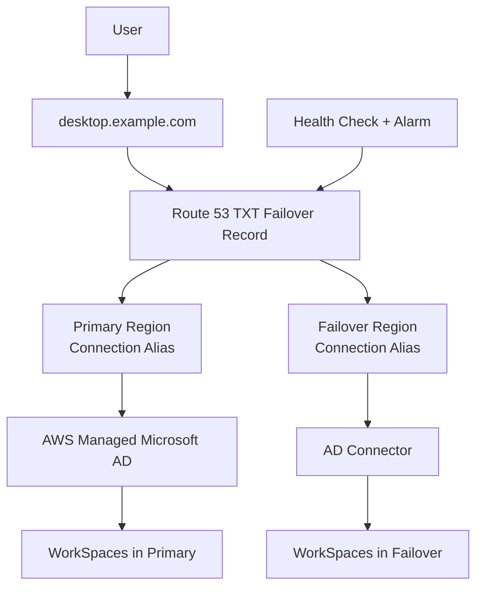

# 177. AWS WorkSpaces

## 🎯 Giới thiệu
- **AWS WorkSpaces** cung cấp một **managed secure Cloud desktop**.
- Đây là cách tốt để giảm việc quản lý **on-premise VDI** (*Virtual Desktop Infrastructure*).
- Người dùng có thể truy cập **Windows** hoặc **Linux** desktop trên cloud.
- Có 2 kiểu pricing:
  - **On-demand pricing**: tính theo giờ
  - **Monthly subscription**: dùng không giới hạn
- WorkSpaces có đặc điểm:
  - **Secure**
  - **Encrypted**
  - **Network isolation**
- Tích hợp với **Microsoft Active Directory**, nên máy có thể join vào domain nếu cần.

## 1. WorkSpaces Application Manager (WAM) 📦
- **WAM** dùng để **deploy và manage applications** dưới dạng **visualized application containers**.
- Ý tưởng:
  - Containerize ứng dụng
  - Deploy lên tất cả WorkSpaces
  - Provision ở quy mô lớn
  - Giữ ứng dụng luôn updated bằng WAM
- **WAM khác với Windows updates**:
  - **WAM**: chỉ quản lý **applications**
  - **Windows update**: cập nhật hệ điều hành Windows của WorkSpace

## 2. Windows Updates và Maintenance Windows 🛠️
- Mặc định, Amazon WorkSpaces được cấu hình để cài **software updates**.
- Nếu WorkSpace chạy **Windows**, thì **Windows Update** được bật sẵn.
- Bạn có thể kiểm soát tần suất cập nhật, nhưng việc cài đặt chỉ diễn ra trong **maintenance windows**.
- Các kiểu maintenance:
  - **AlwaysOn WorkSpaces**
    - Default maintenance window: **từ 12:00 AM đến 4:00 AM Chủ nhật**
    - Cập nhật chắc chắn diễn ra trong khung này
  - **AutoStop WorkSpaces**
    - Nếu người dùng không dùng thường xuyên, WorkSpaces sẽ tự động start **mỗi tháng một lần** để cài Windows updates
  - **Manual maintenance window**
    - Bạn tự định nghĩa thời gian
    - WorkSpaces sẽ offline trong chốc lát để thực hiện maintenance

## 3. Cross-Region Redirection 🌍
- Mục tiêu là chạy WorkSpaces directories ở **nhiều region**:
  - **Primary region**
  - **Failover region**
- Trong **primary region**, WorkSpaces directory có thể kết nối với **AWS Managed Microsoft AD** để lưu user và cho phép mở session.
- Trong **failover region**, cần tạo **AD Connector**.
- Lý do:
  - **Multi-region Managed Microsoft AD** hiện **không được support**
  - Vì vậy phải dùng **AD Connector**
- Cần tạo:
  - **Connection aliases** cho cả primary và failover region
  - Một record trong **Route 53**
- Record này là:
  - `desktop.example.com`
  - kiểu **TXT**
  - loại **failover**
- Cách hoạt động:
  - Khi primary region healthy, Route 53 trả về record tương ứng với primary
  - Khi có health check và alarm kích hoạt failover, Route 53 trả về record của failover region
  - Người dùng sẽ được connect đúng vào region còn hoạt động

- Lưu ý quan trọng:
  - **User data không persistent giữa các region**
  - User data là **region specific**
  - WorkSpaces cũng là **region specific**
- Nếu muốn chia sẻ dữ liệu giữa hai region để user không thấy sự khác biệt khi failover, có thể dùng **Amazon WorkDocs** để giữ persistence cho user data.

## 4. IP Access Control Groups 🔐
- **IP access control groups** là một cơ chế rất đơn giản, giống như **security groups** cho Amazon WorkSpaces.
- Đây là danh sách:
  - **IP addresses**
  - **CIDR address ranges**
- Chỉ các IP/CIDR được cho phép mới có thể connect vào WorkSpaces.
- Ví dụ:
  - Nếu user truy cập từ corporate data center, bạn có thể chỉ allow public CIDR của data center đó
- Nếu user đi qua **VPN** hoặc **NAT**:
  - Phải allow **public IP** của VPN hoặc NAT connection

## 📊 Bảng tóm tắt
| Tiêu chí | Mô tả |
|----------|------|
| Mục đích chính | Cung cấp **managed secure Cloud desktop**, thay thế quản lý **on-premise VDI** |
| OS hỗ trợ | **Windows** hoặc **Linux** |
| Pricing | **On-demand per hour** hoặc **monthly subscription** |
| Bảo mật | **Secure**, **encrypted**, **network isolation** |
| Directory integration | Tích hợp với **Microsoft Active Directory** |
| WAM | Quản lý và deploy ứng dụng dạng **virtualized application containers** |
| Windows Update | Bật mặc định cho WorkSpaces Windows, chạy trong **maintenance windows** |
| Cross-region | Dùng **primary region** và **failover region**, kết hợp **Route 53 failover TXT record** |
| Failover AD | Dùng **AD Connector** ở failover region vì **multi-region Managed Microsoft AD** không support |
| Persistence | User data **không persistent** giữa region; có thể dùng **Amazon WorkDocs** |
| Network access control | **IP access control groups** giới hạn IP/CIDR được phép truy cập |

## 💡 Mẹo ghi nhớ cho kỳ thi AWS
- **WAM = Applications**, còn **Windows Update = OS updates**.
- **AlwaysOn** thì maintenance window mặc định là **Sunday midnight đến 4 AM**.
- **AutoStop** WorkSpaces có thể tự start lại **mỗi tháng một lần** để cập nhật.
- Cross-region WorkSpaces:
  - **Primary** dùng **AWS Managed Microsoft AD**
  - **Failover** dùng **AD Connector**
  - Dùng **Route 53 TXT failover record** cho `desktop.example.com`
- **User data không tự đồng bộ giữa regions**.
- **IP access control groups** = kiểu **security group** cho WorkSpaces, nhưng dựa trên **IP/CIDR**.

## ✅ Kết luận
- **AWS WorkSpaces** là giải pháp **Cloud desktop managed** giúp giảm quản lý **VDI on-premise**.
- Các điểm cần nhớ khi ôn thi:
  - **WAM** cho application deployment
  - **Windows updates** chạy trong **maintenance windows**
  - **Cross-region redirection** dùng **Route 53 failover**, **connection aliases**, và **AD Connector** ở vùng failover
  - **IP access control groups** kiểm soát nguồn truy cập theo IP/CIDR
