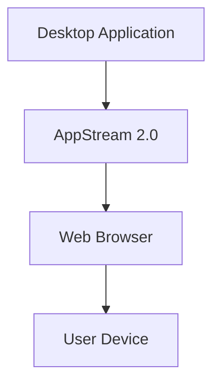

# 178. Amazon AppStream 2.0

## 🎯 Giới thiệu
- **Amazon AppStream 2.0** là **desktop application streaming service**.
- Mục tiêu là **deliver desktop application đến bất kỳ computer nào** mà **không cần acquire hay provision infrastructure**.
- Ứng dụng được **stream qua web browser**, nên người dùng chỉ cần một trình duyệt để sử dụng app.
- Ví dụ trong transcript: **Blender** được stream vào **Chrome web browser** và có thể dùng như bình thường.

## 1. AppStream 2.0 hoạt động như thế nào
- AppStream stream **ứng dụng desktop** vào **web browser**.
- Không cần người dùng kết nối vào **VDI**.
- Có thể chạy trên **any device has a web browser**.
- Ví dụ: stream **Windows desktop application** sang **Mac device** qua **Chrome web browser**.

## 2. AppStream 2.0 vs WorkSpaces
| Tiêu chí | AppStream 2.0 | WorkSpaces |
|----------|---------------|------------|
| Mục đích | Stream **desktop application** | Cung cấp **true desktop** |
| Cách truy cập | Qua **web browser** | Kết nối vào **VDI** |
| Kiểu sử dụng | Dùng app được stream | Mở **native applications** hoặc app đóng gói bằng **Workspace Application Manager (WAM)** |
| Thiết bị hỗ trợ | Bất kỳ thiết bị nào có browser | Gắn với desktop/VDI |
| Trạng thái | Theo ứng dụng được stream | Có thể **on demand** hoặc **always on** |

## 3. Điểm cần nhớ cho kỳ thi
- **AppStream 2.0 = stream application**
- **WorkSpaces = desktop/VDI**
- AppStream giúp đưa ứng dụng đến người dùng mà **không cần hạ tầng phía máy người dùng**.
- Mỗi AppStream application có thể cấu hình chạy trên **instance type per application type**.
- Có thể phân bổ tài nguyên khác nhau như:
  - **CPU**
  - **RAM**
  - **GPU**
- Ví dụ transcript nêu: ứng dụng như **Photoshop** có thể cần nhiều **CPU, RAM, GPU** hơn.

## 📊 Bảng tóm tắt
| Tiêu chí | Mô tả |
|----------|------|
| Dịch vụ | **Amazon AppStream 2.0** |
| Loại dịch vụ | **Desktop application streaming service** |
| Cách phân phối | Stream ứng dụng qua **web browser** |
| Hạ tầng phía người dùng | Không cần acquire/provision infrastructure |
| So sánh chính | Khác với **WorkSpaces**, vì WorkSpaces cung cấp **true desktop** |
| Điều chỉnh tài nguyên | Có thể cấu hình **instance type per application type** |
| Tình huống phù hợp | Khi muốn stream desktop app tới nhiều thiết bị khác nhau |

## 💡 Mẹo ghi nhớ cho kỳ thi AWS
- Nhớ nhanh: **AppStream = application streaming**, **WorkSpaces = desktop streaming/VDI**.
- Nếu đề bài nói:
  - **stream app qua browser** → nghĩ ngay đến **AppStream 2.0**
  - **cung cấp desktop đầy đủ** → nghĩ đến **WorkSpaces**
- Nếu ứng dụng cần nhiều tài nguyên khác nhau, AppStream cho phép chọn **instance type** phù hợp theo **application type**.
- Từ khóa quan trọng: **browser**, **desktop application**, **VDI**, **instance type**.

## ✅ Kết luận
- **Amazon AppStream 2.0** dùng để **stream desktop applications** qua **web browser**.
- Đây là lựa chọn phù hợp khi muốn người dùng truy cập ứng dụng mà **không cần provision infrastructure** ở phía họ.
- Điểm phân biệt quan trọng nhất cho kỳ thi là: **AppStream 2.0 stream application**, còn **WorkSpaces cung cấp desktop/VDI**.
